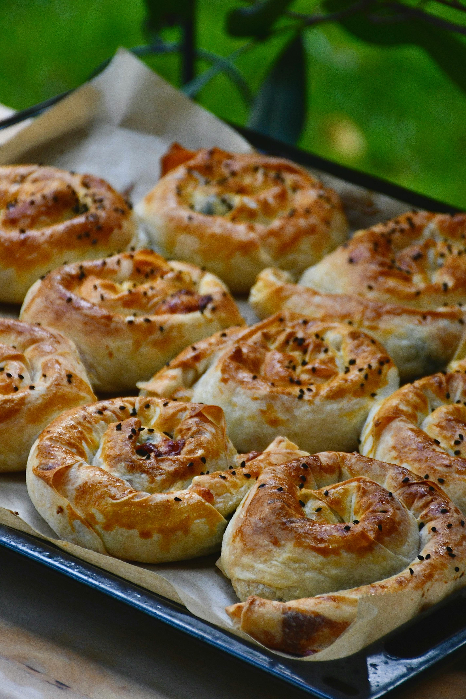

# Baked Börek with Khandrajo Filling

*These delicate, crispy-pastried Turkish appetizers enclose a savory eggplant, onion, and tomato filling (khandrajo) that's somewhat akin to ratatouille. The pastry exterior becomes shatteringly crisp while the filling remains moist and deeply flavored. These are substantial enough for a light meal yet elegant enough for appetizer spreads.*

**Prep Time:** 1 hour 15 minutes
**Cook Time:** 40 minutes
**Yield:** 20 börek

## Overview
Börek are Turkish pastry packages filled with various ingredients: meat, cheese, or vegetables. This vegetarian version uses khandrajo, a concentrated eggplant ragù heavily reduced until jammy and concentrated. Traditional börek-making uses thin, hand-rolled dough (yufka), but modern versions use readily available filo pastry. The key to success is preparing the khandrajo well ahead; it must be completely cool before filling (otherwise it creates soggy börek). The eggplant roasts down to deep mahogany richness through high-heat cooking, creating a sweet-savory filling. Baked börek develop shatteringly crisp exteriors through careful pastry handling and high-temperature baking.

## Ingredients

### Khandrajo Filling
- 1 large onion (approximately 200 grams, finely chopped)
- 30 milliliters groundnut oil
- 2 large eggplants (approximately 800 grams total, cut into 3cm cubes)
- Fine sea salt and freshly ground black pepper to taste
- 400 grams tinned tomatoes (chopped, or fresh tomatoes puréed)

### Pastry & Assembly
- 50 grams butter
- 60 milliliters water
- 60 milliliters olive oil
- 1 teaspoon fine sea salt
- 250 grams flour (all-purpose)
- 1 egg yolk (for egg wash)
- 1 tablespoon milk (for egg wash)
- 1 teaspoon sesame seeds (for garnish, optional)

## Method

### Stage 1A – Prepare Khandrajo Base
1. Wash and pat dry 2 large eggplants.
1. Cut into 3 centimeter cubes (you should have approximately 800 grams diced eggplant).
1. Drain tinned tomatoes, reserving approximately 100 milliliters of liquid.
1. Chop or purée 400 grams tinned tomatoes; you should have approximately 350 grams tomato solids.

### Stage 1B – Cook Khandrajo
1. Heat a karahi (wok) or large saucepan over medium heat.
1. Add 1 tablespoon groundnut oil.
1. Add 1 finely chopped large onion.
1. Stir-fry for 3-4 minutes until the onion becomes translucent and softens.
1. Continue adding remaining oil gradually as needed as the eggplant is added (to prevent sticking).
1. Add the diced eggplant with salt and pepper.
1. Stir, coating eggplant pieces with oil.
1. As the mixture cooks and the eggplant releases moisture, continue stirring (eggplant will darken gradually).
1. When the onion and eggplant have darkened noticeably, add the chopped tomatoes and reserved liquid.
1. Stir thoroughly, mixing well.
1. Continue cooking, stirring occasionally, for approximately 20 minutes.
1. The mixture should gradually reduce and concentrate, the oil rising to the surface.
1. Increase heat to high and stir constantly for another 5-10 minutes.
1. The mixture will become fairly dry (if sticking to the pan, add reserved tomato liquid gradually and scrape well).
1. When the mixture is really dry and thick (jammy consistency), transfer to a bowl to cool completely.
1. This must be done well ahead; the khandrajo must be completely cold before using as filling.
1. The filling can cool at room temperature for 30 minutes, then refrigerated for several hours.
1. Skim any oil that rises to the surface before using.

### Stage 2A – Prepare Pastry Dough
1. Cut 50 grams butter into small pieces.
1. Gently melt the butter over low heat, ensuring it does not brown or cook (approximately 2-3 minutes).
1. Remove from heat immediately once melted.
1. Allow to cool slightly (still warm but not hot).

### Stage 2B – Combine Dough Ingredients
1. In a large bowl, combine 60 milliliters water, 60 milliliters olive oil, and the melted 50 grams butter.
1. Stir together; the mixture will look milky and combined.
1. Add 1 teaspoon salt.
1. Stir in 250 grams flour; the mixture will come together as a soft dough.
1. Gather the dough with your hands and knead well for approximately 10 minutes.
1. The dough should be soft, elastic, and slightly tacky (not dry, not wet).
1. Form into a smooth ball.
1. Cover with a damp cloth and allow to rest at room temperature for exactly 30 minutes.
1. This resting period relaxes the gluten and makes the dough easier to roll.

### Stage 2C – Roll & Rest Dough Again
1. On a lightly oiled surface, roll out the dough to approximately 3-5 millimeters thickness (thinner than basic bread dough, thicker than filo).
1. It should be thin enough to see your hand through it faintly.
1. Cover again with a damp cloth and allow to rest for another 30 minutes.
1. This second resting ensures the dough is completely relaxed and won't shrink when shaped.

### Stage 3 – Shape Börek
1. After the second resting, divide the dough into 20 equal pieces (approximately 20 grams each).
1. Roll each into a ball.
1. On an oiled surface, roll one dough ball into a thin, approximately 12cm diameter circle.
1. Place approximately 1 tablespoon cold khandrajo filling in the center.
1. Fold the circle in half over the filling, forming a half-moon shape.
1. Press the edges firmly to seal (the edge should be completely sealed; no filling should escape during baking).
1. Place on a lightly oiled baking sheet.
1. Repeat with remaining dough and filling.
1. Once all börek are shaped, prepare egg wash: combine 1 egg yolk with 1 tablespoon milk.

### Stage 4 – Glaze & Finish
1. Using a pastry brush, lightly brush each börek with the egg wash (both top and sides if possible).
1. Sprinkle lightly with sesame seeds if desired (traditional garnish).
1. Allow to rest on the baking sheet at room temperature for 10 minutes.

### Stage 5 – Bake Börek
1. Preheat oven to 190°C (375°F).
1. Place filled and glazed börek in the preheated oven.
1. Bake for 12-15 minutes until the pastry is pale golden and the eggplant filling browns slightly at the edges (if you can see it through the pastry seal).
1. The pastry should be crispy-looking, not doughy or dark.
1. Remove from the oven once the pastry is pale golden.

### Stage 6 – Serve
1. Allow to cool for 5 minutes on the baking sheet.
1. Transfer to a serving platter.
1. Serve warm (not piping hot, not cold).

## Notes
- **Khandrajo Must Be Cool:** Hot filling creates soggy börek; cold filling creates crispy pastry with moist interior.
- **Eggplant Concentration Essential:** The high-heat final cooking concentrates eggplant and intensifies flavor; don't skip this step.
- **Oil Rising Normal:** As the khandrajo reduces, oil rises to the surface; this is expected. Skim before using as filling.
- **Pastry Dough Relaxation:** The two resting periods are essential; they prevent the dough from shrinking or becoming tough.
- **Thin Pastry:** The rolled dough should be thin enough to see through slightly; this creates crispy result.
- **Complete Sealing:** Incomplete seals allow filling to escape and create soggy börek; press edges very firmly.
- **Egg Wash Lightly:** Heavy egg wash creates thick, overly brown crust; light brushing creates golden, delicate surface.

## Variations
**With Meat:** Add 100 grams ground lamb or beef to the khandrajo; brown it in the oil before adding vegetables.
**With Cheese:** After the filling has cooled, mix 50 grams crumbled white cheese (feta or similar) into the khandrajo.
**Spicier Version:** Add 1/2 teaspoon Aleppo pepper or red chilli flakes to the khandrajo during cooking.
**With Fresh Herbs:** Mix 2 tablespoons finely chopped fresh mint or parsley into the cooled khandrajo.

## Serving
Perfect with: Yogurt-based sauce, fresh salad, afternoon tea, appetizer platters, light lunch
Temperature: Warm (not piping hot)
Ratio: 2-3 börek per person
Context: Turkish appetizers, casual entertaining, lunch item, pastry platter

## Storage
- Refrigerate cooked börek in a sealed container for up to 3 days.
- Reheat gently in a 160°C oven for 8-10 minutes (wrapped loosely in foil to prevent excessive browning).
- Can be frozen after baking for up to 1 month; reheat from frozen in 180°C oven for 12-15 minutes.
- Can be partially prepared ahead: fill and shape börek, refrigerate unbaked for up to 4 hours, then bake at service time.
- Do not microwave; pastry becomes tough and soggy.
- Best served within a few hours of baking; after that, pastry loses its crispness.