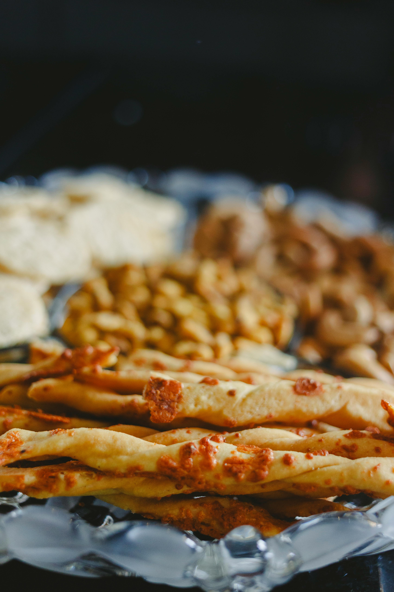

# Cheese Straws

*These iconic, elegant appetizers are perfect nibbles with an aperitif or served alongside a light consommé or soup. Golden, crispy pastry ribbons are twisted to create visual appeal while the cheese and paprika create savory, peppery flavor. Warm from the oven, they're irresistible.*

**Prep Time:** 30 minutes
**Cook Time:** 5-6 minutes
**Yield:** 24 cheese straws

## Overview
Cheese straws are the simplest of cold appetizers: store-bought puff pastry brushed with egg wash, lavished with grated cheese, dusted with paprika, cut into strips, twisted for visual interest, and crisped in a hot oven. The result is a crackle-crispy pastry ribbon with the savory flavor of cheese and the subtle heat of paprika. The key to success is using store-bought puff pastry (which saves enormous time) with proper thickness rolling, ensuring even cheese coverage, and twisting each straw to ensure even baking. These are best served still warm from the oven; cold cheese straws become limp and uninteresting.

## Ingredients

### Pastry Base
- 400 grams puff pastry (approximately 1 sheet, thawed if frozen)

### Egg Wash
- 1 egg yolk (approximately 1 tablespoon)
- 1 tablespoon whole milk
- Pinch of fine sea salt

### Cheese & Spice Coating
- 80 grams Emmenthal or Parmesan cheese (freshly grated, not pre-shredded)
- 1 teaspoon sweet paprika (or smoked paprika for different character)
- 1 small pinch cayenne pepper (optional, for subtle heat)

## Method

### Stage 1 – Prepare Pastry
1. Remove puff pastry from package and allow to come to room temperature (approximately 10 minutes).
1. If using frozen puff pastry, thaw according to package directions.
1. Lightly flour a clean work surface.
1. Gently unfold or unroll the puff pastry sheet onto the floured surface.
1. Using a rolling pin, gently roll the pastry to approximately 2-3 millimeters thickness (as thin as you can roll without tearing).
1. The sheet should be approximately 28 x 20 centimeters when properly rolled.
1. If the pastry tears, don't worry; it can still be used (tears will be invisible in finished product).
1. Trim the edges with a chef's knife to neaten the rectangle; any trimmed scraps can be used to patch holes or create additional straws.

### Stage 2 – Prepare Egg Wash
1. In a small bowl, combine 1 egg yolk with 1 tablespoon milk.
1. Add a small pinch of fine sea salt.
1. Whisk together until uniform (consistency should resemble liquid cream; not thick, not watery).
1. Set aside.

### Stage 3 – Apply Egg Wash
1. Using a pastry brush, brush the entire upper surface of the puff pastry sheet very lightly with the egg wash.
1. Ensure even coverage; egg wash helps the cheese adhere.
1. The pastry should look glossy but not drenched (too much egg wash creates thick, overly browned crust).

### Stage 4 – Add Cheese & Spice
1. Sprinkle 80 grams freshly grated Emmenthal or Parmesan cheese evenly across the egg-washed pastry surface.
1. The cheese should cover the entire surface in a relatively even layer; don't create thick bunches or sparse areas.
1. In a small bowl, combine 1 teaspoon sweet paprika with a small pinch of cayenne pepper (if using).
1. Dust the paprika-cayenne mixture evenly across the cheese layer.
1. The surface should look vibrant golden-orange from the paprika; some areas of cheese may show through.

### Stage 5 – Trim Edges & Cut Strips
1. Using a sharp chef's knife, trim any rough or uneven edges of the pastry, creating a neat rectangle.
1. Starting on the longest side (approximately 28 centimeters), use the chef's knife to cut the pastry lengthwise into two bands.
1. Each band should be approximately 14 centimeters long and 12 centimeters wide.
1. Then, cutting crosswise, cut each band into approximately 1 centimeter wide strips.
1. This creates approximately 12-14 strips per band, or 24-28 straws total.
1. Each straw should be approximately 14 centimeters long and 1 centimeter wide.

### Stage 6 – Twist Straws
1. Lightly flour a large baking sheet or line it with parchment paper.
1. Taking one pastry strip, hold it at both ends (with lightly oiled or floured fingers).
1. Twist the strip gently 5 times, rotating one end in one direction while holding the other steady.
1. The straw should form a loose spiral as it's twisted.
1. Place the twisted straw onto the prepared baking sheet.
1. Repeat with each remaining strip, spacing them approximately 2 centimeters apart (they'll expand slightly during baking).
1. Once all straws are twisted, refrigerate the baking sheet for exactly 20 minutes.
1. This chilling helps the pastry firm up and prevents excessive spreading during baking.

### Stage 7 – Bake Straws
1. Preheat your oven to 180°C (350°F).
1. Remove the chilled baking sheet from the refrigerator.
1. Place immediately into the preheated 180°C oven.
1. Bake for 5-6 minutes.
1. Watch carefully: the edges should turn pale golden; the cheese should melt and create a slightly darker (golden-orange) appearance overall.
1. Do not over-bake; straws become tough and dark brown if baked too long (even 1 minute too long is detectable).
1. The straws should smell distinctly of melted cheese and paprika.
1. Remove from the oven as soon as the edges are light golden.

### Stage 8 – Cool & Serve
1. Using a palette knife (offset spatula), carefully transfer each hot cheese straw to a wire cooling rack.
1. Handle gently; the straws are fragile while still hot.
1. Allow to cool for 5 minutes on the rack; they'll continue to firm up as they cool.
1. Transfer to a serving platter.
1. Serve while still warm (this is when they're crispiest and most delicious).
1. If they must be served later, arrange in a tall goblet or on a plate to show off their visual appeal.

## Notes
- **Store-Bought Pastry Acceptable:** Quality puff pastry from the frozen section is excellent; making from scratch is unnecessary for casual appetizers.
- **Cheese Choice Matters:** Emmenthal creates nutty, slightly sweet result; Parmesan creates sharp, savory result. Choose based on preference.
- **Fresh Grating Essential:** Pre-shredded cheese contains anti-caking agents that prevent melting smoothly; freshly grated only.
- **Paprika Type:** Sweet paprika provides color and mild flavor; smoked paprika adds depth; use whichever suits your taste.
- **Egg Wash Brushing:** Light even coverage is key; heavy egg wash creates thick crust; sparse coverage means cheese doesn't adhere as well.
- **Thickness Matters:** Rolling to 2-3mm creates crispy result; thicker creates cake-like texture.
- **Chilling Before Baking:** The 20-minute chill is essential; it prevents excessive spreading and ensures even baking.
- **Baking Temperature Precise:** 180°C is ideal; higher temps create burnt edges before centers cook; lower temps create greasy, undercooked result.
- **Immediate Service Best:** Cheese straws are at their peak within 30 minutes of baking; after that, they lose crispness as they cool completely.

## Variations
**Spicier Version:** Add 1/4 teaspoon cayenne instead of pinch, or increase to 1/2 teaspoon for significantly more heat.
**Herbed Straws:** Add 1/2 teaspoon dried thyme or dried oregano to the paprika mixture for herbaceous note.
**With Parmesan & Truffle:** Use all Parmesan (no Emmenthal); add 1-2 drops black truffle oil (very sparingly) to the egg wash for luxury version.
**Curry Variation:** Replace paprika entirely with 1 teaspoon mild curry powder for Indian-inspired character.
**With Poppy Seeds:** Instead of paprika, dust with 1 teaspoon poppy seeds for different appearance and subtle nutty flavor.

## Serving
Perfect with: Aperitif drinks (champagne, wine, cocktails), light consommé or soup, cheese board, before-dinner nibbles, cocktail parties
Temperature: Warm (within 30 minutes of baking)
Ratio: 3-4 straws per person
Context: Pre-dinner appetizer, elegant canapé stand-in, simple entertaining, quick appetizer

## Storage
- Best consumed fresh and warm (within 30 minutes of baking).
- Store cooled cheese straws in an airtight container with parchment between layers for up to 2 days.
- Reheat in a 160°C oven for 3-4 minutes (wrapped loosely in foil to prevent excessive browning) to restore some crispness.
- Do not refrigerate; cold, humid environment makes them limp.
- Can be partially prepared ahead: cut and shaped straws can be frozen on a baking sheet, then baked directly from frozen (add 1-2 minutes to baking time).
- Fully baked straws do not freeze well; texture degrades significantly.
- Can be assembled (brushed with egg wash, coated with cheese) several hours ahead, refrigerated, then baked at service time for maximum freshness.