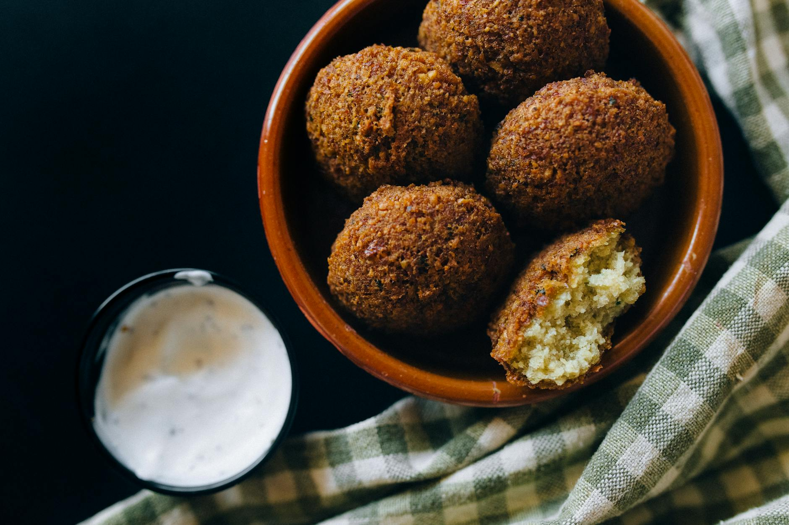

# Falafel

*These golden, crispy deep-fried chickpea rissoles are eaten throughout the Middle East as street food, appetizers, and light meals. Served with tahina dip and crisp Egyptian salad, wrapped in pita bread, they're simple, utterly satisfying, and entirely vegetarian. The pale green interior speckled with dark green herbs is both visually striking and flavorful.*

**Prep Time:** 8 hours
**Yield:** Approximately 24-28 falafels

## Overview
Falafel represents the apotheosis of vegetarian fried food: beans ground to a light, slightly grainy purée, bound minimally with herbs and spices, then deep-fried until the exterior shatters with crispness while the interior remains creamy and pale green. The key to success is never cooking the dried beans, using only dried, soaked varieties (never canned), which allows the texture to remain light and fluffy rather than becoming dense. The extended resting period before frying allows the mixture to firm up, holding its shape during cooking. These are best eaten absolutely fresh, while the interior is still steaming and the exterior crackles.

## Ingredients

### Chickpea Foundation
- 250 grams dried broad beans (or chickpeas; dried soaked type) - soaked 8 hours minimum
- 1 tablespoon fresh flat-leaf parsley (very finely chopped)
- 1 tablespoon fresh coriander (very finely chopped)
- 4 spring onions (green stems especially, very finely chopped)
- 1 garlic clove (very finely chopped, nearly paste)

### Spicing & Structure
- 1/2 teaspoon ground cumin
- Fine sea salt to taste (begin with 1/4 teaspoon)
- Freshly ground black pepper to taste
- Small pinch bicarbonate of soda (approximately 1/8 teaspoon)

### Frying
- Oil for deep frying (approximately 1.5 liters; groundnut or vegetable oil preferred)

## Method

### Stage 1 – Soak Beans
1. Place 250 grams dried broad beans in a large bowl.
1. Cover generously with cold water (beans will expand as they absorb water).
1. Allow to soak overnight, or for a minimum of 8 hours.
1. After soaking, the beans should be plump and soft, but still completely raw (never boiled).
1. Remove any debris or shriveled beans from the soaking water.
1. Drain the beans and pat dry thoroughly with paper towels.
1. Excess moisture on the beans will make the falafel paste sticky and difficult to work with.

### Stage 2 – Grind Beans to Purée
1. Using a food processor, add the drained soaked beans (in batches if necessary).
1. Using the fine disc of a mincer (if available) OR the food processor pulse function, grind the beans until they reach the consistency of a fairly dry, slightly grainy purée.
1. Do not over-process into a smooth paste; you want slight graininess remaining (this creates the characteristic texture).
1. The purée should be pale greenish (color from bean skin) and hold together lightly when squeezed.
1. Transfer the ground beans to a mixing bowl.
1. Do not add any liquid at this stage (which differs from chickpea falafel; broad bean falafel should be quite dry).

### Stage 3 – Build Flavor & Texture
1. Add 1 tablespoon very finely chopped fresh flat-leaf parsley to the bean purée.
1. Add 1 tablespoon very finely chopped fresh coriander.
1. Add 4 very finely chopped spring onion stems (green parts especially; white parts are acceptable but less delicate).
1. Add 1 garlic clove, very finely chopped (nearly a paste).
1. Using a wooden spoon, mix the ingredients together thoroughly.
1. The mixture should be uniformly green-speckled, aromatic from herbs.

### Stage 4 – Season & Bind
1. Add 1/2 teaspoon ground cumin.
1. Add approximately 1/4 teaspoon fine sea salt (taste and adjust after forming first falafel).
1. Add a few grinds of freshly ground black pepper.
1. Add a small pinch of bicarbonate of soda (approximately 1/8 teaspoon); this lightens the falafel and aids browning.
1. Knead the mixture thoroughly with your hands or a spoon for approximately 1-2 minutes, until all ingredients are fully distributed and the mixture is completely even in color and texture.
1. The mixture will be pale green throughout, speckled with darker green herb pieces.

### Stage 5 – Rest & Dry Out
1. Cover the mixing bowl loosely (not plastic-wrapped; you want some air exposure).
1. Place in the refrigerator, uncovered or very loosely covered, for 2 hours.
1. During this time, the mixture will firm up and any excess moisture will evaporate.
1. This resting period is essential; warm or moist falafel will fall apart during frying.
1. After 2 hours, the mixture should be quite firm and will hold its shape when formed.

### Stage 6 – Form Falafels
1. Working with damp hands (not wet, but lightly moistened), take a piece of the paste approximately the size of a large marble (about 25-30 grams).
1. Knead it in the palm of your hand for a few seconds, forming a ball.
1. The mixture should be cohesive enough to maintain its shape; if it's crumbly, the resting period wasn't long enough.
1. Place the formed ball on a lightly oiled plate or tray.
1. Gently flatten with your finger to create a slightly flattened disk (approximately 4-5 centimeters diameter, 1.5 centimeters thick).
1. Do not compress them; light handling maintains internal texture.
1. Repeat until all mixture is formed (you should have approximately 24-28 falafels).
1. Chill the formed falafels in the refrigerator for at least 30 minutes before frying (this helps them hold together during cooking).

### Stage 7 – Heat Oil
1. Pour approximately 1.5 liters of groundnut or vegetable oil into a deep-fryer basket or heavy saucepan.
1. Set over medium-high heat and bring to approximately 175-180°C (350-360°F).
1. Use a deep-fry thermometer to ensure accurate temperature; too cool and falafels become greasy; too hot and exteriors burn before interiors cook.
1. Test oil temperature: a small piece of bread should brown in approximately 30-45 seconds at correct temperature.
1. The oil should shimmer across the surface; wisps of smoke should be barely visible.

### Stage 8 – Fry Falafels
1. Carefully place 4-6 falafels into the hot oil (don't overcrowd; this reduces oil temperature and creates greasy results).
1. They will sink initially, then float as they cook.
1. Fry for approximately 2-3 minutes until they are deep golden brown on all sides.
1. Using a slotted spoon, turn them once or twice during frying to ensure even browning on all surfaces.
1. Remove from oil with a slotted spoon and drain on paper towels.
1. Repeat with remaining falafels in batches.
1. The exterior should be crackling crispy and deep golden brown; the interior will be steaming and pale green.

### Stage 9 – Rest & Serve
1. Allow the falafels to rest on paper towels for 2-3 minutes.
1. Transfer to a warm serving platter.
1. Serve immediately while still warm and crispy (cold falafel becomes dense and unpleasant).
1. Accompany with tahina dip, Egyptian salad, and warm pita bread.

## Notes
- **Dried Soaked Beans Essential:** Canned or cooked beans create dense, mealy texture; only raw dried soaked beans work.
- **Grinding Technique:** Slightly grainy purée (not smooth paste) creates the characteristic fluffy interior; over-processing makes dense falafel.
- **Herb Ratio Critical:** Too little herb and flavor is bland; too much creates mushy, herb-dominant texture. 1 tablespoon each is balanced.
- **Resting Period Non-Negotiable:** The 2-hour chill allows moisture to evaporate and mixture to firm up enough to hold shape during frying.
- **Oil Temperature:** 175-180°C is exact; 5 degrees cooler and they're greasy, 5 degrees hotter and they're burnt outside-raw inside.
- **Damp Hands Tip:** Slightly moist hands (not wet) prevent sticking while forming.
- **No Pre-cooking:** The soaked beans are raw; cooking them before grinding creates wrong texture entirely.
- **Fresher is Better:** Falafels are best served within 30 minutes of frying; after that, they firm up and become less appealing.

## Variations
**With Spice Heat:** Add 1/4 teaspoon cayenne pepper to the mixture for subtle heat.
**Cilantro Emphasis:** Use 2 tablespoons coriander and reduce parsley to 0.5 teaspoon for cilantro-dominant version.
**Garlic-Forward:** Increase garlic to 2-3 cloves for more assertive flavor (taste carefully; garlic can become harsh).
**With Fresh Mint:** Add 0.5 teaspoon fresh mint leaves for cool contrast (non-traditional but interesting).
**Cumin Double:** Increase cumin to 1 teaspoon for richer, warmer spice character.

## Serving
Perfect with: Tahina dip (essential), Egyptian tomato-cucumber salad, hummus, pickled vegetables, warm pita bread, mixed grill platters
Temperature: Piping hot (serve within 10-15 minutes of frying)
Ratio: 3-4 falafels per serving as appetizer; 5-6 as light meal
Context: Street food, appetizer platters, light lunch, vegetarian main course, mezze spread

## Storage
- Best consumed fresh and warm (within 30 minutes of frying).
- Refrigerate cooled falafels in a sealed container for up to 2-3 days.
- Reheat in a 160°C oven for 8-10 minutes (wrapped loosely in foil to prevent over-browning); they won't regain original crispness but become palatable again.
- Can be frozen for up to 1 month; reheat from frozen in 160°C oven for 12-15 minutes.
- Do not microwave; texture becomes mushy and unpleasant.
- Can be partially prepared ahead: form falafels and chill overnight. Fry fresh at service time.
- The formed (unfired) falafel can be frozen for up to 3 months and fried directly from frozen (add 1-2 minutes to frying time).