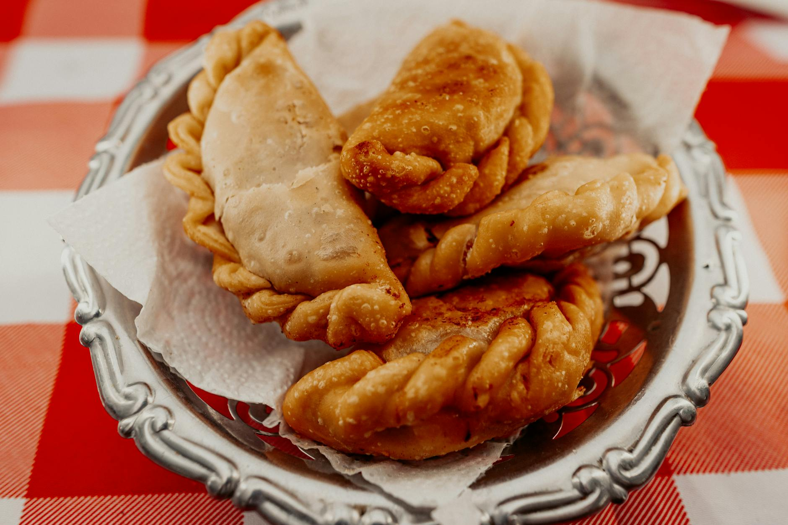

# Fried Börek with Meat Filling

*These crispy, golden-brown fried pastry packages enclose a seasoned meat filling redolent with warm spices and fresh herbs. Similar in concept to Indian samosas, börek are much thinner-shelled, creating a shatteringly crisp exterior protecting a savory, hot interior. These are excellent as an entrée or served as sophisticated aperitif snacks.*

**Prep Time:** 1 hour 10 minutes
**Cook Time:** 25 minutes
**Yield:** 30 börek

## Overview
Fried börek are Turkish-influenced pastries that combine simple pastry (made from water, oil, and flour) with a seasoned ground meat filling. The meat is cooked in aromatics, bound together with egg, and enriched with fresh parsley. The pastry is thin and tender, becoming shatteringly crisp when deep-fried. The key to success is ensuring the filling is completely cold before assembling (otherwise it creates soggy pastry), rolling the pastry thin (for crispness rather than doughiness), and maintaining proper oil temperature during frying. These are best consumed immediately, while still warm and crispy.

## Ingredients

### Meat Filling
- 1 medium onion (approximately 120 grams, very finely chopped)
- 1 tablespoon groundnut oil
- 1 garlic clove (very finely chopped)
- 120 grams ground meat (lamb or beef preferred; pork acceptable)
- 1 teaspoon ground allspice
- 1/4 teaspoon freshly ground nutmeg
- Fine sea salt to taste
- Freshly ground black pepper to taste
- 1 egg (large)
- 30 milliliters fresh parsley (finely chopped)

### Simple Pastry Dough
- 225 grams all-purpose flour
- 1 teaspoon fine sea salt
- 75 milliliters lukewarm water
- 1-2 tablespoons additional oil (for rolling pin rubbing)

### For Frying
- Oil for deep frying (approximately 1.5-2 liters; groundnut or vegetable oil)

## Method

### Stage 1A – Prepare Filling
1. Heat 1 tablespoon groundnut oil in a large frying pan over medium heat.
1. Add 1 very finely chopped medium onion.
1. Cook, stirring occasionally, for approximately 10 minutes until the onion softens and becomes translucent.
1. Increase heat to medium-high.
1. Add 1 very finely chopped garlic clove.
1. Cook, stirring constantly, for approximately 1-2 minutes until the onion begins to turn light golden.
1. The pan should smell fragrant and aromatic.

### Stage 1B – Add Meat & Spices
1. Add 120 grams ground meat to the softened onion and garlic.
1. Using a wooden spoon, break the meat into small pieces as it cooks.
1. Stir constantly until the meat turns brown throughout (approximately 5-7 minutes).
1. Ensure no large clumps of meat remain; break into fine pieces as needed.
1. The meat should be completely cooked through and look light to medium brown.
1. Add 1 teaspoon ground allspice and 1/4 teaspoon freshly ground nutmeg.
1. Stir continuously for approximately 1 minute, allowing the spices to toast and distribute evenly.
1. Add fine sea salt to taste (begin conservatively with 1/4 teaspoon; you'll adjust more precisely once cooled).
1. Add several grinds of freshly ground black pepper.
1. Stir to combine all ingredients.
1. The filling should smell warmly spiced and savory.

### Stage 1C – Finish Filling
1. Transfer the cooked meat mixture to a bowl and allow to cool to room temperature (approximately 15-20 minutes).
1. Once cool, beat 1 large egg with a fork until yolks and whites are completely combined.
1. Add the beaten egg to the cooled meat mixture.
1. Using a spoon, fold the egg into the meat mixture until thoroughly combined (the egg will bind the loose meat).
1. Add 30 milliliters finely chopped fresh parsley.
1. Fold the parsley into the mixture.
1. The filling should be moist and cohesive, with parsley distributed throughout.
1. Taste and adjust salt and pepper as needed.
1. Set aside; the filling should cool further as you prepare pastry.

### Stage 2A – Make Pastry Dough
1. Sift 225 grams flour and 1 teaspoon salt into a large bowl.
1. Make a well in the center of the flour.
1. Pour 75 milliliters lukewarm water into the well.
1. Using your fingers or a wooden spoon, gradually mix the flour into the water.
1. Continue mixing until the flour is completely combined and the mixture forms a rough dough.
1. Gather the shaggy dough with your hands.
1. Knead well for approximately 10 minutes (knead on the counter or in the bowl).
1. The dough will be soft, slightly tacky, and elastic.
1. Form the dough into a smooth ball.
1. Rub a thin coating of oil over the surface of the dough.
1. Cover with a damp cloth and allow to rest at room temperature for 30 minutes.
1. This resting period relaxes the gluten and makes the dough much easier to roll and shape.

### Stage 2B – Portion & Roll Pastry
1. Divide the rested dough into 30 equal portions (approximately 15-18 grams each).
1. Roll each into a smooth ball.
1. Rub a rolling pin very lightly with oil.
1. On an oiled work surface (or between oiled plastic sheets), roll one dough ball into a thin, approximately 10 centimeter diameter circle.
1. The pastry should be thin enough that light shows through it; this is the target thickness.
1. Don't worry if the pastry tears slightly; small tears won't affect the final product.
1. Place approximately 1 tablespoon cold meat filling in the center of the pastry circle.
1. Fold the pastry in half, forming a half-moon shape, and press edges firmly to seal completely (no filling should escape during frying).
1. Place on a lightly oiled tray.
1. Repeat with remaining dough and filling.
1. Once all börek are formed and sealed, refrigerate for at least 30 minutes before frying (this helps them hold together during cooking).

### Stage 3 – Heat Oil
1. Pour approximately 1.5-2 liters oil into a deep fryer or heavy saucepan.
1. Set over medium-high heat and bring to approximately 170-175°C (340-350°F).
1. Use a deep-fry thermometer; temperature is critical for success.
1. Test oil temperature: a small piece of bread should brown in approximately 45-60 seconds at correct temperature.
1. If too cool (below 160°C), börek become greasy; if too hot (above 190°C), exteriors burn before interiors cook through.

### Stage 4 – Fry Börek
1. Carefully place 4-6 börek into the hot oil (don't overcrowd; this reduces oil temperature significantly).
1. They will sink initially, then float as they cook and gain buoyancy.
1. Fry for approximately 2-3 minutes, turning once or twice during frying to ensure even browning on both sides.
1. Toss them gently with a slotted spoon to prevent sticking to each other.
1. Remove from oil with a slotted spoon once they're deep golden brown on both sides.
1. Drain on paper towels briefly.
1. Transfer to a warm serving platter lined with paper towels.
1. Repeat with remaining börek in batches.
1. Keep finished börek warm in a low oven (approximately 100°C) while frying remaining batches.

### Stage 5 – Serve
1. Serve the börek immediately while still warm and crispy.
1. They're best eaten within 10-15 minutes of frying (after that, they begin to absorb atmospheric moisture and lose crispness).

## Notes
- **Filling Must Be Cold:** Hot filling creates soggy, greasy börek; the filling should be completely cool, even chilled, before assembling.
- **Thin Pastry Essential:** Thin pastry becomes gloriously crispy; thick pastry becomes doughy and dense. The pastry should be thin enough to see light through.
- **Oil Temperature Exact:** 170-175°C is precise; even 10 degrees is noticeable (cooler = greasy, hotter = burnt).
- **Don't Overcrowd Oil:** Each börek needs space; oil temperature drops substantially if too many are added at once.
- **Filling Ratio:** 1 tablespoon filling per börek is appropriate; too much and they burst during frying; too little and they're all pastry.
- **Egg Binding:** Raw egg added to cooled meat creates binding and cohesion; it's essential for the filling to hold together.
- **Allspice Warmth:** The allspice-nutmeg combination is classic for Turkish meat fillings; don't skip or substitute.
- **Complete Sealing:** Any gap in the seal allows filling to escape and oil to penetrate, creating greasy, soggy result.

## Variations
**With Spice Heat:** Add 1/4 teaspoon cayenne pepper to the meat filling for subtle heat.
**Vegetarian Version:** Omit meat; use 120 grams finely diced potato (boiled and cooled) or crumbled cheese instead.
**Herb Emphasis:** Increase parsley to 2 tablespoons and add 1 tablespoon fresh mint for herbaceous emphasis.
**With Pine Nuts:** Add 2 tablespoons toasted pine nuts to the cooled filling for texture and richness.
**Spice-Forward:** Add 1/4 teaspoon ground cinnamon for deeper, more complex warmth (traditional variation).

## Serving
Perfect with: Yogurt sauce, fresh salad, afternoon appetizer, light meal, mezze spread
Temperature: Piping hot (within 15 minutes of frying)
Ratio: 3-4 börek per person as appetizer; 6-8 as light meal
Context: Turkish appetizers, fried pastry platter, casual entertaining, light lunch

## Storage
- Best consumed fresh and warm (within 30 minutes of frying).
- Refrigerate cooled börek in a sealed container for up to 2-3 days.
- Reheat gently in a 160°C oven for 8-10 minutes (wrapped loosely in foil to prevent excessive browning).
- Can be frozen after frying for up to 1 month; reheat from frozen in 180°C oven for 12-15 minutes.
- Can be partially prepared ahead: form and refrigerate unbaked börek for up to 8 hours, then fry at service time for maximum crispness.
- Do not microwave; pastry becomes limp and filling can become too hot.
- Fresh börek are far superior to reheated; if possible, prepare filling and dough ahead and fry fresh at service time.