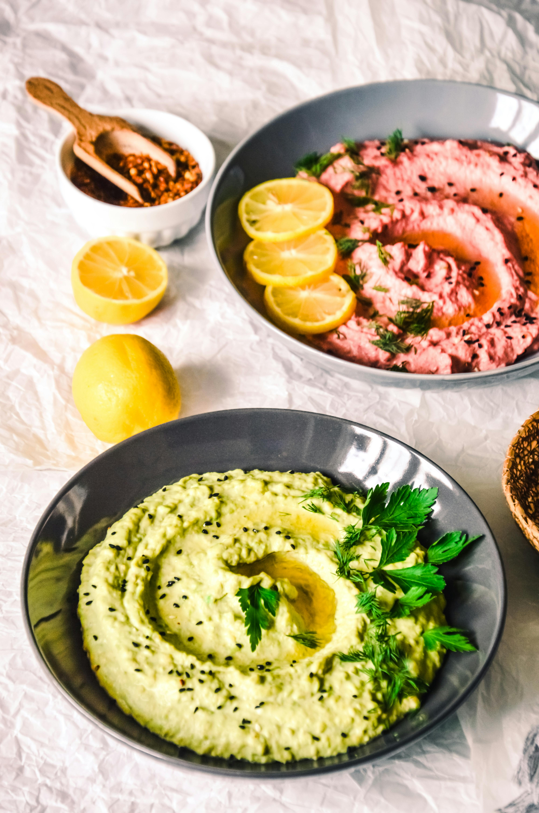

# Hummus

*This plain yet sophisticated chickpea purée is beloved throughout the Middle East and beyond. The addition of turmeric elevates it beyond simple chickpea paste, imparting subtle warmth and golden hue. Other flavorings, chilli, ginger, harissa, can be added for variation, but the plain version celebrates the chickpeas themselves.*

**Prep Time:** 8 hours
**Yield:** Approximately 400 milliliters (8-10 servings as appetizer)

## Overview
Hummus is the simplest and most elegant of Middle Eastern dips: cooked chickpeas reduced to silky purée through long cooking and blending, enriched with olive oil, brightened with lemon juice, and warmed subtly with turmeric. Unlike Western versions that often include tahini (making them hummus bi tahina), traditional plain hummus celebrates the chickpea itself. Success requires patience in cooking the chickpeas until they're absolutely tender (allowing them to purée to silky consistency), careful sourcing of dried chickpeas (which yield better texture than canned), and quality olive oil for finishing. The result is a dip that's refined yet deeply satisfying, perfect as part of a mezze spread or simply with warm pita and olives.

## Ingredients

### Chickpea Base
- 120 grams dried chickpeas (or 1.5 cups, soaked minimum 8 hours)
- Soaking water (reserved after draining)
- Approximately 1.5 liters water (for cooking, fresh cold water)

### Aromatics & Seasonings
- 1 medium onion (approximately 120 grams, very finely chopped)
- 1 tablespoon sunflower oil (for cooking aromatics)
- 1 garlic clove (very finely chopped)
- 1/2 teaspoon ground turmeric
- Fine sea salt to taste (approximately 1/4 teaspoon, adjusted)

### Finishing & Enrichment
- 20 milliliters olive oil (best quality available)
- Fresh juice of approximately 1/2 lemon (approximately 1.5 tablespoons)
- Freshly ground black pepper to taste

## Method

### Stage 1 – Soak Chickpeas
1. Place 120 grams dried chickpeas in a large bowl.
1. Cover generously with cold water (chickpeas will expand significantly).
1. Soak overnight, or for a minimum of 8 hours.
1. The chickpeas should be plump and soft, easily dented with a fingernail.
1. Drain the chickpeas, reserving approximately 100 milliliters of the soaking water if feasible.
1. Remove any debris or shriveled chickpeas.
1. Pat the drained chickpeas dry with paper towels.

### Stage 2 – Cook Aromatics
1. Heat 1 tablespoon sunflower oil in a large saucepan or stock pot over medium heat.
1. Add 1 very finely chopped medium onion.
1. Cook, stirring occasionally, for approximately 10 minutes until the onion softens and becomes translucent (do not brown).
1. Add 1 very finely chopped garlic clove.
1. Cook for an additional 1 minute, stirring.
1. The pan should smell fragrant from the garlic and onion.

### Stage 3 – Add Chickpeas & Water
1. Add the drained, soaked chickpeas to the softened onion and garlic.
1. Pour approximately 1.5 liters fresh cold water into the pot (enough to cover the chickpeas by approximately 5 centimeters).
1. Bring to a rolling boil over high heat (approximately 5-10 minutes).
1. Once boiling, immediately reduce heat to low.
1. Simmer very gently, partially covered, for approximately 1 hour.
1. Stir occasionally and add more water if the level drops below the chickpeas (they should always be submerged or just barely covered).
1. After 1 hour, the chickpeas should be very soft and easily mashed between your fingers.
1. Total cooking time may vary 45 minutes to 1.5 hours depending on chickpea age and desired softness (softer chickpeas = silkier hummus).

### Stage 4 – Drain Chickpeas
1. Once the chickpeas are completely tender, carefully drain them through a fine-mesh strainer.
1. Reserve the cooking liquid (approximately 300-400 milliliters); this will be used for adjusting consistency.
1. Set the cooked chickpeas aside.

### Stage 5 – Build Hummus Base
1. Transfer the hot cooked chickpeas to a food processor fitted with a metal blade.
1. Add 1/2 teaspoon ground turmeric.
1. Add approximately 1/4 teaspoon fine sea salt (taste and adjust after processing).
1. Begin processing, starting with low speed, then increasing to high.
1. Process continuously for approximately 2-3 minutes.
1. The mixture will begin to change color (from tan to golden-tan from turmeric) and texture (from grainy to beginning to break down).
1. Gradually, as processing continues, the chickpeas will release their natural oils and become creamy rather than starchy.
1. Continue processing until the mixture reaches the consistency of a thick, smooth purée (approximately 5-7 minutes total processing time).
1. The hummus should be completely smooth, with no visible pieces of chickpea remaining.

### Stage 6 – Adjust Consistency
1. If the hummus is very thick (barely moving when the processor blade runs), gradually add reserved cooking liquid while processing.
1. Add liquid 1-2 tablespoons at a time, processing between additions.
1. The goal is for the hummus to be thick yet pourable, think stiffer whipped cream or peanut butter consistency.
1. Stop adding liquid once this consistency is reached (you may not use all the reserved liquid).
1. Continue processing briefly to ensure liquid is fully incorporated.

### Stage 7 – Add Finishing Elements
1. While the processor is running, slowly pour 20 milliliters high-quality olive oil into the hummus.
1. Let it process while the oil is poured, incorporating the oil fully (approximately 1-2 minutes).
1. Add fresh lemon juice (approximately 1.5 tablespoons), while processing.
1. The lemon juice will brighten the hummus and add complexity.
1. Add a few grinds of freshly ground black pepper.
1. Process briefly to combine.
1. Taste the hummus.
1. Adjust salt, lemon juice, or turmeric as needed (remember that flavors mellow slightly as the hummus cools).

### Stage 8 – Serve
1. Transfer to a shallow serving bowl.
1. Create a modest indent in the center with the back of a spoon.
1. Drizzle a small amount of additional olive oil in the indent for visual appeal.
1. Optional: sprinkle with a pinch of sumac or paprika for color.
1. Serve with warm pita bread, raw vegetables, or as part of a mezze spread.

## Notes
- **Dried Chickpeas Essential:** Canned chickpeas create a denser, less silky texture; dried soaked chickpeas yield superior results.
- **Complete Cooking:** Undercooked chickpeas won't break down smoothly; they must be completely soft and tender.
- **Oil Addition:** Oil added during processing emulsifies and creates creaminess; oil at the end would create a slick layer rather than integration.
- **Turmeric Character:** Subtle and warming; too much creates bitter, overly strong result. 1/2 teaspoon for 120g chickpeas is correct.
- **Lemon Balance:** Acid brightens and prevents hummus from tasting flat; taste and adjust carefully.
- **Processor Quality:** A powerful food processor creates silkier hummus than a blender; a mortar and pestle would require extreme patience.
- **Cooking Liquid:** The starchy cooking water helps achieve silky texture when used as thinning agent; regular water creates different (less rich) result.
- **Salt Sensitivity:** Add salt gradually; it enhances flavor at low levels but becomes harsh at high levels.

## Variations
**Hummus bi Tahina:** Fold 2-3 tablespoons sesame tahini into finished hummus for richer, nuttier version (more traditional in many regions).
**Spiced Hummus:** Add 1/4 teaspoon cayenne pepper or 1/2 teaspoon harissa paste for heat.
**With Ginger:** Add 1/2 teaspoon freshly grated ginger for subtle warmth and complexity.
**Garlic-Forward:** Increase garlic to 2-3 cloves for more assertive character (though traditional is mild).
**Roasted Red Pepper:** Fold 2-3 tablespoons roasted red pepper purée into finished hummus for different color and mild sweetness.

## Serving
Use with: Warm pita bread, raw vegetable crudités, olives, as part of mezze spread, alongside grilled meats, as a sauce base for bowls
Temperature: Room temperature or cool
Ratio: 30-40ml per serving as appetizer dip
Context: Middle Eastern meals, appetizers, vegetarian spreads, lunch bowls, dipping accompaniment

## Storage
- Refrigerate in a sealed glass container for up to 4-5 days.
- The hummus will firm up when cold; allow to come to room temperature 30 minutes before serving for optimal texture and flavor.
- Can be frozen for up to 2 months in sealed containers; thaw in refrigerator overnight and stir vigorously to restore creaminess.
- A thin layer of oil on the surface (traditional presentation) helps protect from oxidation and drying.
- Do not microwave; heat damages the delicate creamy texture.
- Hummus will thicken as it cools; if too thick when serving, carefully fold in 1-2 tablespoons warm water or reserved cooking liquid to loosen slightly.
- Fresh hummus tastes best within 2-3 days; after that, flavors become flat and texture begins to harden.