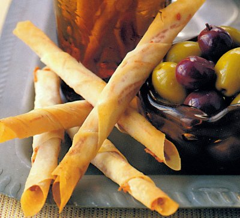

# Parma Ham Mikados

*These delicate, crispy filo pastry appetizers are wrapped with thin Parma ham and finished with butter and mustard. Sophisticated and deceptively simple, they're irresistibly elegant served with green and black olives, perfect for pre-dinner drinks or special occasions.*

**Prep Time:** 15 minutes
**Cook Time:** 2 minutes
**Yield:** 12 mikados

## Overview

Parma ham mikados are the apotheosis of simple elegance: delicate filo pastry wrapped with thin Parma ham, buttered and mustard-enriched, then briefly crisped in a hot oven. The interior ham remains tender while the filo exterior becomes shatteringly crisp. Success depends on handling filo gently (to avoid tearing), using quality Parma ham (thinly sliced), and baking briefly enough to crisp without hardening. These must be eaten immediately; cold or at room temperature, they lose their appeal. The name "mikados" refers to the Japanese term for emperors, these are regal appetizers.

## Ingredients

### Base & Wrapping
- 12 filo squares (approximately 12 x 10 centimeters each)
- 12 very thin slices Parma ham (preferably imported, authentic Parma)

### Butter & Seasoning Mixture
- 100 grams butter (softened, at room temperature)
- 30 grams strong Dijon mustard (approximately 1 tablespoon, pungent style preferred)

### Equipment
- Light oil (for greasing baking sheet)

## Method

### Stage 1 – Prepare Parma Ham
1. Place 12 filo squares on a clean work surface.
1. Take 12 very thin slices of Parma ham.
1. Each slice should be thin enough to see through.
1. Using a sharp knife, cut each Parma ham slice into very fine julienne (thin matchsticks).
1. Keep the julienne strips separated (not bundled together).
1. Set aside.

### Stage 2 – Prepare Butter-Mustard Mixture
1. In a small bowl, combine 100 grams softened butter with 30 grams strong Dijon mustard.
1. Mix together thoroughly with a spoon until the mustard is completely incorporated and uniform.
1. The mixture should have a pale tan color from the mustard.
1. The aroma should be distinctly mustard-forward (this is correct; the butter will temper it in the baking).

### Stage 3 – Brush Filo Squares
1. Preheat oven to 180°C (350°F).
1. Lightly oil a baking sheet.
1. Take 1 filo square and place it flat on the work surface with one corner facing you.
1. Using a small pastry brush, brush both sides of the filo square very lightly with the butter-mustard mixture (use sparingly; too much creates soggy, greasy filo).
1. Each square should be lightly coated, not dripping.
1. Place the brushed filo square back on the work surface.

### Stage 4 – Arrange Ham on Filo
1. Take one shredded bundle of Parma ham (the julienne cut earlier).
1. Lay it across the filo square, running roughly side-to-side (crosswise to the corner facing you).
1. The ham strands should cover approximately 1/3 to 1/2 of the filo square's surface.
1. The julienne should be somewhat loose and airy, not tightly packed.

### Stage 5 – Roll Filo Around Ham
1. Starting at the corner nearest to you, lift and roll the filo square over the ham shreds, enclosing them.
1. Press gently as you roll, creating a small cylindrical package.
1. Roll until you've created a thin, pencil-sized roll approximately 8-10 centimeters long.
1. Place the rolled mikado seam-side down onto the prepared baking sheet.
1. The finished mikado should look like a small, delicate pastry roll.
1. Repeat with remaining filo squares and ham until all 12 are assembled.

### Stage 6 – Bake Mikados
1. Place the baking sheet in the preheated 180°C oven.
1. Bake for exactly 2 minutes.
1. The filo will not brown significantly in this brief time; instead, it will become crispy and set.
1. Remove from the oven as soon as 2 minutes have elapsed.
1. The mikados should look pale golden, not dark or darkly browned (browning indicates over-baking).

### Stage 7 – Remove & Serve
1. Using a small palette knife (offset spatula), very carefully lift each mikado from the baking sheet.
1. Handle gently; they're delicate while still warm.
1. Transfer to a serving platter.
1. Serve immediately while still warm (warm filo is crispy; cool filo becomes limp).
1. Traditionally, arrange on a platter with green and black olives scattered between the mikados.

## Notes
- **Filo Handling Gentle:** Filo tears easily; handle with care. Small tears won't affect the final product, but rough handling creates ragged results.
- **Parma Ham Quality:** Authentic imported Parma ham is essential; domestic "prosciutto" creates different character and texture.
- **Butter-Mustard Ratio:** Equal parts (by weight or volume) butter and mustard creates the correct balance; too little mustard and the flavor is bland; too much and it becomes acrid.
- **Light Brushing:** Heavy application of butter-mustard creates soggy, greasy mikados; light brushing on both sides is correct.
- **Filo Thickness:** The thin pastry creates the characteristic delicate crispness; thicker pastry creates tough, doughy result.
- **Baking Time Exact:** 2 minutes is precise; 30 seconds more and the filo begins to brown and toughen; less and it's not fully crisped.
- **Immediate Service Essential:** These are at their peak within 5 minutes of baking; after 10 minutes, they absorb atmospheric moisture and soften.
- **Oven Temperature:** 180°C is ideal; higher temps brown the filo before it crisps; lower temps don't create proper crispness.

## Variations
**Without Mustard:** Use butter alone, brushed onto the filo (creates different, milder flavor).
**With Herbed Butter:** Mix 1/2 teaspoon finely chopped fresh herbs (tarragon, thyme, or parsley) into the butter-mustard mixture.
**With Arugula:** Add a small leaf of fresh arugula under the Parma ham before rolling for peppery note (non-traditional but interesting).
**Smoked Salmon Version:** Substitute thin smoked salmon slices for Parma ham (creates different character entirely).
**With Truffle Oil:** Add 1-2 drops black truffle oil to the butter-mustard mixture for luxury version (use very sparingly).

## Serving
Perfect with: Green and black olives, before-dinner drinks (champagne, cocktails), small bites at parties, sophisticated appetizer platter
Temperature: Warm (within 5 minutes of baking)
Ratio: 2-3 mikados per person
Context: Elegant pre-dinner appetizer, cocktail reception, special occasion canapé, sophisticated nibbles

## Storage
- Best served fresh and warm (within 10 minutes of baking).
- Refrigerate unbaked prepared mikados on a baking sheet (covered loosely) for up to 4 hours and bake just before service.
- Baked mikados do not store well; texture deteriorates quickly.
- Can be partially assembled ahead: brushed, ham-topped filo squares can be refrigerated for up to 2 hours before rolling and baking.
- Do not freeze; filo texture degrades significantly.
- For multiple batches at a gathering: prepare filo-ham combinations ahead, roll at the last minute, and bake in small batches for continuous supply of warm, fresh mikados.