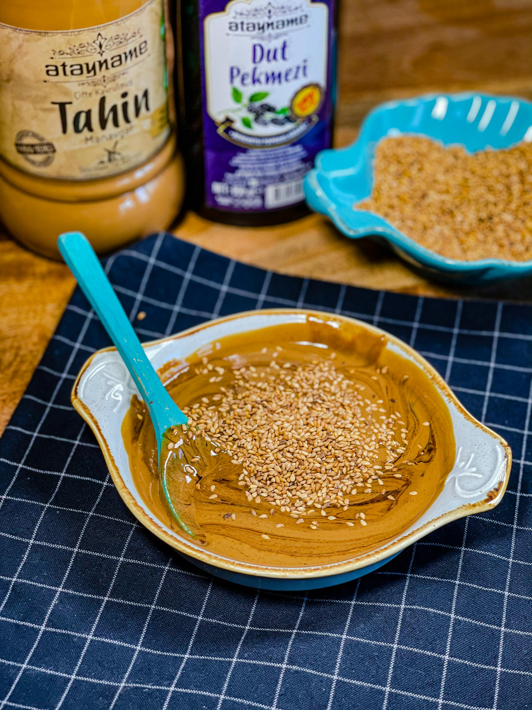

# Tahina Dip

*Tahina (sesame seed paste) differs from tahini primarily in its tanginess and complexity. While tahini is rich, slightly bitter and sweet, tahina has a more complex, tangy character that makes it equally at home as a dip on its own or combined with chickpeas. This simple preparation celebrates the paste's inherent qualities: sesame richness, lemon brightness, and garlic pungency tempered by water into creamy consistency.*

**Prep Time:** 10 minutes
**Yield:** Approximately 200 milliliters (4-5 servings as appetizer dip)

## Overview
Tahina dip is the essence of simplicity: sesame seed paste, crushed garlic, fresh lemon juice, and water combined into silky, pourable consistency. Unlike hummus (which combines chickpeas with tahina) or tahina bi lemon (which uses fewer ingredients), this version is tahina-forward, allowing the sesame paste's complex flavor to shine. The crushed garlic provides pungency that tempers the richness, while lemon juice adds brightness and prevents the dip from tasting flat. Water transforms thick paste into pourable dip through careful gradual addition. The result is elegant, versatile, and perfect alongside warm pita, raw vegetables, or as an accompaniment to grilled meats.

## Ingredients

### Base
- 30 milliliters tahina paste (full-fat, good quality)

### Aromatics & Acid
- 1 garlic clove (medium, raw)
- Juice of 1 lemon (approximately 2-3 tablespoons fresh juice)
- Fine sea salt to taste (approximately 1/8 teaspoon, adjusted)

### Textural Adjustment
- 3-4 tablespoons cold water (added gradually)

### Garnish (Optional)
- 1-2 small sprigs fresh flat-leaf parsley (finely chopped)
- Optional: light drizzle of olive oil

## Method

### Stage 1 – Prepare Garlic
1. Take 1 medium garlic clove.
1. Peel away the papery outer skin.
1. Using a mortar and pestle (or the side of a large knife on a cutting board), crush the garlic with approximately 1/8 teaspoon fine sea salt.
1. Continue crushing until the garlic becomes a fine paste (approximately 1-2 minutes).
1. The salt acts as an abrasive, helping to break down the garlic cells into a smoother paste.
1. The garlic-salt combination should smell pungent and aromatic.

### Stage 2 – Prepare Tahina Paste
1. Stir 30 milliliters tahina paste in its container with a spoon to ensure any oil that has risen to the surface is reincorporated.
1. The tahina should look uniform, thick, and almost putty-like.
1. Note: Tahina is often quite thick and doesn't pour; this is normal and expected.
1. Transfer the tahina to a clean bowl (preferably not metal, as tahina reacts slightly with aluminum).

### Stage 3 – Combine Tahina & Garlic
1. Add the crushed garlic paste to the tahina.
1. Using a spoon, stir and fold the garlic into the tahina thoroughly.
1. The mixture will remain quite thick; this is correct for this stage.
1. Continue stirring until the garlic is fully incorporated and evenly distributed.

### Stage 4 – Add Lemon Juice Gradually
1. Have 2-3 tablespoons fresh lemon juice ready (squeezed from approximately 1 lemon immediately before use).
1. Add the lemon juice to the tahina-garlic mixture gradually, approximately 1 tablespoon at a time.
1. With each addition of lemon juice, stir vigorously with a spoon.
1. The mixture will initially look as though it's breaking or separating; this is temporary and expected.
1. Continue stirring after adding each tablespoon of lemon juice.
1. Gradually, as you continue stirring, the mixture will emulsify and become creamy rather than separated.
1. The color and texture will change from thick, muddy paste to lighter, creamier consistency.
1. This emulsification happens through vigorous stirring; don't expect it to be instantaneous.

### Stage 5 – Adjust Consistency with Water
1. Once all lemon juice is incorporated and the mixture looks creamy, assess the thickness.
1. The dip should be pourable but not soupy; think between mayonnaise and Greek yogurt in consistency.
1. Begin adding water very gradually, approximately 1 tablespoon at a time.
1. After each tablespoon of water, stir thoroughly.
1. The mixture will become progressively thinner and lighter in color.
1. Continue adding water until you reach desired consistency (you may not need all 3-4 tablespoons if the initial emulsification created a loose texture).
1. The final consistency should pour slowly from a spoon but not run like water.

### Stage 6 – Taste & Season
1. Taste a small spoonful of the tahina dip.
1. The flavor should be distinctly sesame, with noticeable garlic pungency and lemon brightness.
1. If too strong in garlic, add another spoonful of water to dilute slightly.
1. If too thick, add water in small increments (1 teaspoon at a time).
1. If too thin, allow to sit at room temperature for 15-20 minutes; it will thicken slightly as emulsification sets.
1. Salt is likely sufficient from the garlic-crushing step, but taste and add additional pinch if needed (be conservative; too much salt overwhelms sesame flavor).

### Stage 7 – Serve
1. Transfer the tahina dip to a shallow serving bowl.
1. Optional: Create a small indent in the center with the back of a spoon.
1. Optional: Drizzle a tiny amount of olive oil in the indent.
1. Optional: Scatter a small amount of finely chopped fresh parsley across the top for color and fresh herb note.
1. Serve with warm pita bread, fresh vegetable crudités, or alongside grilled meats and other mezze items.

## Notes
- **Tahina Quality Critical:** Good quality tahina (not bitter, not stale tasting) is essential; poor quality creates off-flavored dip.
- **Oil Separation Normal:** Tahina naturally separates; stirring before use reincorporates oil (if you cannot, discard separated oil and use the bottom paste).
- **Gradual Lemon-Stirring Essential:** Adding lemon juice all at once creates broken, separated result; gradual addition with constant stirring creates smooth emulsion.
- **Water Adjustment Critical:** Water is added gradually to control consistency; all at once creates too-thin dip.
- **Emulsification Patience:** The transformation from broken-looking to creamy takes vigorous stirring for 1-2 minutes; don't give up too early.
- **Garlic Rawness:** Some prefer their tahina dip without raw garlic (instead stirred in gently); this is purely personal preference.
- **Lemon Juice Fresh Only:** Bottled lemon juice creates flat, chemical-tasting result; fresh is essential.
- **Salt in Garlic:** Crushing garlic with salt creates smoother paste than crushing garlic alone; this is a time-tested technique.

## Variations
**Hummus bi Tahina:** Add 100 grams cooked chickpeas (or 4 tablespoons chickpea purée) to finished tahina for richer, more substantial dip.
**With Cumin:** Add 1/8 teaspoon ground cumin to the tahina for warmth and spice.
**Extra Garlicky:** Increase garlic to 1.5-2 cloves for more assertive character (taste carefully; garlic can become harsh).
**Herbed Version:** Add 1 tablespoon finely chopped fresh parsley or coriander mixed into the finished dip for herbaceous note.
**Paprika Finish:** Dust the top with a light sprinkle of paprika (sweet or smoked) for color and subtle spice.

## Serving
Serve with: Warm pita bread, fresh vegetable crudités (carrots, celery, bell peppers, cucumbers), olives, grilled meats, as part of mezze spread, with falafel
Temperature: Room temperature
Ratio: 30-40ml per person as appetizer dip
Context: Middle Eastern meals, vegetarian appetizer, mezze spread, dipping accompaniment, light lunch

## Storage
- Refrigerate in a sealed glass container for up to 5-7 days.
- Tahina dip thickens as it cools; allow to come to room temperature for 20-30 minutes before serving, or gently stir in a teaspoon of water to restore pourable consistency.
- Can be frozen for up to 2 months in sealed containers; thaw in refrigerator overnight and stir vigorously to restore creaminess.
- A thin layer of olive oil on the surface helps protect from drying; recommended for long-term storage.
- Do not microwave; heat damages the delicate emulsified texture.
- The dip will separate slightly as it sits (this is normal); vigorous stirring before serving restores smoothness.
- Fresh tahina dip tastes best within 2-3 days; after that, emulsification can begin to break and flavors mellow.

