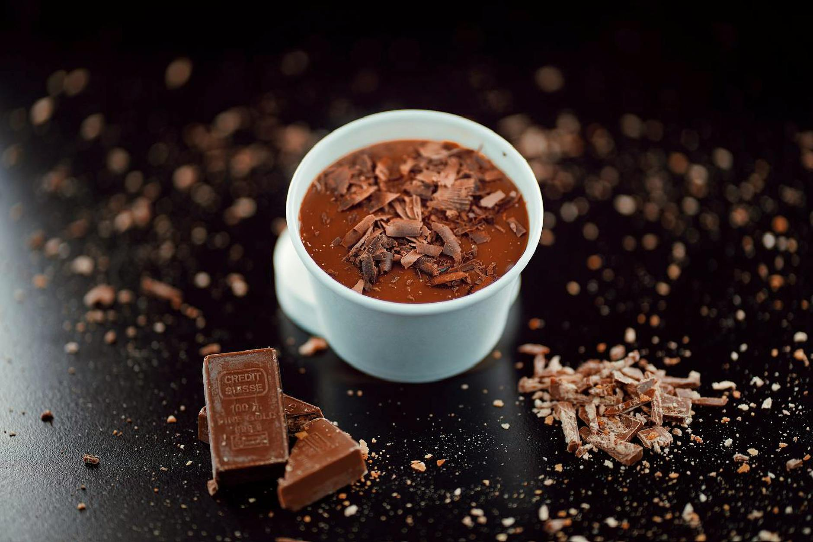

# Chocolate crème pâtissière

*A classic French tartlet filling, that also forms the basis of other classic sauces. Add a little cocoa or coffee powder to the custard instead of the vanilla to give you a chocolate or coffee-flavoured cream. If you use cocoa, use a little less flour and add a touch more sugar.*

**Serves:** 750 grams

## Overview
Chocolate crème pâtissière is a rich, velvety custard-based cream infused with melted chocolate. This versatile cream serves as an elegant filling for tartlets and desserts, with the deep chocolate flavor complementing both simple and elaborate presentations. The smooth texture and balanced sweetness make it an essential component in a pastry chef's repertoire.

## Ingredients
- 6 egg yolks
- 125 grams sugar
- 40 grams flour
- 500 ml milk
- 1 vanilla pod (split length-ways)
- 75 grams chocolate (grated)

## Method
1. Place the egg yolks and about one-third of the sugar in a bowl and whisk until they are pale and form a light ribbon. 
1. Sift in the flour and mix well.
1. Combine the milk, the remaining sugar and the split vanilla pod in a saucepan and bring to the boil. 
1. As soon as the mixture bubbles, pour about one-third onto the egg mixture, stirring all the time. 
1. Pour the mixture back into the pan and cook over a gentle heat, stirring continuously. 
1. Heat gently for 2 minutes, then tip the custard into a bowl.
1. Stir in the chocolate until it has completely melted.
1. If needing to cool the custard before using, place the bowl over a larger bowl of iced water, stirring occasionally.
1. If leaving to cool naturally then dust lightly with icing sugar, or dot with flakes of butter to prevent a skin forming as the custard cools.

## Notes
- Chocolate crème pâtissière must reach 2 minutes of gentle heat to fully cook the flour and eliminate any raw flour taste
- The chocolate should be finely grated or chopped to melt smoothly and evenly throughout the custard
- Adding the hot milk to the egg-flour mixture gradually prevents curdling and ensures a silky smooth texture
- A skin forms naturally as the cream cools; prevent this by dusting with icing sugar or dotting with butter

## Serving
Serve chilled as a filling for tartlets, éclairs, or pastry-based desserts. The cream can be piped directly into pastry shells or spread smoothly with a palette knife. Pairs beautifully with fresh berries, poached pears, or caramelized fruits. Often garnished with cocoa powder or chocolate shavings for added elegance.

## Storage
Store the finished crème pâtissière in an airtight container in the refrigerator for up to 3 days. If you need to prepare it in advance, cover the surface directly with plastic wrap to prevent a skin from forming. The cream can be briefly warmed and stirred to restore its smooth consistency before use.