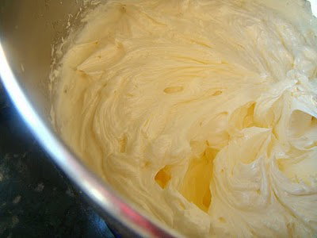

# Crème au beurre

*Butter-cream made with meringue italienne is a simple, easy to make cream, which can be used in many recipes, including all sorts of biscuit and sponge based desserts. Its great advantage is that it is neither too rich nor too sickly.*

**Serves:** 1.3kg

## Overview
Crème au beurre is an elegant butter-based cream that combines the lightness of Italian meringue with rich, creamy butter. This sophisticated filling is versatile enough for both classic and contemporary desserts, offering a perfect balance of richness and delicacy. The velvety texture and subtle sweetness make it ideal for layering between cake layers or piping into decorative borders.

## Ingredients
### Meringue Italienne
- 250 ml water
- 700 grams sugar
- 50 grams glucose
- 9 egg whites

### For the Crème au beurre
- 1 kilogram butter (at room temperature)

## Method
1. Using the ingredients, make one quantity of Meringue Italienne.
1. When the meringue is almost cold, set the mixer on low speed and beat in the butter, a little at a time. 
1. Beat for about 5 minutes until the mixture is very smooth and homogeneous.

## Notes
- The meringue must be almost completely cooled before adding butter; warm meringue will cause the butter to separate and the cream to become greasy
- Add butter gradually while mixing at low speed to ensure smooth, homogeneous incorporation
- Beating for the full 5 minutes is essential for achieving the light, creamy texture that distinguishes quality crème au beurre
- If the mixture appears separated or grainy, gently warm it (not above 35°C) and re-beat until smooth

## Serving
Use crème au beurre as a filling between cake layers, as a frosting for desserts, or piped into decorative borders and rosettes. Flavor variations can be created by adding vanilla, chocolate, coffee, praline, or liqueurs to the finished cream. The cream's smooth texture makes it ideal for creating elegant, professionally-finished desserts.

## Storage
Refrigerate in an airtight container for up to 5 days, or freeze for up to 1 month. Before using refrigerated cream, bring it to room temperature and gently re-beat for 1-2 minutes to restore the light, fluffy texture. The cream may be softer than desired at room temperature; chill briefly if needed before piping.