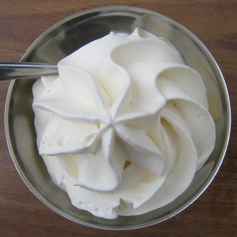

# Crème chantilly

*Crème Chantilly is used to lighten and enrich numerous creams - the Crème pâtissière in an Alméria for example. It can also be served just as it is and will complement many desserts, fruits or ice creams.*

**Serves:** 600 grams

## Overview
Crème Chantilly, or whipped cream, is a classic component that adds lightness and elegance to virtually any dessert. Whether served plain with fresh fruit or incorporated into other creams, its airy texture and subtle sweetness enhance both simple and sophisticated preparations. Flavor variations such as chocolate or coffee versions expand its versatility in the pastry kitchen.

## Ingredients
### For all the creams
- 500 ml whipping cream (well chilled)
- 50 grams icing sugar
- 2 drops vanilla extract (optional)

### For the chocolate cream
- 150 grams  plain chocolate

### For the coffee cream
- 1 tablespoon hot milk
- 1 tablespoon coffee extract (or 2 tablespoons instant coffee)

## Method
### Crème Chantilly
1. Combine the well chilled cream with the sugar and vanilla in a chilled mixer bowl and beat at a medium speed for 1 or 2 minutes. 
1. Increase the speed and beat for 3 or 4 minutes, until the cream begins to thicken. 
1. Do not over beat, or the cream may turn into butter. 
1. It should be a little firmer than ribbon stage.

### Chocolate Chantilly
1. Melt the chocolate in a double boiler, the temperature should not exceed 35°C. 
1. Remove from the heat and whisk in one-third of the plain Crème Chantilly. 
1. Fold gently and delicately into the remaining Crème Chantilly. 
1. Do not overwork the mixture.

### Coffee Chantilly
1. Dissolve the coffee in the hot milk, and allow to cool. 
1. Add it when you beat the cream.

## Notes
- All equipment must be well chilled, including the mixer bowl and beaters, to achieve maximum volume when whipping
- Whip at medium speed initially, then increase to high speed once the cream begins to thicken; avoid over-beating which turns cream to butter
- The target consistency is slightly firmer than ribbon stage, the cream should hold soft peaks
- Dairy cream with higher fat content (at least 35%) produces the most stable whipped cream

## Serving
Serve crème Chantilly chilled alongside fresh fruit compotes, warm desserts, or alone with fresh berries. Use as a filling between cake layers, a topping for warm desserts, or part of more complex cream preparations. Chocolate and coffee variations pair beautifully with both light and rich desserts.

## Storage
Whipped crème Chantilly is best served immediately after preparation. Refrigerate for up to 24 hours; the cream will gradually separate slightly. If separation occurs, gently re-whip for 30 seconds. For longer storage (up to 2 days), cover the surface with plastic wrap to prevent skin formation and protect flavor from absorbing other odors.