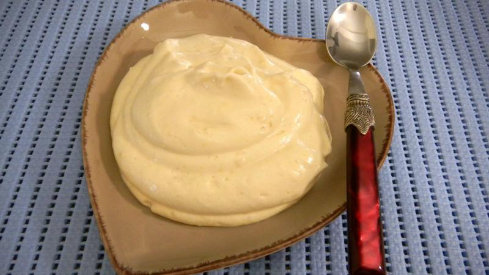

# Crème chiboust

*This crème brings together the richness of crème pâtissière with the lightness of Italian meringue, creating an exceptionally light and elegant cream.*

**Serves:** 1.3kg

## Overview
Crème chiboust is a sophisticated cream that marries the velvety texture of custard with the airy lightness of Italian meringue. The addition of Grand Marnier introduces a subtle floral note that elevates desserts. This cream is best used immediately after preparation to preserve its delicate, mousse-like consistency.

## Ingredients

### For the Crème pâtissière
- 6 egg yolks
- 80 grams sugar
- 30 grams custard powder
- 350 ml milk
- half a vanilla pod

### For the Meringue Italienne
- 80 ml water
- 360 grams sugar
- 30 grams glucose
- 6 egg whites

### For the Crème chiboust
-  50 ml Grand Marnier

## Method
1. Using the ingredients, make a quantity of Crème pâtissière and Meringue Italienne
1. Stir in the alcohol into the Crème pâtissière, and with a whisk, stir in one-third of the Meringue Italienne . 
1. Then, with a spatula, gently fold in the remaining Meringue Italienne until the mixture is completely homogeneous.
1. Do not overwork, or the cream will collapse and lose its lightness.

**Note**: You must use this cream as soon as you have mixed in the meringue italienne, so it is essential to have the rest of the dessert ready before finishing the Crème Chiboust.

## Notes
- Timing is critical; prepare all other dessert components before beginning the cream so assembly can be immediate
- Fold the meringue gently with a spatula using lifting motions; aggressive stirring deflates the mixture
- The alcohol dissolves into the crème pâtissière before meringue is added to distribute the flavor evenly
- The temperature contrast between the warm custard and cooled meringue should be minimal to prevent texture loss

## Serving
Use crème chiboust immediately as a filling for tarts, St. Honoré cakes, or mousse-based desserts. Its light texture makes it particularly suited to delicate presentations. Often torched or browned under the grill for added visual appeal.

## Storage
Best consumed immediately; do not store prepared crème chiboust as the meringue will gradually weep and separate. If necessary, refrigerate for a maximum of 1-2 hours in an airtight container, though texture degradation is expected.
