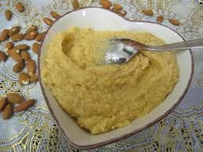

# Crème d'amande

*An almond-based cream with a delicate, nutty flavor and a slightly creamy texture.*

**Serves:** 1kg

## Overview
Crème d'amande is a smooth, nutty cream that showcases the natural flavors of ground almonds combined with butter and eggs. This versatile cream provides richness and subtle almond undertones to pastries and tarts. Its straightforward preparation and elegant flavor make it a valued component in both classic and contemporary pastry work.

## Ingredients
- 250 grams butter
- 500 grams [Tant pour tant](../../base-ingredients/baking/tant-pour-tant.md)
- 50 grams flour
- 5 eggs
- 50 ml rum (optional)

## Method
1. Work the butter with the beater or spatula until very soft. 
1. Still beating, work in the tant pour tant and the flour, then the eggs one by one, beating between each addition. 
1. The mixture should be light and homogeneous. 
1. Stir in the rum.

## Notes
- Soften the butter thoroughly before beginning; it should be spreadable but not melted or oily
- Tant pour tant (equal parts ground almonds and powdered sugar) should be sifted to remove lumps for a smooth, even texture
- Add eggs one at a time to ensure they are fully incorporated; this prevents the mixture from becoming grainy
- The optional rum adds depth; other liqueurs such as Grand Marnier or Kirsch offer interesting flavor variations

## Serving
Use crème d'amande as a filling for flan cases, as a base for tarts, or piped into decorative patterns. Often topped with sliced almonds, fresh fruit, or candied peel. Pairs beautifully with both light and rich desserts.

## Storage
Refrigerate in an airtight container for up to 4 days. The cream can be frozen for up to 1 month; thaw at room temperature and re-beat briefly if the texture appears separated. Bring to room temperature for 30 minutes before piping or spreading.