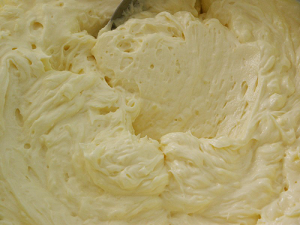

# Crème Mousseline

*A light and luxurious cream combining the structure of crème pâtissière with the richness of butter, creating an exceptionally smooth and creamy filling.*

**Serves:** 1.3kg

## Overview
Crème Mousseline is an elevated variation of crème au beurre, incorporating cooked custard with butter to create a lighter, more delicate texture. The flavoring options make it endlessly adaptable, allowing pastry chefs to craft custom creams for specific dessert applications. Its velvety smoothness and rich flavor profile make it ideal for festive and sophisticated presentations.

## Ingredients
- 750 grams [Crème pâtissière](./creme-patissiere.md) (without flavouring)
- 250 grams butter (cut into pieces)
- flavouring of your choice (caramel, chocolate, coffee, praline, Grand Marnier)

## Method
1. As soon as the Crème pâtissière is cooked, take the pan off the heat and beat in one-third of the butter. 
1. Pour into a bowl over cold water and ice, stirring occasionally to prevent a skin from forming.
1. Place the remaining butter in the bowl of the mixer and beat at a low speed for 3 minutes, until rather pale. 
1. Increase the speed to maximum, and add the cooled Crème pâtissière, a little at a time. 
1. Beat for 5 minutes until the cream is perfectly light and creamy.
1. Add the flavouring of your choice, or leave the cream plain. It is now ready to use.

## Notes
- Beating the first portion of butter into the hot custard immediately after cooking helps it cool evenly and prevents skin formation
- The second beating of cold butter (3 minutes at low speed) is crucial for incorporating air and creating the characteristic light texture
- Temperature control is essential; the crème pâtissière must be cool to room temperature before final beating with butter
- Flavor additions such as caramel, chocolate, coffee, or liqueurs should be added after the 5-minute beating to preserve the cream's airy texture

## Serving
Pipe crème Mousseline into decorative rosettes, borders, and fills. Use as a cake filling or serve dolloped on desserts. Its luxurious texture makes it suitable for elegant plated presentations and special occasion cakes.

## Storage
Refrigerate in an airtight container for up to 5 days. Freeze for up to 1 month before use. Allow frozen cream to thaw at room temperature (2-3 hours) and gently re-beat for 1-2 minutes to restore texture if needed.