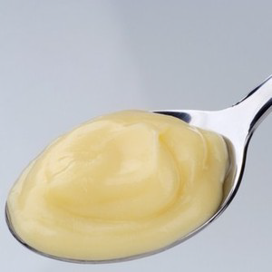

# Crème pâtissière (Confectioners' custard)

*A classic French tartlet filling, that also forms the basis of other classic sauces. Add a little cocoa or coffee powder to the custard instead of the vanilla to give you a chocolate or coffee-flavoured cream. If you use cocoa, use a little less flour and add a touch more sugar.*

**Serves:** 750 grams

## Overview
Crème pâtissière is the foundation of French pastry, serving as a versatile custard cream for fillings, sauces, and as a base for other cream preparations. Its smooth texture and delicate vanilla flavor provide an elegant backdrop for a wide range of desserts. The technique of tempering eggs and cooking with starch creates a silky, stable cream essential to pastry work.

## Ingredients
- 6 egg yolks
- 125 grams sugar
- 40 grams flour
- 500 ml milk
- 1 vanilla pod (split length-ways)

## Method
1. Place the egg yolks and about one-third of the sugar in a bowl and whisk until they are pale and form a light ribbon. 
1. Sift in the flour and mix well.
1. Combine the milk, the remaining sugar and the split vanilla pod in a saucepan and bring to the boil. 
1. As soon as the mixture bubbles, pour about one-third onto the egg mixture, stirring all the time. 
1. Pour the mixture back into the pan and cook over a gentle heat, stirring continuously. 
1. Heat gently for 2 minutes, then tip the custard into a bowl.
1. If needing to cool the custard before using, place the bowl over a larger bowl of iced water, stirring occasionally.
1. If leaving to cool naturally then dust lightly with icing sugar, or dot with flakes of butter to prevent a skin forming as the custard cools.

## Notes
- Whisking the egg yolks and sugar pale (ribbon stage) incorporates air and ensures smooth incorporation of flour
- Sifting flour is essential to prevent lumps; adding flour to wet eggs creates irreversible clumps
- Tempering occurs when hot milk is gradually added to egg mixture while stirring, this prevents curdling
- The 2-minute gentle cooking after returning to pan fully cooks the flour and eliminates any starchy taste

## Serving
Serve as a filling for tartlets, éclairs, and French pastries. Use as a base for crème Mousseline, crème au beurre, or crème chiboust. Flavor variations (chocolate, coffee, praline) expand its versatility. Often topped with fresh fruit, chocolate shavings, or candied peel.

## Storage
Refrigerate in an airtight container for up to 3 days. Cover the surface directly with plastic wrap to prevent skin formation. Bring to room temperature before use or gently warm and stir to restore smoothness. The cream can be briefly whisked with additional liquid to adjust consistency.