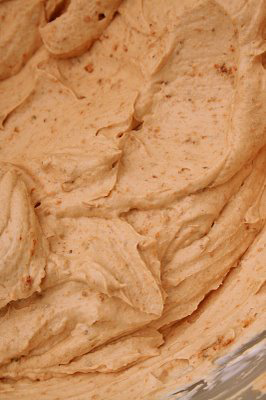

# Crème Pralinée

*This is one of those creams which seems particularly delicious in winter. Its delicate, nutty flavour makes it perfect for filling all kinds of biscuit and sponge based desserts.*

**Serves:** 1.25 kg

## Overview
Crème Pralinée combines the richness of crème pâtissière with the lightness of crème Chantilly, infused with the distinctive flavor of crushed praline and caramelized hazelnuts. This elegant cream showcases the warmth and depth of roasted nuts, making it particularly suited to autumn and winter desserts. Its sophisticated flavor profile elevates both simple cakes and elaborate presentations.

## Ingredients
- 500 grams [Crème pâtissière](./creme-patissiere.md)
- 500 grams [Crème Chantilly](./creme-chantilly.md)
- 150 grams praline (crushed)
- 100 grams hazelnuts (shelled)
- 1 pinch icing sugar

## Method
1. In a bowl, combine one-third of the Crème pâtissière with the praline and whisk together until thoroughly mixed. 
1. Add the rest of the Crème pâtissière and mix well again using the whisk.
1. Using a spatula, gently fold in the Crème Chantilly.
1. If you want to add hazelnuts to the mixture, first place them under a very hot grill to detach the papery skin, then rub them in a cloth to remove the skin completely. 
1. Arrange the nuts in a grill pan, sprinkle with the icing sugar and replace under the grill until lightly caramelized. 
1. Leave to cool completely.
1. When the nuts have cooled, chop them with a knife, or crush coarsely with a rolling pin.
1. Fold them into the Crème Pralinée at the very last moment so that they remain crunchy.

## Notes
- Praline paste should be thoroughly whisked into one-third of the crème pâtissière first to ensure even flavor distribution
- Crème Chantilly must be folded gently with a spatula using lifting motions to preserve the airiness of the cream
- Caramelized hazelnuts add textural contrast; the caramel should reach a light amber color for optimal flavor
- Adding nuts at the very last moment preserves their crunch; early addition allows them to absorb moisture from the cream

## Serving
Use crème Pralinée as a filling for cakes, tarts, and mousse-based desserts. Pipe into decorative borders or dollop onto plated desserts. The nutty flavor pairs beautifully with chocolate, vanilla, or fruit-based components.

## Storage
Refrigerate in an airtight container for up to 48 hours; this shorter shelf life accounts for the whipped cream component. Do not freeze, as the Crème Chantilly will not recover well. Add caramelized nuts immediately before final assembly to maintain their crunch.