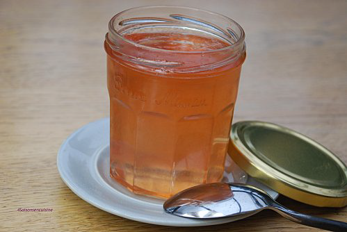

# Gelée de pommes

*A crystal-clear apple jelly that serves as an elegant glaze and garnish for desserts.*

**Serves:** 500 ml 

## Overview
Gelée de pommes is a refined apple jelly that captures the natural flavor and bright clarity of fresh apples. Its delicate sweetness and light texture make it an ideal glaze for tarts and desserts, adding both visual shine and fresh apple flavor. This classic French preparation demonstrates elegant simplicity in its technique and presentation.

## Ingredients
- 500 ml water
- 250 grams sugar
- 500 grams Cox's apples
- 6 leaves gelatine

## Method
1. Pour the water into a large saucepan and add the sugar. Heat until the sugar has dissolved completely and is beginning to boil, stirring with a whisk from time to time. 
1. Skim the surface if necessary.
1. Soak the gelatine leaves in cold water for 20 minutes then drain.
1. Wash the apples and coarsely chop, including the core and drop them into the boiling sugar syrup. 
1. Cover the saucepan and simmer for about 7 minutes. 
1. Take the pan off the heat and push the apples to one side so that you can drop in the drained gelatine and dissolve it. 
1. When it has dissolved, pass the mixture carefully through a conical strainer into a bowl.
1. Use the jelly as a glaze for various desserts when it is cold, but before it begins to set.

## Notes
- Clear, bright apple jelly depends on careful straining; pour the mixture slowly through cheesecloth or a fine strainer without pressing
- Avoid cloudy results by not squeezing the apples through the strainer; let gravity alone drain the liquid
- Simmering for only 7 minutes preserves the fresh apple flavor; overcooking dulls the taste
- Gelatine must be fully dissolved before straining; ensure the mixture is thoroughly incorporated

## Serving
Apply gelée de pommes as a glossy glaze over tarts, fresh fruit, or mousse-based desserts while still liquid. The clear jelly allows the colors beneath to show through beautifully. Often used to decorate plated desserts or as a component in fruit-based terminal presentations.

## Storage
Once set, cover the jelly with plastic wrap and refrigerate for up to 3 days. For longer storage (up to 1 week), ensure the jelly is sealed in an airtight container. Can be gently warmed over low heat to return to liquid state for re-glazing if needed.