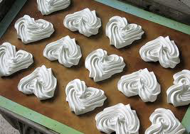

# Meringue Francaise (French Meringue)

*This meringue is light and fluffy, and melts in the mouth.*

**Serves:** For approximately 24 meringue discs or kisses

## Overview
Meringue Francaise is the simplest meringue preparation, requiring only whipped egg whites, sugar, and icing sugar. Its light, airy texture and delicate crunch make it ideal for countless applications from simple piped kisses to structural components in layered desserts. The gradual addition of sugar and careful folding of icing sugar preserves the airiness essential to this preparation.

## Ingredients
- 4 egg whites
- 125 grams sugar
- 125 grams icing sugar (sifted)

## Method
1. Preheat the oven to 120°C.
1. Whisk the egg whites until soft peaks form. 
1. Beat in the sugar, a little at a time and continue to beat for 10 minutes. 
1. The mixture should be firm and very smooth and shiny. 
1. Gradually sift in the icing sugar, folding it gently into the mixture with a slotted spoon. 
1. Do not overwork the mixture.
1. Pipe or spoon the mixture into a baking parchment or lightly buttered and floured greaseproof paper, using 2 soup spoons or a piping bag fitted with the appropriate nozzle.
1. Lower the oven temperature to 100°C and cook the meringues for 1 hour 45 minutes. 
1. The meringues are ready when the top and bottom are dry. 

### Meringue discs
1. On the baking parchment draw equal circles with a dark pencil, turn over the parchment and use these circles as a guide for the meringues.
1. Use a palette knife to make 4 mm high circles, and use these to construct a tower of cream and fruit meringues.

## Notes
- Ensure egg whites are completely free of yolk and that equipment (bowl, whisk) are immaculately clean and dry; even traces of fat prevent proper whipping
- Beat sugar in gradually (over 10 minutes) to create the thick, glossy meringue; quick addition results in a grainy texture
- Icing sugar must be sifted and folded gently to preserve the airy structure, aggressive stirring deflates the mixture
- The low oven temperature (100°C) dries the meringues slowly; higher heat browns the exterior before the interior dries

## Serving
Pipe meringue kisses directly onto parchment for simple petit fours, use as structural layers in cream- and fruit-filled desserts, or form into discs for stacking with crèmes and fresh fruit. Meringue towers showcase the airiness and delicate texture beautifully in plated presentations.

## Storage
Meringues are best stored in an airtight container with layers separated by parchment to prevent sticking. Keep in a cool, dry place (not the refrigerator) for up to 1 week. Do not freeze, as moisture loss during thawing destroys the delicate, crispy texture. The meringues absorb moisture from humidity; store with silica gel packets if the environment is damp.