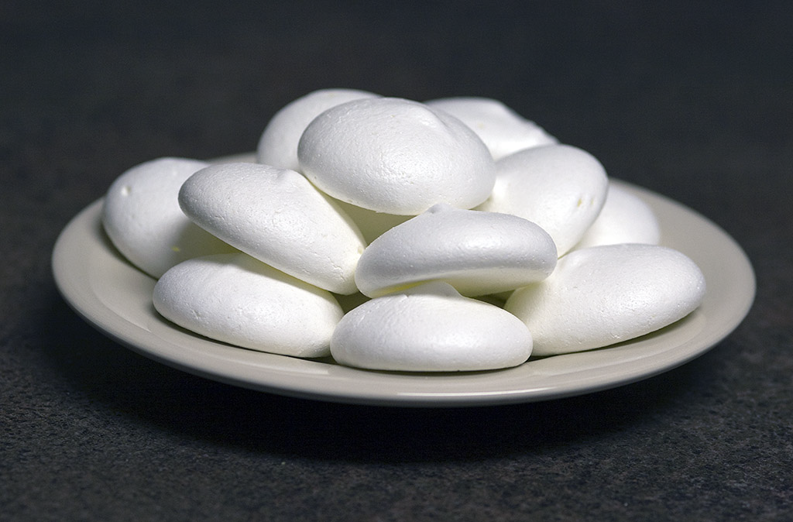

# Meringue Suisse (Swiss meringue)

*This meringue has a firmer, more solid texture than French meringue and is perfect for making decoration or for desert bases. It is not as delicate and melting as French meringue*

**Serves:** 8 - 10

## Overview
A sophisticated meringue created by heating egg whites and sugar over a water bath before whipping. The result is more stable and less grainy than French meringue, ideal for piped decorations, tortes, or as a base for other desserts. More forgiving than its French cousin, without sacrificing elegance.

## Ingredients
- 4 egg whites
- 300 grams sugar

## Method
1. Preheat the oven to 120°C
1. Combine the egg whites and sugar in a mixing bowl. 
1. Stand the bottom of the bowl in a bain-marie set over a direct heat. 
1. Beat the mixture continuously until it reaches a temperature of about 40°C.
1. Remove the bowl from the bain-marie and continue to beat until the mixture is completely cold.
1. Spoon the mixture onto baking parchment or lightly buttered and floured greaseproof paper, using 2 soup spoons, or use a piping bag fitted with different nozzles to pipe it into various shapes and sizes.
1. Lower the oven temperature to 100°C and cook the meringues for 1 hour and 45 minutes. 
1. They are ready when both the top and the bottom are dry.

## Notes
- **Bain-marie temperature:** Reaching 40°C ensures food safety from raw eggs while developing a silky texture.
- **Beating after heating:** Continued beating after cooling incorporates air and creates the firm peaks necessary for piping.
- **Egg whites:** Use room-temperature eggs for smoother incorporation and better volume.
- **Storage containers:** Use airtight, moisture-proof containers with desiccant packets.
- **Humidity:** Make meringues on dry days; humidity causes stickiness.

## Serving
Serve with: Tarts, bavarians, layered desserts, or on their own with fruit
Piping options: Shells, rosettes, or decorative borders

## Storage
- Keeps up to 2 weeks in a cool, dry place in airtight containers
- Can be made 3-4 days ahead for entertaining
- Does not freeze well, texture becomes grainy
- Keep away from moisture and humidity
- Individual meringues store longer than piped decorations