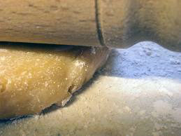

# Pâté à foncer (Flan Pastry)

*Traditionally this dough is used as a base for flans or tartlets.*

**Serves:** 480 grams

## Overview
Pâté à foncer is a tender, crumbly pastry traditionally used as the base for flans and tartlets. Its delicate texture and neutral flavor provide an elegant foundation that doesn't compete with fillings. The technique of rubbing fat into flour by hand creates the characteristic short, crumbly texture that distinguishes this pastry.

## Ingredients
- 250 grams flour
- 125 grams butter (softened)
- 1 size 3 egg 
- 1 teaspoon sugar
- ½ teaspoon salt
- 40 ml cold water

## Method
1. Place the flour on the work surface and make a well in the centre. 
1. Cut the butter into small pieces and place them in the well, together with the egg, sugar and salt. 
1. Rub in all these ingredients with the fingertips of your right hand, then, with your left hand, draw in the flour a little at a time.
1. When all the ingredients are almost amalgamated, add the water.
1. Knead the dough with the palm of your hand 4 or 5 times until completely mixed.
1. Roll the dough into a ball, flatten the top slightly, wrap in greaseproof paper or polythene and refrigerate for several hours before use.

## Notes
- This dough is delicate and should not be overworked; stop mixing as soon as all ingredients are combined to maintain crumbly texture
- Keep work surface and all ingredients cool; warm conditions cause the butter to soften and the dough to become tough
- Refrigeration is crucial; chilled dough is easier to line tart tins without shrinking or breaking
- The dough can be made 1-2 days in advance and stored wrapped in the refrigerator

## Serving
Line flan tins and tartlet molds with this pastry; bake blind (with dried beans or weights) at 200°C for 15 minutes before adding savory or sweet fillings. The tender pastry base provides elegant contrast to rich fillings like crème pâtissière, chocolate, or savory custards.

## Storage
Wrap unrolled dough and refrigerate for up to 2 days, or freeze for up to 1 month. Thaw frozen dough in the refrigerator before rolling. Once lining a tin, the dough can be refrigerated for up to 12 hours before baking or blind-baking.