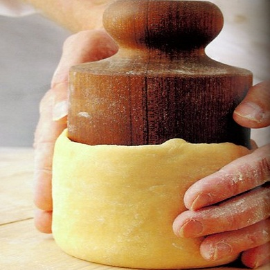

# Pâte moulée (Raised pie pastry)

*This pastry is best made at least two hours in advance, ideally 24 hours before you use it.*

**Serves:** 950 grams

## Overview
Pâte moulée is a rich, dense pastry traditionally used for raised pies and savory terrines. The high proportion of lard creates a tender, crumbly texture and rich flavor characteristic of traditional British charcuterie presentations. Its distinctive composition and handling technique set it apart from other pastry doughs.

## Ingredients
- 500 grams plain flour
- 20 grams salt
- 200 grams lard (cut into small pieces and softened)
- 5 egg yolks (mixed with 110 ml cold water)

## Method
1. Put the flour on the work surface and make a well.
1. Place the salt and lard in the centre.
1. Use your fingertips to mix and soften the ingredients in the well, gradually drawing in the flour and mixing with your fingertips.
1. When the dough has a fine grainy texture, make a well in the middle.
1. Gradually pour the egg yolks and water mixture into the well, mixing with your fingertips.
1. When the dough is well amalgamated, push it away from you 4 or 5 times with the heel of your hands to make it homogeneous.
1. Roll into a ball, wrap in cling film and refrigerate for at least 2 hours.
1. If it has rested in the refrigerator for a while, take it out an hour before rolling.

## Notes
- Lard is essential to this recipe; it creates the traditional texture and flavor that butter cannot replicate
- The fine grainy texture achieved during mixing determines the final crumbly consistency; do not overwork
- Resting for at least 2 hours (ideally overnight) allows the dough to relax and become more workable
- The dough should be pliable but not warm when rolling; take it from the refrigerator 1 hour before use

## Serving
Use pâte moulée to line raised pie molds for traditional British meat pies, terrines, or game-filled presentations. The pastry's density and rich flavor provide an ideal framework for savory fillings. Often baked until golden and served warm with accompaniments like aspic glaze.

## Storage
The dough can be refrigerated for 2-3 days wrapped in cling film. Freeze for up to 1 month; thaw in the refrigerator before rolling. Once lining a mold, refrigerate for up to 4 hours before baking. Baked pies can be stored in the refrigerator for 3-4 days.