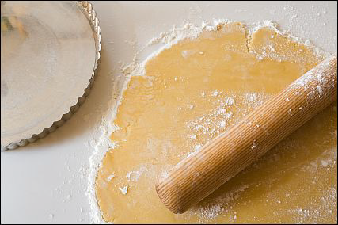

# Pâte brisée (Shortcrust)

*This light, crumbly, delicate shortcrust can be used as a substitute for puff pastry, but is always used to make classic flan and tartlet cases.*

**Serves:** 475 grams

## Overview
Pâte brisée is a classic French shortcrust pastry that serves as the foundation for elegant tarts and tartlets. Its tender, crumbly texture and neutral flavor provide a perfect base that complements both sweet and savory fillings without competing. The simple technique of rubbing fat into flour creates its characteristic short, delicate crumb.

## Ingredients
- 250 grams flour
- 150 grams butter (slightly softened)
- 1 egg
- 1 pinch caster sugar
- 1 teaspoon salt
- 1 tablespoon milk

## Method
1. Place the flour on the work surface and make a well in the centre.
1. Cut the butter into small pieces and place them in the well, together with the egg, sugar and salt.
1. Rub in all these ingredients with the fingertips of your right hand, then, with your left hand, draw in the flour a little at a time.  
1. When all the ingredients are almost amalgamated, add the cold milk. 
1. Knead the dough with the palm of your hand 4 or 5 times until completely mixed.
1. Roll the dough into a ball, flatten the top slightly, wrap in greaseproof paper or polythene and refrigerate for several hours before use.

## Notes
- Rubbing the cold butter into flour by hand creates the short, crumbly texture; do not use warm hands or over-rub
- Keep all ingredients cold; warm dough becomes tough during rolling
- The dough should be chilled for several hours (preferably overnight) before rolling and lining tins
- Work quickly and gently when lining tins; the delicate dough tears easily if overhandled or warm

## Serving
Line flan tins and tartlet molds with pâte brisée and blind-bake at 200°C for 15 minutes before adding fillings. Use as the base for fruit tarts (topped with crème pâtissière), chocolate tarts, or savory preparations with vegetable purees or custard fillings.

## Storage
Wrap unrolled dough and refrigerate for 2 days, or freeze for up to 1 month. Thaw frozen dough in the refrigerator before rolling. Once lining a tin, the dough can be refrigerated for up to 12 hours before baking. Blind-baked shells can be refrigerated for 1 day before filling.