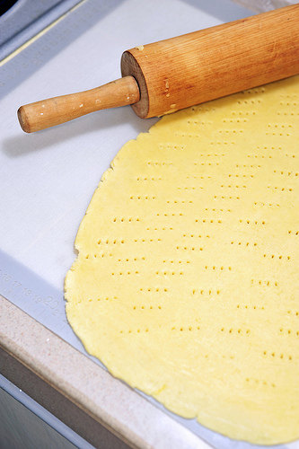

# Pâte sucrée (Sweet Short Pastry)

**Serves:** 520 grams

## Overview
Pâte sucrée is a sweet, tender pastry that serves as an elegant base for fruit tarts and pastries. The addition of sugar and eggs creates a richer dough than pâte brisée, while maintaining the characteristic shortbread-like texture. This pastry provides a sweet backdrop that complements both tart and rich fillings.

## Ingredients
- 250 grams flour
- 100 grams butter
- 100 grams icing sugar (sifted)
- 1 pinch salt
- 2 size 4 eggs (at room temperature)

## Method
1. Put the flour on the work surface and make a well in the centre. 
1. Cut the butter into small pieces, place them in the centre, then work with your fingertips until completely softened.
1. Add the sugar and salt, mix well together, then add the eggs and mix. 
1. Gradually draw the flour into the mixture.
1. When everything is thoroughly mixed, work the dough 2 or 3 times with the palm of your hand until it is very smooth.
1. Roll the dough into a ball, flatten the top slightly, wrap in greaseproof paper or polythene and refrigerate for several hours before use.

## Notes
- Unlike pâte sablée, flour is not the last ingredient; the dough is more cohesive and less delicate
- Ensure the butter is completely softened before adding eggs, preventing a grainy texture
- The dough becomes smooth with palm-of-hand working; this is normal for this recipe and differs from crumbly doughs
- Chilling is essential; the dough must be cold before rolling to prevent sticking

## Serving
Use pâte sucrée for elegant fruit tarts topped with crème pâtissiére and glazed fresh fruit. The sweet pastry base pairs beautifully with light, fruity fillings. Also suitable for chocolate tarts or cream-based desserts. Line tartlet molds for individual petit fours.

## Storage
Wrap unrolled dough and refrigerate for 2-3 days, or freeze for up to 1 month. Thaw frozen dough in the refrigerator before rolling. Once lining a tin, the dough can be refrigerated for up to 12 hours before blind-baking or filling. Blind-baked shells store in an airtight container for 2 days.