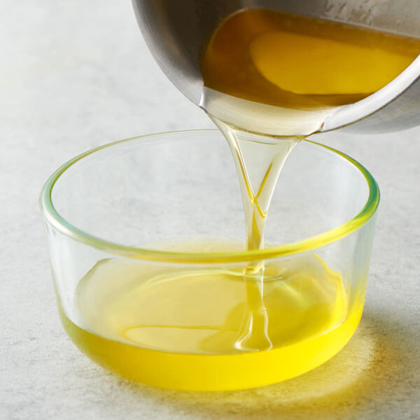

# Clarified Butter (Beurre Clarifié)

*Clarified butter is pure butterfat separated from milk solids and water. It has a higher smoke point than regular butter, making it ideal for high-heat cooking and classical French sauces.*

**Yield:** Approximately 85 grams (from 120 grams butter)

## Overview
Clarified butter is produced by gently melting butter and allowing its components to separate by density: water evaporates, milk solids either float or sink, and pure butterfat remains in the middle. The result is a clear golden liquid with a clean, buttery flavor and significantly higher smoke point (~450°F vs. ~350°F for regular butter). Essential for hollandaise, béarnaise, and high-heat sautéing.

## Ingredients
- 120 grams unsalted butter (room temperature)
- Water (none added; water content in butter evaporates naturally)

## Method

### Stage 1 – Melt Gently
1. Cut the unsalted butter into chunks.
1. Place in a heavy-bottomed saucepan.
1. Melt over very gentle, low heat, do not rush.
1. As the butter melts, foam (milk solids) will rise to the surface.

### Stage 2 – Skim Foam
1. As foam accumulates on the surface, skim it off carefully with a spoon or skimmer.
1. Continue skimming until the foaming stops (usually after 5-10 minutes of gentle melting).
1. Stop skimming once you see the clear golden liquid below.

### Stage 3 – Separate & Strain
1. Remove the saucepan from heat and let rest for 5 minutes to allow sediment to settle.
1. Carefully pour the clear golden liquid into a clean glass bowl, holding back the milky sediment at the bottom of the pan.
1. Discard the sediment (or save it for cooking stock, it has excellent flavor).
1. The clarified butter should be the color of pale olive oil.

### Stage 4 – Final Filtration (Optional)
1. For extra-clear clarified butter, pour through cheesecloth or a fine sieve into a storage container.
1. This removes any remaining sediment.

## Notes
- **Heat Gentleness:** Rushing the melting or using high heat damages the butter's flavor and creates too much foaming.
- **Yield Loss:** Expect to lose about 30% of the original weight in water and milk solids; 120 grams yields ~85 grams clarified.
- **Storage:** Keeps refrigerated for several weeks and can be frozen for up to 3 months.
- **Smoke Point:** The significantly higher smoke point makes this essential for classical meat cookery and sauce-making.
- **Ghee vs. Clarified Butter:** Ghee is clarified butter cooked longer until all water evaporates and milk solids brown slightly, adding nutty flavor.

## Variations
**Ghee (Indian Clarified Butter):** Continue heating after clarification until milk solids brown lightly, about 2-3 minutes more.
**Herbed Clarified Butter:** Infuse with thyme, rosemary, or bay leaf during the initial melting.

## Serving
Use for: Hollandaise sauce, béarnaise sauce, high-heat sautéing, cooking proteins, dipping sauce for lobster
Temperature: Warm or room temperature
Amount: As needed per recipe

## Storage
- Refrigerate in a glass jar for up to 4 weeks
- Freeze for up to 3 months
- The solid state when cold is normal; warm it gently before use
- Label with date of preparation
