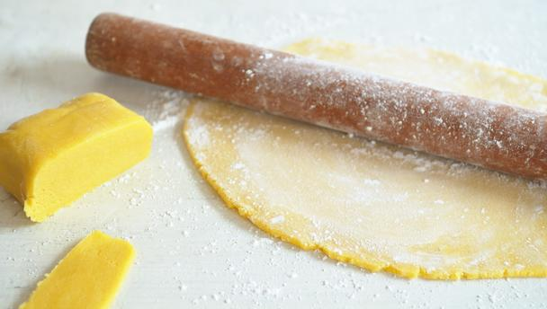

# Zesty Orange Marzipan

*Marzipan is a confection of ground almonds, sugar, and egg, traditionally used as cake coating on wedding and Christmas cakes. Orange zest adds brightness and complexity to traditional marzipan's mild almond sweetness.*

**Yield:** Approximately 500-550 grams

## Overview
Marzipan is a classical cake finishing technique particularly popular in English baking traditions, where it's rolled into thin sheets and applied under royal icing on celebration cakes. Orange zest elevates traditional marzipan beyond simple sweetness, adding citrus brightness. The egg binder creates a pliable paste that rolls smoothly without cracking. Fresh marzipan is better than commercial versions, more delicate, more pronounced almond flavor, and the orange adds a distinctive character perfect for special cakes.

## Ingredients

### Sugars & Almonds
- 175 grams caster sugar (fine sugar)
- 175 grams icing sugar (confectioner's sugar)
- 250 grams ground almonds (almond meal)

### Orange & Binding
- 1 medium orange (washed, zest separated from juice)
- 1 egg (room temperature)
- 1 egg yolk (room temperature)

### For Rolling
- Icing sugar (for dusting work surface)
- Optional: marmalade (for glazing cake before marzipan application)

## Method

### Stage 1 – Prepare Dry Mixture
1. Sift the caster sugar and icing sugar together into a clean bowl.
1. Add the ground almonds to the sifted sugars.
1. Zest the orange using a microplane grater; measure about 1 tablespoon zest. 
1. Add the orange zest to the dry mixture.
1. Gently stir all dry ingredients together with a whisk until evenly distributed.

### Stage 2 – Prepare Egg Binding
1. In a separate bowl, beat the whole egg and egg yolk together with a fork until combined and slightly frothy.
1. Reserve 1 tablespoon of this egg mixture for later if glazing.

### Stage 3 – Combine & Knead
1. Pour the beaten egg mixture into the dry ingredients.
1. Stir together with a wooden spoon until well combined and beginning to clump.
1. Turn out onto a clean work surface and knead briefly with your hands until the marzipan becomes completely mixed and pliable.
1. The texture should be smooth but not sticky.
1. If the mix is too dry, add a few drops of fresh orange juice; if too wet, dust with a little icing sugar and knead briefly.

### Stage 4 – Rest (Optional but Recommended)
1. Wrap the marzipan in cling film.
1. Let it rest at room temperature for 30 minutes.
1. This resting allows the almonds to fully hydrate and makes rolling easier.

### Stage 5 – Coat the Cake
1. Place your prepared cake (sponge, typically) on a cake board or stand.
1. Using a sharp knife, level the top of the cake if domed.
1. Use your fingers or a small ball of marzipan to fill any obvious holes or gaps in the cake.
1. Warm the marmalade or apricot jam gently.
1. Brush a thin, even layer of marmalade over the entire top and sides of the cake.
1. This crumb-sealing layer prevents marzipan from absorbing moisture and sticking to the cake.

### Stage 6 – Roll Marzipan
1. Dust your work surface with icing sugar.
1. Place the marzipan on the sugared surface.
1. Using a rolling pin, begin rolling gently in one direction, keeping pressure even.
1. After a few rolls, rotate the marzipan 1/4 turn.
1. Continue rolling and turning, working gently, until the marzipan is roughly 5mm thick.
1. For a 20 cm cake, the rolled marzipan should be approximately 40 cm in diameter.

### Stage 7 – Apply to Cake
1. Once rolled to the correct thickness, roll the marzipan onto the rolling pin.
2. Carefully lift the rolling pin and unroll the marzipan onto the cake, centering it.
1. Starting at the top center, smooth the marzipan down and over the sides using the palms of your hands.
1. Work gently to avoid stretching or creating creases.
1. Continue smoothing down and around the sides, tucking the paste to follow the cake's contours.

### Stage 8 – Trim & Finish
1. Using a sharp, clean knife, trim the excess marzipan where it meets the cake board.
1. Smooth the cut edges with dampened fingers.
1. Leave the marzipan-coated cake uncovered to dry overnight before adding royal icing or other finishing.
1. Drying creates a slight crust that prevents royal icing from sliding.

## Notes
- **Egg Safety:** Use pasteurized eggs if concerned about raw egg, or optionally use egg substitute.
- **Orange Zest Amount:** Measure freshly zested orange rather than guessing; too much zest can create a bitter finish.
- **Marmalade Application:** Thin marmalade (or apricot jam) seal prevents soggy marzipan and helps it stick to the cake.
- **Rolling Thickness:** Too thick and the cake looks clumsy; too thin and the marzipan tears. 5mm is the sweet spot.
- **Drying Time:** Overnight drying is important before royal icing application; wet marzipan creates sliding, uneven icing.
- **Work Quickly:** Kneading develops the almond oils; work efficiently to avoid overly soft marzipan.

## Variations
**Classic Marzipan (No Orange):** Omit orange zest and juice; use 1-2 drops of almond extract instead.
**Lemon Version:** Replace orange zest with lemon zest and a few drops of lemon juice.
**Rosewater:** Omit fruit zest; add 1 teaspoon rosewater to the egg mixture.
**Thicker Layer:** Use all 500g for a more substantial protective layer on large tiered cakes.

## Serving
Use for: Cake coating (particularly fruitcakes, wedding cakes, Christmas cakes), marzipan sweets, modeling into shapes
Best on: Dense fruitcakes, sponges, Italian panettone
Temperature: Room temperature
Application: Under royal icing typically, or as a finished coating on its own

## Storage
- Wrapped in cling film, keeps at room temperature for up to 1 week
- Refrigerate for up to 2 weeks (bring to room temperature for rolling)
- Can be frozen for up to 1 month; thaw slowly at room temperature before use
- Marzipan-coated cakes keep at room temperature for 1-2 weeks (longer if the marzipan is well-sealed)
- The orange zest shortens fresh shelf-life slightly compared to classic marzipan; use within 1 week of application for optimal flavor 