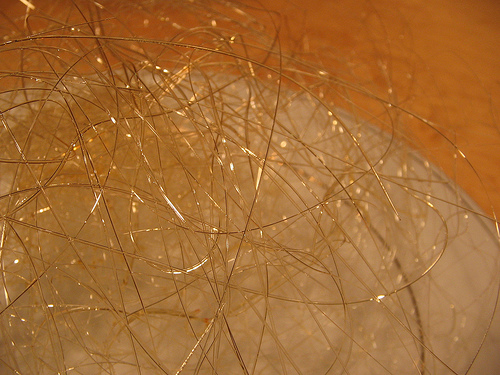

# Spun Sugar

*Spun sugar creates delicate, gossamer-like decorations for elegant desserts. Fine sugar nests frame dishes beautifully and add visual sophistication.*

**Yield:** Approximately 250 grams of decorative spun sugar (yields a large nest or several small decorations)

## Overview
Spun sugar is a classical pastry technique: caramelized sugar pulled into fine threads and shaped into nests or drapes. The process requires precision with temperature, timing, and technique. Once master, spun sugar adds theatrical elegance to plated desserts. It's completely edible, entirely sugar-based, and must be assembled and used immediately or stored in airtight conditions, as humidity causes melting.

## Ingredients
- 250 grams caster sugar (fine sugar melts smoothly)
- Water (for cooling bath)
- Ice (for cooling bath)

## Equipment
- Stainless steel pot or heavy-bottomed saucepan
- Wooden spoon (for stirring)
- Wooden chopsticks or similar rods (2 of them)
- Tape (to secure chopsticks)
- Sharp fork or whisk (for spinning)
- Parchment paper (for catching drips)
- Sturdy baking sheet or cookie sheet (to weight down chopsticks)
- Large bowl with ice-cold water (for cooling)

## Method

### Stage 1 – Setup Spinning Station
1. Position two chopsticks so they overhang the edge of your counter top, approximately 6 inches apart.
2. Use tape to secure them firmly in place.
3. Place a sturdy baking sheet on top of the chopsticks to weigh them down and create a work surface.
4. Lay a large piece of parchment paper on the floor directly below the chopsticks to catch excess sugar and simplify cleanup.

### Stage 2 – Melt Sugar
1. Place the stainless steel pot on the stove over medium-high heat.
2. Pour approximately half the caster sugar into the pot.
3. As the sugar begins to melt, stir gently with a wooden spoon, working the spoon around the bottom and sides.
4. Gradually add the remaining sugar in small handfuls so the entire mixture continues melting evenly.
5. Do not stir once all sugar is added; allow it to melt by residual heat and gentle movement.

### Stage 3 – Monitor Caramel Color
1. Once all sugar has melted, it will begin taking on an amber color.
2. Lift some caramel with the wooden spoon and let it drizzle back into the pot to judge the color accurately.
3. Cook to a light amber color, not dark amber, which becomes bitter.
4. The darker the caramel, the more bitter the flavor; pale amber is ideal for eating.

### Stage 4 – Cool Caramel
1. Remove the pot from heat immediately when the desired caramel color is reached.
2. Gently place the pot into a large bowl of cold ice water bath for just 2-3 seconds.
3. Remove immediately; this stops the cooking but doesn't cool the caramel excessively.
4. Return the pot to the counter.

### Stage 5 – Check Consistency
1. Wait 2-3 minutes for the caramel to cool slightly and thicken.
2. If the caramel is too hot and thin, threads will be too fine and break.
3. If it's too cool and thick, it will be difficult to pull threads.
4. The correct consistency is when a thread pulled up with a spoon holds together but isn't stiff.
5. Lift some caramel with a spoon to test the stage, it should form a fine thread that snaps easily.

### Stage 6 – Spin Threads
1. Once the caramel reaches the correct consistency, dip two forks (or a cut wire whisk) back-to-back into the caramel.
2. Using a quick flicking motion with your wrist, drizzle the caramel over the two hanging chopsticks.
3. Repeat this dipping and flicking motion over and over, layering threads in different directions.
4. Build up layers of fine threads until you have achieved the desired thickness and shape.
5. Build a nest shape by spinning most threads in a circular pattern.

### Stage 7 – Remove & Shape
1. Allow the spun sugar to cool for 1-2 minutes on the chopsticks.
2. Once hardened, gently lift the sugar nest or drape off the chopsticks using both hands.
3. You can reshape it gently while still warm, or leave the natural shape created during spinning.
4. Work quickly; the sugar hardens as it cools.

## Notes
- **Temperature Precision:** The window between too-hot (breaks threads) and too-cool (stiff) is narrow. Experience and practice are essential.
- **Humidity Enemy:** Spun sugar cannot tolerate humidity; create it in dry conditions and use immediately, or store in an airtight container with desiccant.
- **Candy Thermometer Optional:** If using a thermometer, aim for 320-330°F (160-165°C) for pale amber.
- **Speed Matters:** Work quickly once the caramel reaches proper consistency; it stiffens as it cools.
- **Safety:** Caramelized sugar causes severe burns. Never touch it without testing temperature first. Keep hands dry.
- **Mistakes Are Common:** Even experienced pastry chefs create failed  spun sugar. Practice and patience are essential.

## Variations
**Flavored Caramel:** Dissolve a small amount of flavoring (lemon zest, vanilla, or rose water) into the sugar before cooking.
**Colored Sugar:** Add food coloring to the raw sugar (use powdered colors; liquid colors might cause crystallization).
**Spun Nets:** Spin in a circular pattern to create lacy nets instead of nests.

## Serving
Use for: Dessert plating garnish, wedding cakes, special occasion presentations
Temperature: Room temperature
Plating: Add just before serving to avoid humidity wilting the sugar
Presentation: Balance on top of a mousse or plated component for maximum visual impact

## Storage
- Use immediately after spinning for best texture and appearance
- Can be stored in an airtight container with silica gel desiccant for up to 24 hours in very dry conditions
- Any humidity exposure will cause the sugar to weep and collapse
- Not suitable for humid climates or humid seasons (spring, summer)
- Reheat gently in a low oven if spun sugar becomes softened during storage, then allow to cool completely before use