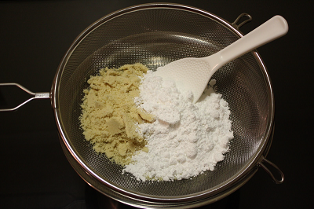

# Tant pour Tant

*Tant pour tant (French for "half and half") is equal parts almond meal and icing sugar ground together to create a fine, uniform powder. This foundation is essential in French pastry work, used in macarons, sponges, and fine cakes.*

**Yield:** Varies by proportions used (example: 100g almonds + 100g icing sugar = 200g tant pour tant)

## Overview
Tant pour tant is a prepared dry ingredient combining ground almonds and superfine icing sugar in precise 1:1 ratio by weight. The icing sugar helps grind the almonds to a powder while simultaneously absorbing the natural oils released during grinding, creating a uniform, dry powder. This is a foundation ingredient in French pastry, indispensable for macarons, Gênoise sponges, and almond cakes. The quality of your tant pour tant directly affects the final texture of delicate French pastries.

## Ingredients
- 100 grams ground almonds (almond meal, not almond flour)
- 100 grams icing sugar (confectioner's sugar, finely powdered)
- Water (none needed)

## Method

### Stage 1 – Combine Dry Ingredients
1. Measure equal weights of ground almonds and icing sugar (using a scale is essential for precision).
1. Pour both into a food processor fitted with a steel blade.
1. Pulse several times to begin combining the ingredients.

### Stage 2 – Process to Fine Powder
1. Continue processing with steady pulses (not continuous grinding) for 2-3 minutes.
1. The friction will release natural oils from the almonds.
1. The icing sugar will absorb these oils, creating a uniform, dry mixture.
1. Process until the mixture resembles fine breadcrumbs or sand, completely uniform with no visible almond pieces.

### Stage 3 – Sift Twice
1. Pass the processed mixture through a fine sieve (or finest sieve you have) into a clean bowl.
1. Discard any large almond particles that remain in the sieve; these indicate incomplete grinding.
1. Pour the sifted mixture back into the sieve and sift again (a second sift is essential for macarons).
1. The goal is the finest possible powder without any grit.

### Stage 4 – Storage
1. Store in an airtight container at room temperature.
1. Use within 2 weeks for best results (almond oils can oxidize over time).

## Notes
- **Weight Precision:** Use a scale, not volume; icing sugar and almonds have different densities.
- **Almond Meal vs. Flour:** Almond meal is coarser; use it, not pre-sifted almond flour. The grinding process is part of the creation.
- **Double Sift Importance:** Critical for macarons; a second sift removes large particles that disrupt macaron structure.
- **Oil Release:** The friction during processing releases almond oils, which is why the mixture stays dry, the sugar absorbs them.
- **Freshness:** Oxidized oils from old tant pour tant create off-flavors and dense results; always use freshly prepared or very recent batches.

## Variations
**Praline Tant pour Tant:** Replace half the almonds with ground praline paste for deeper almond flavor.
**Pistachio Version:** Replace almonds with ground pistachios (1:1 with icing sugar).
**Hazelnut:** Use equal parts ground hazelnuts and icing sugar by weight.

## Serving
Use in: Macaron shells, Gênoise sponge, almond-based cakes, entremets, pastry creams with almond
Temperature: Room temperature (use dry, not moistened)
Amount: Per specific recipe (typically 100-150g tant pour tant per macaron or dessert recipe)

## Storage
- Store in an airtight container at room temperature for up to 2 weeks
- Can be refrigerated for up to 4 weeks (bring to room temperature before use)
- Do not freeze; thawing introduces moisture
- For longer storage, freeze the separated ingredients (almonds and icing sugar) individually, then make tant pour tant fresh as needed
