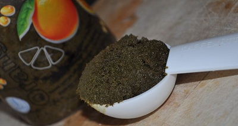

# Green Balti Masala Paste

*This vivid green curry paste draws its color from fresh coriander and mint rather than green chillies. It's beautiful, aromatic, and distinctly different from Thai green pastes, with an Indian spice foundation and British-Indian preservation technique.*

**Yield:** Approximately 450-500 grams

## Overview
Green Balti masala paste combines Indian spices with fresh herbs, creating a vibrant paste used in British-Indian curries. Unlike Thai green pastes, this one includes fenugreek (for nutrition and earthiness), fresh mint (for cooling contrast), and turmeric (for color and warmth). It's preserved with vinegar like Balti masala paste, allowing batch preparation and long refrigerated storage. The color is striking and the flavor is complex, earthy from spices, bright from fresh herbs.

## Ingredients

### Fresh Herbs & Aromatics
- 6 garlic cloves (peeled and chopped)
- 2 tablespoons fresh ginger (finely grated or minced)
- 40 grams fresh mint leaves (packed)
- 40 grams fresh coriander leaves (packed)

### Spices
- 1 teaspoon fenugreek seeds
- 3 teaspoons fine sea salt
- 3 teaspoons ground turmeric
- 2 teaspoons chilli powder
- 1/2 teaspoon ground cloves
- 1 teaspoon ground cardamom seeds

### Liquids & Oil
- 120 ml white wine vinegar
- 120 ml vegetable oil
- 50 ml sesame oil (traditional, though vegetable oil works)
- Additional vegetable oil (for sealing jars)

### For Storage
- Sterilized glass jars

## Method

### Stage 1 – Prepare Fenugreek
1. Place the fenugreek seeds in a bowl.
1. Cover completely with cold water.
1. Leave to soak overnight (or at minimum 8 hours).
1. The seeds will swell and develop a gelatinous, jelly-like coating, this is correct.
1. Drain thoroughly just before use, discarding the soaking water.

### Stage 2 – Prepare Fresh Ingredients
1. Wash fresh mint and coriander thoroughly and pat very dry (moisture invites mold during storage).
1. Remove leaves from stems and discard or save stems for stock.
1. Loosely pack the leaves; you should have approximately 40 grams of leaves (by weight).

### Stage 3 – Blend to Purée
1. Place the soaked and drained fenugreek seeds, garlic, fresh ginger, fresh mint, fresh coriander, salt, turmeric, chilli powder, cloves, and cardamom seeds in a blender.
1. Add the white wine vinegar.
1. Blend on high speed until the mixture becomes a completely smooth purée.
1. You may need to stop and scrape down the sides of the blender halfway through.
1. The result should have no visible herb or spice particles.

### Stage 4 – Rest the Paste
1. Transfer the purée to a bowl.
1. Allow the mixture to stand at room temperature for at least 10 minutes, preferably 30 minutes.
1. This resting allows flavors to develop and the fenugreek's gel coating to distribute throughout the paste.

### Stage 5 – Cook the Paste
1. Heat the vegetable oil and sesame oil together in a large karahi or wok over medium heat until shimmering.
1. Carefully add the entire herbal paste mixture to the hot oil.
1. Immediately begin stirring constantly to prevent sticking.
1. Continue stir-frying, never stopping your stirring, for approximately 5 minutes.
1. The water content will cook off, and the paste will darken slightly from fresh green to more muted green-brown.
1. Stir continuously throughout.

### Stage 6 – Test for Doneness
1. Remove the pan from heat and allow to rest for 3-4 minutes.
1. Look for clear oil separation at the top of the paste; if present, the paste is done.
1. If oil doesn't clearly separate, add a little more oil and return to heat for another minute, stirring constantly.
1. Remove from heat and cool slightly.

### Stage 7 – Jar & Preserve
1. Prepare sterilized glass jars.
1. Spoon the warm paste into jars, filling to within 1 cm of rim.
1. Heat additional vegetable oil.
1. Once the paste cools to warm, pour a thin but complete layer of hot oil over the top to seal.
1. Seal tightly with lids.
1. Refrigerate immediately.

## Notes
- **Fenugreek Soaking:** Essential for hydration and gel development. This creates a binder that helps the paste hold together.
- **Herb Drying:** Very important for long storage; any moisture leaves promote mold growth. Pat herbs completely dry after washing.
- **Sesame Oil:** Adds authentic flavor and aroma; regular vegetable oil works but the result is less characteristic.
- **Oil Seal:** Complete coverage is essential to prevent mold. Check jars after a few days.
- **Storage Temperature:** Always refrigerate; fresh herbs and oil can support bacterial growth at room temperature.
- **Blender vs. Mortar:** This paste is thick and herb-heavy; a blender makes more sense than a mortar for achieving smoothness.

## Variations
**With Cilantro Only:** Omit mint; use all 80 grams coriander instead.
**Spicier:** Increase chilli powder to 3 teaspoons.
**Extra Turmeric:** For deeper golden color and earthiness, use 4 teaspoons turmeric.
**Milder Cloves:** Reduce to 1/4 teaspoon if clove flavor is too strong for your taste.

## Serving
Use in: British-Indian curries, green vegetable curries, mild curries with fresh herb character
Typical ratio: 3-4 tablespoons per 400 ml water or stock
Cooking: Fry in hot oil with onions before adding liquid and main ingredients
Temperature: Requires cooking in hot oil before use

## Storage
- Refrigerate in sealed jars with oil overlay for up to 2 months
- Check during first week for any mold on surface (indicates jar wasn't sterilized or oil seal isn't complete)
- Always use clean spoons; avoid contaminating the jar with wet utensils
- If any mold or off-odor appears, discard entire jar
- Do not freeze; freezing damages the texture and herbs
- The oil seal must be undisturbed; don't puncture through it multiple times
