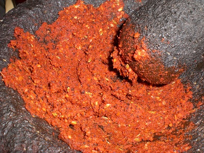

# Madrasi Masala Paste

*Madras is heat delivered with complexity. This paste combines dry-roasted spices ground to powder with aromatic oil-cooked ingredients, creating a foundation for fierce curries that have structure beneath the kick.*

**Yield:** Approximately 450 grams

## Overview
Madrasi masala paste represents the very hot end of British-Indian curry pastes. It's made by toasting and grinding dry spices (mimicking the South Indian cooking technique) then combining them with fried aromatics. The vinegar and oil preservation technique allows batch preparation. The color is deep reddish-brown from the dried chillies, and the aroma is unmistakably fiery. This paste requires careful heat management during cooking and creates genuine sweat-inducing curries.

## Ingredients

### Dry Spices for Toasting
- 8 teaspoons coriander seeds
- 4 teaspoons cumin seeds
- 4 teaspoons black peppercorns
- 4 dried red chillies (deseeded for less heat, left whole for maximum fire)
- 1 teaspoon fenugreek seeds
- 1 teaspoon mustard seeds
- 1 teaspoon fennel seeds

### Fresh Aromatics
- 4 garlic cloves (peeled and chopped)
- 2 tablespoons fresh ginger (finely minced)
- 2 medium onions (roughly chopped)
- 150 ml white wine vinegar

### Spice Powders (Already Ground)
- 1 tablespoon ground turmeric
- 2 teaspoons chilli powder (for additional heat on top of dried chillies)
- 1 teaspoon salt

### Liquids & Oil
- 150 ml vegetable oil
- Water (as needed for consistency)

### For Storage & Jars
- Sterilized glass jars
- Additional vegetable oil (for sealing)

## Method

### Stage 1 – Dry Roast Whole Spices
1. Place a heavy-bottomed frying pan or karahi over medium heat with no oil.
1. Add the coriander seeds, cumin seeds, black peppercorns, dried red chillies, fenugreek, mustard seeds, and fennel seeds.
1. Stir continuously as the spices heat (never stop stirring).
1. After 2-3 minutes, the spices will become fragrant and begin to change color slightly.
1. Continue stirring for another 2-3 minutes, watching carefully.
1. The spices are ready when they're clearly darker and release a toasted aroma that fills the pan.
1. Do not allow them to smoke or char; that bitterness will ruin the paste.
1. Transfer to a bowl immediately to stop the cooking.

### Stage 2 – Grind to Powder
1. Once the roasted spices have cooled completely (5-10 minutes), transfer them to a spice grinder or clean coffee grinder.
1. Pulse repeatedly until the whole spices become a fine powder.
1. Work in batches if your grinder is small.
1. Sift the powder through a fine mesh to separate any remaining larger pieces; re-grind those pieces.
1. You should have a fine, even powder free of large particles.

### Stage 3 – Prepare Aromatics
1. Roughly chop the onions, garlic cloves, and ginger.
1. Place them in a blender with the white wine vinegar.
1. Blend on high speed until they form a smooth paste.
1. The vinegar assists in creating smoothness.

### Stage 4 – Fry Aromatics
1. Heat the 150 ml vegetable oil in a large karahi or wok over medium heat until shimmering.
1. Add the blended aromatic paste.
1. Immediately begin stirring constantly to prevent sticking.
1. Stir-fry for 5-7 minutes, continuously stirring, until the onion flavor develops and the mixture darkens.
1. The oil will become fragrant and the mixture will thicken.

### Stage 5 – Combine with Ground Spices & Powders
1. Once the fried aromatics have cooled slightly (but are still warm), add the ground spice powder, turmeric, chilli powder, and salt.
1. Stir very thoroughly to combine the ground spices with the oil-fried aromatics.
1. The mixture should form a thick paste; if too dry, add a tablespoon or two of water.
1. Continue stirring for 2-3 minutes to ensure even distribution of all spices.

### Stage 6 – Final Cook
1. Return the paste to the karahi or wok over medium heat.
1. Stir continuously for 3-4 minutes to cook everything together and allow flavors to meld.
1. The paste will darken further.
1. Remove from heat and allow to cool for 5 minutes.

### Stage 7 – Jar & Preserve
1. Prepare sterilized glass jars.
1. Spoon the prepared paste into jars, filling to within 1 cm of the rim.
1. Heat additional vegetable oil.
1. Once the paste cools to warm (not hot), pour a thin but complete layer of hot oil over the top.
1. Seal tightly with lids.
1. Refrigerate immediately.

## Notes
- **Dry-Roasting Technique:** This is essential for developing deep, complex flavor. Don't skip it. The dry heat brings out each spice's character in a way that can't be replicated.
- **Heat Management:** Watch the spices carefully during roasting; smoke means burnt, and burnt spices are bitter. If they start smoking, immediately tip into a bowl.
- **Grinding Fineness:** Chunks of spice in the final paste will be unpleasant. Process until you have a fine powder, sifting if necessary.
- **Heat Level:** This paste is genuinely very hot. The dried chillies provide baseline heat, and the added chilli powder increases it further. Use cautiously; it's easy to make a curry inedible.
- **Oil Separation:** If oil doesn't clearly float on top after cooling, the paste isn't fully cooked. Return to heat and stir for another 2 minutes, then cool again.
- **Storage Temperature:** Always refrigerate; the fresh aromatics and oil can support bacterial growth at room temperature.

## Variations
**Less Heat:** Deseed the dried chillies and reduce chilli powder to 1 teaspoon.
**More Complex Heat:** Add 1 teaspoon ground cloves during the grinding stage.
**With Tomato:** Replace 50 ml vinegar with tomato purée for deeper savory notes beneath the heat.
**Extra Warmth:** Add 1 teaspoon ground cinnamon or 1/2 teaspoon ground nutmeg.

## Serving
Use in: Madras curries, powerfully spiced curries, curries requiring genuine heat
Typical ratio: 2-3 tablespoons per 400 ml water or stock (this paste is concentrated)
Cooking: Fry in hot oil with onions before adding liquid and ingredients; be prepared for a spicy result
Temperature: Requires cooking in hot oil before use

## Storage
- Refrigerate in sealed jars with oil overlay for up to 2 months
- Check for mold during the first week; if mold appears, discard the jar
- The oil seal must remain intact; avoid multiple punctures into the oil layer
- Always use clean, dry spoons when removing paste
- Do not freeze
- Label jars with preparation date; check odor before each use