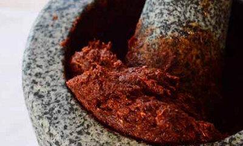

# Thai Masaman Curry Paste (Kruang Kaeng Masaman)

*Originating from the Malaysian border region, this paste combines Thai spices with Indian and Persian influences. It works beautifully with beef, chicken, or duck, particularly robust meats that can stand up to the paste's depth.*

**Yield:** Approximately 175-200 grams

## Overview
Masaman curry paste is perhaps Thailand's most complex paste, reflecting its multicultural origins at the Malaysia-Thailand border. It combines fragrant aromatics with toasted warm spices (cloves, cumin, coriander), creating a rich, almost stew-like curry base quite different from the bright green or red curries. The flavor builds with slow cooking, developing layers of warmth and spice. This paste is essential for classic Masaman curry made with beef and potatoes.

## Ingredients

### Dried Chillies & Aromatics
- 12 large dried red chillies
- 1 lemon grass stalk (tender lower portion)
- 4 tablespoons shallots (finely chopped)
- 5 garlic cloves (peeled and chopped)
- 2 teaspoons fresh galangal (finely chopped)

### Dry Spices (for Toasting)
- 1 teaspoon cumin seeds
- 1 tablespoon coriander seeds
- 2 whole cloves
- 6 black peppercorns

### Flavor & Oil
- 1 cm cube shrimp paste (about 1 teaspoon; wrapped in foil and warmed)
- 1 teaspoon fine sea salt
- 1 teaspoon soft brown sugar
- 2 tablespoons groundnut oil (or neutral oil)

### For Soaking
- Hot water (for rehydrating chillies)

## Method

### Stage 1 – Prepare Dried Chillies
1. Snap the dried red chillies open at the stem end.
1. Shake out and discard most of the seeds; leave a few for flavor and color.
1. Discard the stems.
1. Place the seeded chillies in a bowl.
1. Cover completely with hot (not boiling) water.
1. Leave to soak for 20-30 minutes until completely soft and pliable.

### Stage 2 – Toast Spices
1. While chillies soak, heat a wok or dry frying pan over medium heat for 30 seconds.
1. Add the lemon grass pieces, chopped shallots, garlic, and galangal.
1. Dry-fry for a few seconds, stirring, until the mixture gives off a fragrant, pleasant aroma.
1. Be careful not to brown or burn the ingredients.
1. Add the cumin seeds, coriander seeds, cloves, and peppercorns.
1. Continue dry-frying, stirring constantly, for 5-6 minutes.
1. The spices will darken slightly and release a deep, complex aroma.
1. Immediately spoon the toasted spice mixture into a large mortar to stop the cooking process.

### Stage 3 – Grind Toasted Mixture
1. Using a pestle, grind the warm toasted spice mixture to a fine powder.
1. Work methodically; this can take 5-10 minutes to achieve a smooth powder rather than gritty texture.

### Stage 4 – Incorporate Soaked Chillies
1. Drain the soaked chillies thoroughly.
1. Add them to the mortar with the ground spice mixture.
1. Using the pestle, grind and pound the paste, working the chillies into the spice powder.
1. Continue until the mixture becomes completely smooth and uniform in color.

### Stage 5 – Add Final Ingredients
1. Add the shrimp paste (warmed by wrapping in foil and holding briefly over a flame).
1. Add the salt and soft brown sugar.
1. Add the groundnut oil.
1. Pound and stir thoroughly until everything is completely incorporated.
1. The paste should be smooth, aromatic, and uniform.

## Notes
- **Chilli Reduction:** By removing most seeds, you're moderating heat while keeping the complex flavors. Leave more seeds if you prefer spicier curry.
- **Toasting Technique:** This is crucial to Masaman's depth. Toasting develops spice complexity that raw ground spices cannot achieve.
- **Grinding Patience:** Mortar and pestle is essential; the pounding process creates better texture than food processors.
- **Warm Paste:** It's okay if the paste is warm when you finish, the heat from toasting hasn't damaged anything.
- **Brown Sugar:** Adds subtle sweetness that balances Masaman's spice complexity; don't omit.
- **Shelf Life:** This paste keeps longer than fresh-herb based ones due to its oil content and lack of fresh herbs.

## Variations
**Spicier Version:** Leave all chilli seeds in; increase to 15 chillies.
**With Tamarind:** Add 1 teaspoon tamarind paste for slight sourness.
**Extra Aromatic:** Toast an additional cinnamon stick with the other spices.
**Creamy Paste:** Add 1-2 tablespoons coconut cream during the final grinding.

## Serving
Use in: Masaman curries (beef is traditional), curried stews, curry soups
Typical ratio: 3-4 tablespoons per 400 ml coconut milk
Cooking: Simmer gently for 30+ minutes with beef or tough meats to develop layers of flavor
Temperature: Use immediately or refrigerate

## Storage
- Refrigerate in a glass jar for up to 8 weeks (longer than fresh-herb pastes due to oil content)
- Pour a thin layer of oil over the surface to preserve freshness
- Can be frozen for up to 3 months
- Label with date; while this paste keeps longer, flavors peak within the first 2 weeks
- The paste will firm up when cold; warm to room temperature before using in hot oil