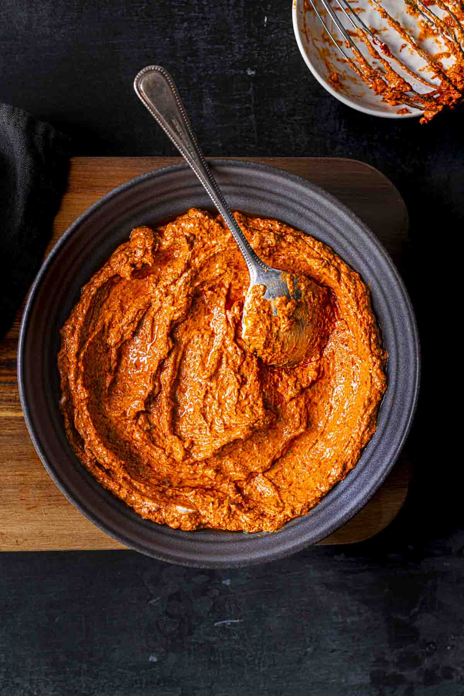

# Tandoori Masala Paste

*Tandoori paste is the marinade for the tandoor oven. It's warm with spices (not hot), deeply colored by turmeric and paprika, and traditionally yogurt is worked in before applying to meat or vegetables. This paste version captures the essential flavors in a form that can be scaled from restaurants down to single dinners.*

**Yield:** Approximately 400-450 grams paste (before yogurt addition)

## Overview
Tandoori masala paste is unique: it's designed to be diluted with yogurt to create a marinade for the tandoor clay oven or modern broiler. The spices are warm and earthy (coriander, cumin, turmeric, paprika) with just enough chilli for gentle heat. The color is spectacular, bright orange-red from paprika and turmeric, making the resulting marinated meat unmistakable. This paste is more aromatic than fiery, with cardamom and clove adding sophistication. Unlike Madras or Balti pastes, this one includes a balance of turmeric and paprika in the aromatics themselves.

## Ingredients

### Dry Spices for Toasting
- 6 teaspoons coriander seeds
- 4 teaspoons cumin seeds
- 2 teaspoons caraway seeds
- 2 teaspoons black peppercorns
- 2 black cardamom pods (or 8 green cardamom pods)
- 1 star anise
- 3-4 cloves
- 1 small stick cinnamon
- 1 teaspoon fennel seeds

### Fresh Aromatics
- 6 garlic cloves (peeled and chopped)
- 3 tablespoons fresh ginger (finely minced)
- 150 ml white wine vinegar
- 100 ml vegetable oil for frying

### Spice Powders (Already Ground) & Colors
- 3 tablespoons ground turmeric
- 1.5 tablespoons paprika (smoked or sweet)
- 2 teaspoons chilli powder
- 1.5 teaspoons salt
- 1 teaspoon ground coriander (extra, for depth)
- 1/2 teaspoon ground cloves (already ground)
- 1/2 teaspoon ground cardamom seeds (already ground)

### Liquids & Storage
- 50 ml additional vegetable oil (for finishing)
- Sterilized glass jars
- Additional oil (for sealing)

## Method

### Stage 1 – Dry Roast Whole Spices
1. Place a heavy-bottomed frying pan or karahi over medium heat with no oil.
1. Add the coriander seeds, cumin seeds, caraway seeds, black peppercorns, black cardamom pods, star anise, cloves, cinnamon stick, and fennel seeds.
1. Stir continuously as they heat (never stop stirring).
1. After 2-3 minutes, the spices will become fragrant and change color slightly.
1. Continue stirring for another 2-3 minutes, watching carefully.
1. You'll know they're done when the aroma is rich and toasted, and the color has deepened.
1. Do not allow them to smoke or char.
1. Transfer to a bowl to cool completely.

### Stage 2 – Grind to Powder
1. Once the roasted spices are completely cool, transfer to a spice grinder or coffee grinder.
1. Pulse repeatedly until the whole spices become a fine powder.
1. Sift through a fine mesh to separate any larger pieces; re-grind those.
1. You should have a fine, smooth powder.

### Stage 3 – Prepare Fresh Aromatics
1. Place the chopped garlic, minced ginger, and white wine vinegar into a blender.
1. Blend on high speed until completely smooth and homogeneous.
1. The vinegar helps create smoothness.

### Stage 4 – Fry Aromatics
1. Heat 100 ml vegetable oil in a large karahi or wok over medium heat until shimmering.
1. Carefully add the blended garlic-ginger mixture.
1. Immediately begin stirring constantly (do not stop).
1. Stir-fry for 4-5 minutes, continuously stirring, until the aromatic mixture becomes fragrant and darkens.
1. The oil will grow fragrant and the mixture will thicken.

### Stage 5 – Combine with Ground & Powder Spices
1. Once the fried aromatics have cooled slightly but are still warm, add all ground spices: the toasted spice powder, turmeric, paprika, chilli powder, salt, extra ground coriander, ground cloves, and ground cardamom.
1. Stir very thoroughly for 2-3 minutes to ensure complete even distribution.
1. The color will brighten toward orange-red as turmeric and paprika fully mix in.
1. The paste should be thick and clumpy; if it seems too dry, add a tablespoon of water.

### Stage 6 – Final Cook & Oil Finish
1. Return the paste to the karahi or wok over medium heat.
1. Stir continuously for 3-4 minutes to cook everything together.
1. Remove from heat and allow to cool for 5 minutes.
1. Stir in the additional 50 ml vegetable oil to create a smooth, pourable final paste.
1. The oil will distribute throughout, creating a more uniform texture.

### Stage 7 – Jar & Preserve
1. Prepare sterilized glass jars.
1. Spoon the finished paste into jars, filling to within 1 cm of the rim.
1. Heat additional vegetable oil.
1. Once the paste cools to warm, pour a thin but complete layer of hot oil over the top to seal.
1. Seal tightly with lids.
1. Refrigerate immediately.

## Notes
- **Dry-Roasting Essential:** This develops the warm, complex spice notes that make tandoori distinctive. The toasting can't be skipped.
- **Color Development:** Turmeric and paprika together create the characteristic orange-red color. Don't be surprised at the vibrancy.
- **One-Piece Spices:** The cinnamon stick, star anise, and cloves add deep layered flavor that ground-only blends miss.
- **Yogurt Integration:** When using this paste, mix 3-4 tablespoons with 150-200 ml yogurt to create the traditional tandoori marinade.
- **Marinating Time:** Meat or vegetables should marinate 8-12 hours minimum for full flavor development; overnight is ideal.
- **Heat Level:** Intentionally mild and aromatic rather than hot; the focus is on spice warmth, not fire.
- **Oil Seal:** Check after a few days to ensure the oil seal is unbroken.

## Variations
**With Ginger Heat:** Add an extra tablespoon of minced fresh ginger before frying aromatics.
**Spicier Version:** Increase chilli powder to 3 teaspoons.
**With Coffee:** Add 1 teaspoon instant coffee powder to the finished paste for extra depth and darkness of color.
**Smokier:** Use smoked paprika (2 tablespoons) instead of sweet paprika for campfire-style flavor.

## Serving
Use in: Tandoori marinades (mixed with yogurt), roasted vegetable coatings, broiler dishes
Typical ratio: 3-4 tablespoons paste mixed with 150-200 ml plain yogurt for a full marinade
Marinating: Apply yogurt mixture and marinate 8-12+ hours before cooking
Cooking: Grill under broiler or in a hot oven; the marinade chars and caramelizes on the surface

## Storage
- Refrigerate in sealed jars with oil overlay for up to 3 months (longer than other Balti pastes because the yogurt won't be added until use)
- The oil seal prevents oxidation and mold
- Check for mold during the first week; if any appears, discard the jar
- Use clean, dry spoons when removing paste; avoid contaminating with yogurt or moisture
- Do not freeze; freezing damages the spice blend
- Label with preparation date for tracking shelf-life
