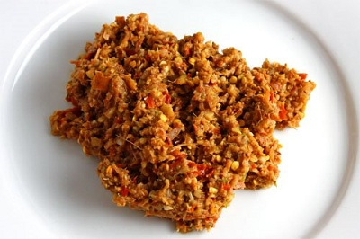

# Thai Red Curry Paste (Kruang Kaeng Dang)

*This wonderful classic curry paste from Thailand has an amazing fragrant characteristic that works beautifully with coconut-based curries. The combination of fresh aromatics, toasted spices, and shrimp paste creates complex depth.*

**Yield:** Approximately 175-200 grams

## Overview
Thai red curry paste is a balance of heat from chillies, brightness from citrus, and umami from shrimp paste. Toasting the coriander and cumin seeds before grinding awakens their essential oils. This paste forms the flavor foundation for authentic Thai red curries. Made fresh, it's noticeably superior to commercial versions, vibrant in color, aromatic, and with cleaner flavor.

## Ingredients

### Fresh Aromatics
- 3 lemon grass stalks (tender lower portions only)
- 10 fresh red chillies (seeded and sliced)
- 115 grams shallots (finely chopped)
- 4 garlic cloves (peeled)
- 1 cm piece fresh galangal (peeled, sliced, and bruised)
- Stems from 4 fresh coriander sprigs

### Spices & Flavor
- 1 tablespoon coriander seeds
- 2 teaspoons cumin seeds
- 1 teaspoon fine sea salt
- 1 teaspoon grated citrus rind (lime or lemon)
- 1 cm cube shrimp paste (about 1 teaspoon)

### Oil
- 30 ml groundnut oil (or neutral oil)

## Method

### Stage 1 – Prepare Aromatics
1. Slice the tender lower portion of the lemon grass stalks into thin rings (discard tough upper portions).
1. Bruise the sliced lemongrass with the side of a knife to release oils.
1. Peel the galangal with a spoon or knife, slice thinly, and bruise similarly.

### Stage 2 – Grind Fresh Paste Base
1. Place the bruised lemongrass, red chillies, shallots, garlic, galangal, and coriander stems in a large mortar.
1. Using a pestle, grind steadily, working the ingredients into a paste.
1. The mortar-and-pestle method (not a food processor) creates better texture and flavor by crushing rather than heating the ingredients.
1. Gradually add the groundnut oil as you grind, incorporating it slowly to create a smooth paste.

### Stage 3 – Toast Spices
1. While grinding the fresh paste, heat a dry wok or frying pan over medium heat for 1 minute.
1. Add the coriander seeds.
2. Toast, shaking the pan frequently, for 1 minute until fragrant.
1. Add the cumin seeds.
1. Continue toasting for another 30-45 seconds until the combined spices release a rich, warm aroma.
1. Be careful not to brown or burn them; burned spices are bitter and must be discarded.
1. Immediately pour the toasted seeds into a mortar and grind to a fine powder.

### Stage 4 – Combine All Elements
1. Add the citrus rind to the fresh paste in the mortar.
1. Mix well.
1. Add the ground toasted spice powder.
1. Stir thoroughly to distribute the spices evenly.
1. Warm the shrimp paste by wrapping it in foil and holding it briefly over a flame, or by warming it in a small dry pan for 15-20 seconds.
1. Add the warmed shrimp paste to the paste.
1. Pound and stir until fully incorporated.
1. Add the salt and mix completely.

## Notes
- **Timing:** This paste is best used immediately after making, when flavors are brightest and most vibrant.
- **Shrimp Paste:** Warming it before adding makes it easier to incorporate. The aroma is strong but mellows with cooking.
- **Citrus Rind:** Fresh lime zest is traditional; lemon works but lime is preferred.
- **Mortar & Pestle:** Essential for proper texture; food processors heat the paste and create a mushy consistency.
- **Chilli Heat:** Leaving seeds in creates more heat; removing most or all seeds yields a milder paste. This recipe includes seeds removed for moderate heat.
- **Spice Toasting:** This step is non-negotiable; it develops the complex aromatics that make Thai red curry distinctive.

## Variations
**Extra Hot:** Leave chilli seeds in and increase to 12-15 chillies.
**Milder Version:** Increase shallots and reduce fresh chillies to 6-8.
**With Galangal Depth:** Add an extra 1/2 cm piece of galangal for pronounced brightness.
**For Coconut Curries:** Use exactly as written; the paste is formulated for coconut milk cooking.

## Serving
Use in: Thai curries, curry soups, curry-based braised dishes
Typical ratio: 2-3 tablespoons paste per 400 ml coconut milk (adjusting to taste preference)
Cooking technique: Fry the paste briefly in hot oil or a bit of the coconut cream before adding liquid
Temperature: Use immediately after making or refrigerate

## Storage
- Refrigerate in an airtight glass container for up to 4-5 days maximum
- For longer storage, wrap portions in foil and freeze for up to 2 months
- The fresh herbs in this paste don't preserve well; it's best used within 3 days for optimal flavor
- If storing, pour a thin layer of oil over the surface to help preserve it
- Do not refrigerate long-term; fresh herbs deteriorate and oxidize