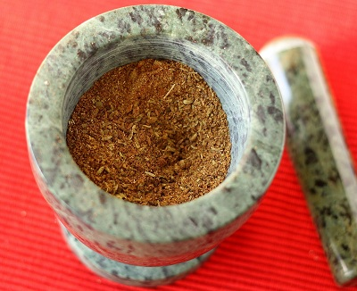

# Balti Masala

*Balti masala is the spice foundation for most British-Indian Balti curries. The mix is mild and well-rounded, designed to be used as a base that cooks build on with additional ingredients and fresh aromatics. Toast, grind, and store for year-round use.*

**Yield:** Approximately 200 grams (makes enough for 20-25 curry portions)

## Overview
Balti masala is a mild, balanced spice blend designed as the foundation for British-Indian curries. Unlike hot masalas, this blend emphasizes warmth over fire. The whole spices are dry-roasted to develop their individual characters before grinding, creating depth of flavor that pre-ground blends can't match. The cinnamon provides sweetness, coriander seeds contribute earthiness, and cardamom adds aromatics. This is a curry powder that improves with age; it develops better flavor after 1-2 weeks of storage.

## Ingredients

### Whole Spices
- 4 tablespoons coriander seeds
- 2 tablespoons white cumin seeds
- 1 cinnamon stick (broken into small pieces)
- 2 teaspoons fennel seeds
- 2 teaspoons black mustard seeds
- 2 teaspoons green cardamom seeds
- 1 teaspoon fenugreek seeds
- 1 teaspoon lovage seeds (or additional fenugreek if unavailable)
- 1/2 teaspoon wild onion seeds (or omit if unavailable)
- 6 cloves
- 1 tablespoon dried fenugreek leaves
- 6 bay leaves
- 25 dried curry leaves

### Ground Spices to Add After Grinding
- 4 teaspoons ground turmeric
- 4 teaspoons garlic powder
- 2 teaspoons ginger powder
- 1.5 teaspoons chilli powder
- 1.5 teaspoons fine sea salt

## Method

### Stage 1 – Prepare Spices
1. Break the cinnamon stick into small pieces (1-2 cm each).
1. Lightly crush the cardamom pods to expose the seeds inside.
1. Measure all whole spices.

### Stage 2 – Dry Roast
1. Place a large wok or heavy-bottomed frying pan over medium heat with no oil.
1. Add all whole spices: coriander seeds, cumin seeds, cinnamon pieces, fennel, mustard seeds, cardamom, fenugreek seeds, lovage seeds, wild onion seeds, cloves, dried fenugreek leaves, bay leaves, and curry leaves.
1. Immediately begin shaking the pan continuously as the spices heat (never stop moving it).
1. After 3-4 minutes, the spices will become fragrant and change color slightly.
1. Continue shaking for another 2-3 minutes, listening for the changing aroma.
1. When the spices smell noticeably toasted and rich, and the color is clearly darker, they're done.
1. Do not allow them to smoke; that indicates burning and bitterness.
1. Transfer immediately to a cool surface or bowl to stop the cooking.

### Stage 3 – Cool Completely
1. Allow roasted spices to cool to room temperature (about 15 minutes).
1. This is essential before grinding; warm spices will clump in the grinder.

### Stage 4 – Grind to Powder
1. Transfer cooled spices to a mortar and pestle, spice grinder, or food processor.
1. Grind thoroughly to a fine, even powder.
1. If your equipment is small, work in batches.
1. The final powder should have no visible large spice fragments.

### Stage 5 – Add Ground Spices & Mix
1. Transfer ground powder to a bowl.
1. Add the turmeric, garlic powder, ginger powder, chilli powder, and salt.
1. Stir very thoroughly for 3-4 minutes to ensure completely even distribution.
1. The color will lighten and become more uniform as you stir.

### Stage 6 – Store
1. Transfer to an airtight glass jar with a tight-fitting lid.
1. Label with the date of preparation.
1. Store in a cool, dark place away from direct light and heat.
1. The spices will mature and develop better flavor over 1-2 weeks.

## Notes
- **Dry-Roasting Essential:** This step is what distinguishes fresh-made masala from store powders. The toasting develops complex flavors that can't be replicated.
- **Constant Heat Movement:** Shaking the pan prevents hot spots and ensures even roasting without burning. Never leave it unattended.
- **Cooling Before Grinding:** Warm spices release oils and will clump in the grinder, making it ineffective. Cool completely.
- **Bay Leaves & Curry Leaves:** These add subtle flavor depth and should roast along with other spices, don't grind them separately.
- **Heat Level Guide:** For mild curries use 1-2 teaspoons per portion; for spicier curries use 2-3 teaspoons.
- **Garlic & Ginger Powder:** These add depth instead of fresh aromatics, making this blend versatile as a dry base.
- **Storage Maturation:** The powder truly tastes noticeably better after 1-2 weeks; don't use immediately if possible.

## Variations
**Spicier Version:** Increase chilli powder to 2.5 teaspoons.
**Extra Aromatic:** Add 1 additional teaspoon of cardamom seeds to the whole spices before roasting.
**With Cloves Warmth:** Increase cloves to 8-10 in the roasting stage.
**Lighter Spice:** Reduce all ground spice additions by 25% for a more delicate blend.

## Serving
Use in: Balti curries, British-Indian curries, curry sauce bases
Typical ratio: 1-3 teaspoons per curry portion depending on desired heat
Application: Fry with onions and aromatics before adding liquid and main ingredients
Temperature: Works best when fried in hot oil to bloom the spices and release flavor

## Storage
- Store in airtight glass jars in a cool, dark place (not above the stove)
- Keep away from moisture, sunlight, and heat sources
- Properly stored, remains flavorful for 10-12 months
- After 6-8 months, flavor begins to fade gradually
- Check for moisture or clumping before each use
- Do not refrigerate; room temperature storage is best
- Label with preparation date for easy tracking
- Make fresh quarterly for optimal flavor and aroma