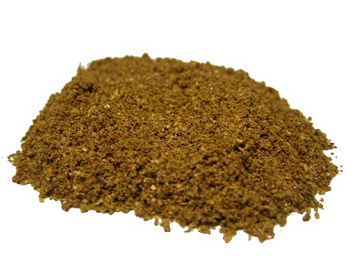

# Garam Masala (Classic)

*Garam means "hot" and masala means "spices", together they describe a blend focused on spices that generate warmth: chillies, pepper, cinnamon, and cloves. This classic blend is added at the end of cooking or sprinkled over finished dishes as a final fragrant garnish, making it distinct from base curry powders.*

**Yield:** Approximately 50-60 grams (makes 15-20 curry portions)

## Overview
Garam masala is the aromatic finishing spice blend in Indian cooking. Unlike base curry powders added early during cooking, garam masala is typically stirred in at the very end or sprinkled over the finished dish. The heat (warmth) comes from black pepper, cinnamon, cardamom, and cloves, spices that traditional Ayurvedic medicine believed raised body temperature. The result is a complex, warming spice blend that's less about chilli heat and more about sophisticated aromatics and depth. This classic version is the finishing touchstone for authentic Indian dishes.

## Ingredients

### Whole Spices
- 10 dried red chillies (deseeded for less heat, kept whole for more fire)
- 2 cinnamon sticks (broken into small pieces)
- 2 curry leaves (dried or fresh)
- 2 tablespoons coriander seeds
- 2 tablespoons cumin seeds
- 1 teaspoon black peppercorns
- 1 teaspoon cloves
- 1 teaspoon fenugreek seeds
- 1 teaspoon black mustard seeds

### Ground Spice
- 1/4 teaspoon chilli powder

## Method

### Stage 1 – Prepare Spices
1. Break dried red chillies in half; remove and discard seeds if you prefer milder heat (leave seeds intact for hotter blend).
1. Break cinnamon sticks into small 1-2 cm pieces.
1. Crumble dried curry leaves into small fragments.
1. Measure all remaining spices.

### Stage 2 – Dry Roast (Two Phases)
**Phase 1 - Hot Spices First:**
1. Place a large heavy-based frying pan over medium heat with no oil.
1. Add the dried red chillies, cinnamon sticks, and curry leaves.
1. Stir and shake the pan continuously for 2 minutes until the spices give off a rich aroma.
1. The curry leaves will darken and the cinnamon will begin to smell sweet.

**Phase 2 - Add Seed Spices:**
1. Add the coriander seeds, cumin seeds, black peppercorns, cloves, fenugreek, and mustard seeds.
1. Continue shaking the pan continuously as the spices roast.
1. After 3-5 minutes, the mustard seeds will start to pop.
1. Continue roasting, shaking constantly, for another 3-5 minutes.
1. The spices should be noticeably darker and release a rich, complex aroma.
1. Watch carefully; do not allow them to smoke or burn.
1. Transfer immediately to a cool surface to stop cooking.

### Stage 3 – Cool Completely
1. Allow roasted spices to cool to room temperature (about 10-15 minutes).
1. Never grind warm spices; they will clump and oil-coat the grinder.

### Stage 4 – Grind to Powder
1. Transfer cooled spices to a mortar and pestle, spice grinder, or food processor.
1. Grind thoroughly to a fine, consistent powder.
1. Work in batches if your equipment is small.
1. The final powder should be smooth with no visible large spice fragments.

### Stage 5 – Add Final Chilli Powder & Mix
1. Transfer ground powder to a bowl.
1. Add the 1/4 teaspoon chilli powder.
1. Stir thoroughly for 1-2 minutes to ensure even distribution.

### Stage 6 – Store
1. Transfer to an airtight glass jar with a tight-fitting lid.
1. Label with preparation date.
1. Store in a cool, dark place away from light and heat.

## Notes
- **Finishing Spice Philosophy:** This blend is designed for end-of-cooking addition (1-2 minutes before serving) or ground over individual bowls. It should never cook for 10+ minutes like base curry powders, that destroys the delicate aromatics.
- **Chilli Heat Adjustment:** Removing seeds from chillies cuts heat significantly. For authenticity and traditional warmth without excessive heat, remove seeds.
- **Two-Phase Roasting:** The hot spices (chillies, cinnamon, curry leaves) roast first to prevent the seed spices from burning before the chillies are fragrant.
- **Mustard Seed Popping:** This is the key indicator that the roasting is progressing correctly. Listen for the popping; when it becomes frequent, the blend is nearly done.
- **The Classic Warmth Profile:** Cinnamon, cloves, pepper, and cardamom (if added) are the traditional warming spices believed in Ayurvedic cooking to raise body heat and improve digestion.
- **Grinding Quality:** Freshly ground garam masala has incomparably better aroma and flavor than store-bought. This is where the finishing touch truly matters.
- **When to Add in Cooking:** Stir in 1-2 minutes before finishing the dish, or sprinkle over individual portions just before serving. Adding too early damages the precious aromatics.

## Variations
**Spicier:** Keep chilli seeds intact; increase dried red chillies to 15; increase final chilli powder to 1/2 teaspoon.
**Milder & More Aromatic:** Deseed all chillies; reduce to 5 chillies; use only 1/8 teaspoon final chilli powder.
**Extra Sweet:** Add another cinnamon stick to the initial roasting.
**With Green Cardamom:** Add 4 green or black cardamom pods to the seed-spice roasting phase for more aromatic depth and sweetness.
**Clove-Forward:** Increase cloves to 1.5 teaspoons for deeper warmth (traditional in some Indian regions).

## Serving
Use in: Final 1-2 minutes of curry cooking, sprinkled over finished curries, rice dishes, vegetable preparations, soups
Typical ratio: 1/2-1 teaspoon sprinkled per serving (much less than base curry powders like Balti)
Application: Stir into off-heat or nearly finished curry; or sprinkle onto individual plates as a garnish
Temperature: Never cook extended time, add just before serving to preserve precious aromatics

## Storage
- Store in airtight glass jars in a cool, dark place away from light, heat, and moisture
- Do not store above the stove or near windows
- Properly stored, remains noticeably flavorful for 6-8 months
- After 6 months, flavor begins to fade; check aroma before using in important dishes
- Monitor for moisture or clumping (indicates humidity exposure)
- Does not require refrigeration; room temperature storage is best
- Much more aromatic and flavorful when freshly ground than store-bought blends
- Make fresh quarterly for optimal quality
- Label with preparation date