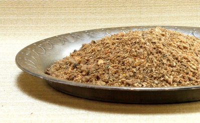

# Sri Lankan Curry Powder

*This distinctly different curry powder reflects Sri Lankan cooking traditions where spices are roasted separately to prevent burning, and presentation with vibrant colors matters as much as flavor. The result is a rich, dark curry powder ideal for all dishes, poultry, meat, and vegetables, with aromatic warmth rather than excessive heat.*

**Yield:** Approximately 75 grams (makes 15-20 curry portions)

## Overview
Sri Lankan curry powder is created through a completely different technique than Indian blends: each component roasts separately because they turn dark at different stages. The result is more complex and less likely to include burnt spices. Color and presentation are fundamental to Sri Lankan cuisine, red, yellow, and black curries artistically arranged around central bowls of rice. This powder creates the sophisticated dark curry bases that define Sri Lankan food.

## Ingredients

### Spices Roasted Separately
**Set 1 - Rapid Roasting Spices:**
- 6 tablespoons coriander seeds
- 3 tablespoons cumin seeds
- 1 tablespoon fennel seeds
- 1 teaspoon fenugreek seeds

**Set 2 - Slow Roasting Aromatics:**
- 1 cinnamon stick (broken into pieces)
- 1 teaspoon cloves
- 8 green cardamom pods

### Other Ingredients
- 6 dried curry leaves
- 2 teaspoons chilli powder (added post-roasting, not toasted)

## Method

### Stage 1 – Prepare All Ingredients
1. Break cinnamon stick into small pieces (1 cm each).
1. Lightly crush cardamom pods to expose seeds.
1. Measure rapid-roasting spices separately.

### Stage 2 – Roast Rapid-Roasting Spices First
1. Place a heavy-bottomed pan over medium heat with no oil.
1. Add the coriander, cumin, fennel, and fenugreek seeds.
1. Continuously stir and toss for 3-4 minutes as they heat.
1. Watch carefully, these roast quickly and can burn. Do not let spices burn; remove as soon as rich aroma develops.
1. Transfer to a bowl to cool.

### Stage 3 – Roast Slow-Roasting Aromatics
1. Return the same pan to medium heat (clean and dry).
1. Add cinnamon pieces, cloves, and cardamom pods together.
1. Roast for 3-4 minutes, stirring frequently, until they give off a pungent aroma.
1. Transfer to the bowl with Set 1 spices; allow to cool completely.

### Stage 4 – Cool Completely
1. Allow all spices to reach room temperature (10-15 minutes).

### Stage 5 – Extract Cardamom Seeds
1. Once cool enough to handle, open the cooled cardamom pods.
1. Extract the seeds inside and place them in the mortar.
1. Discard the cardamom pods themselves.

### Stage 6 – Grind to Powder
1. Add all other roasted spices (coriander, cumin, fennel, fenugreek, cinnamon pieces, cloves) and curry leaves to the mortar.
1. Grind thoroughly to a smooth, fine powder.
1. The color should be noticeably darker than Indian curry powders due to the separate roasting.
1. Sift; re-grind any larger pieces.

### Stage 7 – Add Chilli Powder & Mix
1. Stir in the chilli powder.
1. Mix very thoroughly for 1-2 minutes and use immediately.

## Notes
- **Separate Roasting Critical:** This technique prevents burning. Rapid-roasting spices (coriander, cumin) burn before aromatics (cloves, cinnamon) are fragrant. Roasting separately solves this.
- **Cardamom Seed Extraction:** Removing cardamom from the pod after roasting (rather than roasting seeds alone) preserves more flavor compounds.
- **Darker Color:** The separate roasting creates a naturally darker, richer color, this is authentic and indicates proper technique.
- **Chilli Powder Late Addition:** Adding chilli powder after roasting (not during) prevents burning and preserves heat intensity.
- **Curry Leaves:** These add subtle flavor complexity; don't omit them.

## Variations
**Hotter:** Increase chilli powder to 3 teaspoons.
**Milder:** Decrease chilli powder to 1 teaspoon.
**Earthier:** Add 1/2 teaspoon additional cumin seeds to the rapid-roasting set.
**More Aromatic:** Add 2 additional cloves to the slow-roasting set.

## Serving
Use in: Sri Lankan red curries, yellow curries, meat dishes, poultry preparations, vegetable curries
Typical ratio: 2-4 teaspoons per portion depending on sauce richness and protein type
Application: Fry in hot oil with aromatics before adding liquid and main ingredients
Color: The darker appearance is natural and indicates proper roasting technique

## Storage
- Best used immediately; can store in airtight jar 4-5 months away from light and heat
- Does not require refrigeration
- Flavor remains stable longer than some blends due to separate roasting technique
- Check aroma after 4 months before using in important dishes
- Label with preparation date
- Make fresh quarterly for optimal aromatic quality 