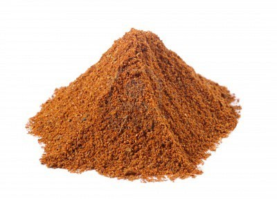

# Tandoori Masala

*Tandoori masala is a warm, earthy spice blend designed for marinating and coating meats and vegetables for the tandoor oven or broiler. The blend is naturally colored by turmeric and paprika, with beetroot and annatto seed powders for vibrant natural color, no chemical dyes. The spices develop better flavor during storage, make and keep for 1-2 weeks before using.*

**Yield:** Approximately 200 grams (makes 25-30 marinades)

## Overview
Tandoori masala is a pre-mixed blend of ground spices specifically designed for tandoor cooking. Unlike Balti masala (which is activated by frying in oil) or garam masala (which is a finishing spice), tandoori masala is typically mixed with yogurt to create a marinade for meats and vegetables. The blend emphasizes warmth over heat, coriander, cumin, and cinnamon, with turmeric and paprika providing natural color and character. The brilliant orange-red color comes from paprika, turmeric, beetroot, and annatto seeds, entirely natural, no chemical dyes. This powder improves significantly with storage.

## Ingredients

### Pre-Ground Spices & Flavorings
- 2 tablespoons ground coriander
- 5 teaspoons ground cumin
- 5 teaspoons garlic powder
- 5 teaspoons paprika
- 4 teaspoons mango powder (amchur)
- 6 teaspoons dried mint (finely crushed)
- 3 teaspoons chilli powder
- 4 teaspoons beetroot powder (natural red coloring)
- 2 teaspoons annatto seed powder (natural yellow coloring)
- 2 teaspoons fine sea salt

## Method

### Stage 1 – Prepare Ingredients
1. Gather all ground spices and measured ingredients.
1. If using whole dried mint, crush it slightly with your fingers to break up larger pieces and release aroma.
1. Have all colorants (beetroot powder, annatto) measured and ready.

### Stage 2 – Combine Spices
1. Pour all ground spices (coriander, cumin, garlic, paprika, mango powder, chilli powder, salt) into a medium mixing bowl.
1. Add the beetroot powder and annatto seed powder.
1. Using a spoon or whisk, stir very thoroughly for 3-4 minutes.
1. Break up any clumps of spice that have formed during storage.
1. Stir constantly until the color is completely uniform throughout with no visible patches of different colors.

### Stage 3 – Add Mint & Continue Mixing
1. Add the crushed dried mint.
1. Stir vigorously for 2 more minutes to distribute the mint evenly throughout the blend.

### Stage 4 – Sift for Consistency
1. Sift through a fine mesh sieve into a clean bowl.
1. This removes any clumps and ensures consistent texture.
1. If small bits remain, return and grind gently with a spoon, then re-sift.

### Stage 5 – Final Check
1. Stir the finished powder one final time.
1. It should be fine, consistent, and evenly colored throughout.

### Stage 6 – Store
1. Transfer to airtight glass jars with tight-fitting lids.
1. Label with preparation date.
1. Store in a cool, dark place away from light and heat.
1. The spices will mature and develop better flavor over 1-2 weeks.

## Notes
- **Pre-Ground Spices:** Uses pre-ground spices (unlike roasted-whole-spice blends), making production simpler but requiring careful measuring.
- **Mango Powder Key:** Creates the signature tartness in tandoori. This is the secret to authentic flavor.
- **Garlic Powder Foundation:** Restaurant-standard, provides umami and subtle sweetness distinguishing tandoori from other masalas.
- **Dried Mint:** Adds crucial cooling contrast to warm spices, especially important in hot weather.
- **Natural Colors:** Paprika, turmeric, beetroot, and annatto create warm golden-red color naturally. No chemical dyes; more authentic and healthier.
- **Maturation Essential:** The blend genuinely tastes better after 1-2 weeks as flavors meld. Avoid using immediately if possible.
- **Yogurt Integration:** Typically mixed at 3-4 tablespoons powder per 150-200 ml plain yogurt to create a tandoori marinade.

## Variations
**Smoky Version:** Use smoked paprika (5 teaspoons) instead of standard paprika for campfire-grill character.
**Spicier:** Increase chilli powder to 4-5 teaspoons.
**Extra Herbaceous:** Increase dried mint to 8 teaspoons for more cooling contrast.
**With Extra Ginger:** Add 1 teaspoon ground ginger powder for warmth and bite.
**Without Mango Powder:** If unavailable, substitute 1 teaspoon ground cumin (earthiness) or 1 teaspoon lime zest powder.

## Serving
Use in: Tandoori marinades (mixed with yogurt), meat and vegetable broiler dishes, roasted vegetable coatings
Typical ratio: 3-4 tablespoons powder mixed with 150-200 ml plain yogurt creates 1 full tandoori marinade
Marinating: Apply yogurt mixture and marinate 8-12+ hours before cooking
Cooking: Grill under broiler or roast in very hot oven; the marinade chars while interior stays tender

## Storage
- Store in airtight glass jars in a cool, dark place away from light and heat
- Do not store above stove or near windows
- Properly stored, remains flavorful for 10-12 months
- Flavor gradually fades after 8 months; check before important dishes
- Monitor for moisture or clumping (indicates humidity exposure)
- Does not require refrigeration; room temperature storage is best
- Make fresh quarterly for best aromatic quality
- Label with preparation date
