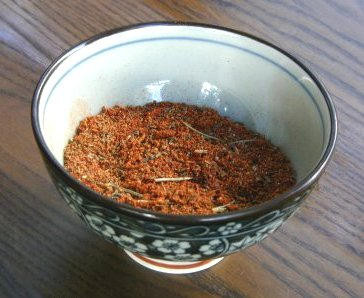

# Barbecue Spice Mix & Marinade

*This versatile spice blend works equally well as a dry rub for grilled meats or as a wet paste marinade when combined with wine and oil. The celery seed and nutmeg provide unexpected sweetness and aromatic warmth; brown sugar adds depth; the spices together create complex barbecue character without overwhelming smokiness or heat.*

**Yield:** Approximately 50 milliliters or 40 grams dry spice (**enough for 4-6 large meat portions when used as rub or marinade base**)

## Overview
Barbecue spice isn't a single fixed preparation, it's a philosophy of layered aromatic flavors that work either as dry rub coating meat before grilling or as paste marinade when combined with wine, aromatics, and oil. The spice mix itself is deceptively simple: celery seed ground fresh, warm spices like nutmeg and allspice character from paprika, heat from chilli powder, umami from garlic and onion powders, all balanced with brown sugar and salt. This is American barbecue tradition in a jar: designed for high-heat grilling where the spice crust develops a caramelized bark while the interior remains juicy. Both dry rub and marinade applications work; the choice depends on available time and texture preference.

## Ingredients (For Dry Spice Mix)

### Base Spices
- 2 teaspoons celery seeds (whole, prefer fresh seeds)
- 1 teaspoon smoked paprika (Spanish style preferred)
- 1 teaspoon freshly grated nutmeg (or 1 teaspoon ground nutmeg if fresh unavailable)
- 1 teaspoon chilli powder (or hot paprika for more heat)
- 1 teaspoon garlic powder
- 1 teaspoon onion salt (or onion powder + fine sea salt)

### Aromatics & Sweetness
- 2 teaspoons dried marjoram (or oregano if marjoram unavailable)
- 1 teaspoon fine sea salt (adjust if using onion salt)
- 2 teaspoons soft dark brown sugar (packed)
- 1 teaspoon freshly ground black pepper

### Additional Ingredients (IF MAKING WET MARINADE)
- 150 milliliters red wine (or white wine, or bourbon)
- 4 tablespoons garlic-infused oil (or regular olive oil)
- 2-3 thin slices fresh onion or 1 tablespoon minced shallot
- 1 tablespoon fresh lime juice (optional, for brightness)

## Method - DRY RUB PREPARATION

### Stage 1 – Grind Celery Seeds
1. Measure 2 teaspoons celery seeds into a mortar.
1. Using a heavy pestle, grind the seeds forcefully for 1-2 minutes.
1. The seeds will break down into a coarse powder with some whole pieces remaining, this is correct.
1. Transfer the ground celery seeds to a bowl.

### Stage 2 – Combine All Spices
1. Add 1 teaspoon smoked paprika to the ground celery seeds.
1. Add 1 teaspoon freshly grated nutmeg (or 1 teaspoon ground nutmeg).
1. Add 1 teaspoon chilli powder.
1. Add 1 teaspoon garlic powder.
1. Add 1 teaspoon onion salt.
1. Add 2 teaspoons dried marjoram (or oregano).
1. Add 1 teaspoon fine sea salt (adjust quantity if using onion salt, which contains salt).
1. Add 2 teaspoons soft dark brown sugar, breaking up any large clumps.
1. Add 1 teaspoon freshly ground black pepper.

### Stage 3 – Mix Thoroughly
1. Stir very thoroughly with a spoon for 2-3 minutes.
1. Break up any clumps of brown sugar that remain.
1. The spice mix should be well combined, with visible brown sugar particles and herb pieces.
1. Taste a tiny pinch: You should taste sweetness, warmth (nutmeg/marjoram), paprika depth, and chilli heat in balance.

### Stage 4 – Use as Dry Rub
1. Pat chosen meat (steaks, chops, chicken) dry with paper towels, moisture prevents dry rub adhesion.
1. Rub the spice mix generously over all surfaces of the meat, pressing firmly so it adheres.
1. Use approximately 2-3 teaspoons spice mix per large steak or 4-6 tablespoons per whole chicken.
1. Allow the rubbed meat to sit at room temperature for 30 minutes to 1 hour before grilling (optional but allows flavor integration).
1. Grill over medium or medium-high heat.

---

## Method - WET MARINADE PREPARATION

### Stage 1 – Toast Celery Seeds (Optional but Recommended)
1. Measure 2 teaspoons celery seeds into a dry skillet.
1. Heat over medium heat for 1-2 minutes, shaking the pan occasionally.
1. The seeds will darken slightly and their aroma will intensify.
1. Remove from heat and allow to cool for 1-2 minutes.
1. Grind the toasted seeds in a mortar with a pestle into coarse powder (as above).

### Stage 2 – Prepare Wine & Aromatics Base
1. Pour 150 milliliters red wine (or white wine, or bourbon) into a bowl.
1. Add 4 tablespoons garlic-infused oil (or regular olive oil).
1. Add 2-3 thin slices fresh onion or 1 tablespoon minced shallot.
1. Add 1 tablespoon fresh lime juice if desired for brightness (optional).
1. Stir very thoroughly to combine.

### Stage 3 – Add Spice Mix
1. Grind the celery seeds as described above.
1. Add all the spices (paprika, nutmeg, chilli powder, garlic powder, onion salt, marjoram, salt, brown sugar, pepper) to the wine-oil mixture.
1. Stir very thoroughly for 2-3 minutes.
1. The mixture will incorporate as a suspended marinade, some settling is normal.
1. Taste: You should taste wine acidity, garlic/onion aromatics, and warm spice blend in balance.
1. Adjust:
   - More wine flavor: Add 2 more tablespoons wine
   - More oil/richness: Add 1 more tablespoon oil
   - More spice: Add 1/2 teaspoon additional chilli powder or paprika
   - More salt: Add pinch of fine salt if it seems flat

### Stage 4 – Apply Marinade to Meat
1. Prepare your meat by patting dry with paper towels.
1. Place meat in a shallow dish or glass baking pan.
1. Pour the wine marinade over the meat, ensuring all surfaces are coated.
1. Turn the meat to coat evenly on both sides.
1. Cover loosely with plastic wrap.

### Stage 5 – Marinating Time
1. For steaks/chops: 4-8 hours in refrigerator
1. For whole chicken: 8-12 hours in refrigerator
1. For thicker cuts: up to 24 hours in refrigerator
1. The longer marinating allows deeper flavor penetration, but 6-8 hours provides excellent results.

### Stage 6 – Prepare for Grilling
1. Remove marinated meat from refrigerator 30 minutes before grilling to bring closer to room temperature.
1. Reserve the marinade in a small bowl for basting (optional during cooking).
1. Pat the meat dry with paper towels before grilling.
1. Discard used marinade that's been in contact with raw meat if not reserved for basting.
1. Grill over medium-high heat, basting occasionally with reserved marinade if desired.

## Notes - GENERAL

- **Celery Seeds Fresh:** Whole celery seeds grind better than pre-ground seeds; their aroma is essential to the character.
- **Nutmeg Fresh-Grated:** Fresh nutmeg provides superior flavor; pre-ground loses potency quickly.
- **Brown Sugar Binding:** The brown sugar helps the dry rub adhere to meat; don't omit.
- **Marjoram Character:** This herb is distinct from oregano, it's slightly sweeter and more floral. Oregano is acceptable substitute.
- **Dry Rub vs. Marinade:** Dry rub creates better caramelized crust; liquid marinade penetrates deeper and is better for thicker cuts.
- **Grill Temperature:** Use medium or medium-high heat (not screaming high) to prevent the sugar from burning while the meat cooks through.
- **Pat Dry Before Cooking:** Moisture creates steam, preventing proper browning. Dry rub/surface must be as dry as possible.

## Variations

### SPICE MIX VARIATIONS:
**Extra Smoky:** Add 1/2 teaspoon liquid smoke to the dry mix or wet marinade.
**Sweeter:** Increase brown sugar to 3 teaspoons (packed); reduce chilli powder to 1/2 teaspoon.
**Extra Spicy:** Add 1/2 teaspoon crushed red chilli flakes or 1/2 teaspoon additional chilli powder.
**With Cumin:** Add 1/2 teaspoon ground cumin for earthiness.
**Smoky & Spicy:** Add 1/4 teaspoon liquid smoke + 1/2 teaspoon additional paprika for pronounced smoke-heat.

### MARINADE VARIATIONS:
**Bourbon Marinade:** Replace wine with bourbon (150 milliliters) for deeper, sweeter character.
**With Fresh Thyme:** Add 2-3 sprigs fresh thyme to the wine mixture for herbal depth.
**Extra Garlic:** Add 2 additional crushed garlic cloves to the wine mixture for pungency.
**With Worcestershire:** Add 1-2 tablespoons Worcestershire sauce to the wine mixture for savory umami.

## Serving
Use as dry rub on: Steaks, chops (pork/lamb), chicken (whole or pieces), ribs, larger fish steaks
Use as wet marinade for: Thick steaks, whole chicken, larger/tougher cuts requiring tenderizing
Rub timing: Apply 30 minutes to 1 hour before grilling for dry rub
Marinade timing: 4-24 hours in refrigerator depending on cut thickness
Grill temperature: Medium to medium-high heat (not screaming hot to prevent sugar burning)

## Storage - SPICE MIX
- Store in airtight glass jar away from light and heat for 4-6 months
- Brown sugar may clump slightly over time; break apart before using
- The dry mix is shelf-stable; best flavor within 3 months of preparation
- Can be made in bulk and kept on hand for quick rubs

## Storage - WET MARINADE
- Unabsorbed wet marinade (not in contact with raw meat) keeps refrigerated for 3-4 days
- Once applied to raw meat, use meat within 8-24 hours for safety
- Does not keep at room temperature due to raw meat contact; always refrigerate
- Reserved marinade for basting can be kept separately if not in contact with raw meat
- Fresh onion slices in marinade should be used within 2-3 days for best flavor