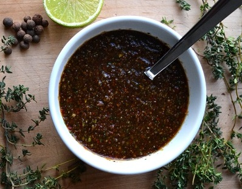

# Jamaican Jerk Marinade

*The essence of Jamaican outdoor cooking, this fragrant paste of charred onions, fiery chillies, and warm spices coats meat for slow grilling over coals. The marinade develops flavor through hours of "jerk", both the spice blend name and the cooking technique of slow-grilling with rhythmic turning over smoky flames. Eight hours of resting allows the spice oils to penetrate meat.*

**Yield:** Approximately 200-250 grams (sufficient for 4-6 large meat pieces)

## Overview
Jamaican jerk marinade represents Caribbean outdoor cooking at its finest: a balance of heat, warmth, umami, and rum-soaked flavor. Unlike quick marinades, this is a stiff paste where cooked onions carry the flavor. The technique of cooking onions, chillies, ginger, and spices together in oil creates a darker, deeper marinade than quick acid-based versions. The rum adds caramel notes and complexity. This paste clings to meat during the slow grill, developing a spiced crust while the interior stays moist. The 8-hour resting period is essential, the spice oils penetrate deeply, infusing every fiber of the meat. This is cooking for patience and reward.

## Ingredients

### Aromatics & Base
- 3 tablespoons vegetable oil (or olive oil)
- 2 medium onions (approximately 300 grams, finely chopped)
- 2 fresh Scotch bonnet chillies (or 2-3 fresh red chillies as substitute)
- 4-5 garlic cloves (crushed)
- 2.5 cm piece fresh ginger root (roughly grated)

### Spices & Seasonings
- 1.5 teaspoons dried thyme (or 3-4 sprigs fresh thyme, chopped)
- 1.5 teaspoons ground allspice berries
- 1/4 teaspoon ground black pepper
- 1/4 teaspoon ground cinnamon (optional, warming)
- 1/4 teaspoon grated nutmeg (optional, warmth)
- 1/2 teaspoon sea salt (adjust to taste)

### Liquid & Alcohol
- 2-3 tablespoons dark rum (Jamaican rum preferred)
- 3 tablespoons fresh lime juice
- 1 tablespoon lime zest (grated rind)
- 1 tablespoon Tabasco sauce (or hot pepper sauce, adjust for heat)

## Method

### Stage 1 – Cook Aromatics Base
1. Heat 3 tablespoons oil in a large skillet over medium heat.
1. Add the finely chopped onions.
1. Stir frequently and cook for 8-10 minutes until the onions turn soft and golden, beginning to caramelize at the edges.
1. The onions should be very soft and translucent, not crisp or raw.
1. This cooking step is essential, raw onion won't incorporate properly.

### Stage 2 – Add Chillies, Garlic & Ginger
1. While the onions cook, prepare the chillies:
   - **For maximum traditional heat (Scotch bonnet):** Wear gloves when handling. Cut off stem, halve, and remove most seeds (leave a few for authentic heat). Fine-chop.
   - **For milder version (red chillies):** Cut off stem, remove all seeds and membrane, fine-chop.
1. Add the chopped chillies to the soft onions.
1. Add the crushed garlic cloves.
1. Add the grated fresh ginger.
1. Stir very thoroughly to combine.
1. Cook for 2-3 minutes over medium heat, stirring constantly, until fragrant and garlic loses its raw edge.

### Stage 3 – Add Spices & Heat
1. Add 1.5 teaspoons dried thyme (or 4 chopped fresh thyme sprigs).
1. Add 1.5 teaspoons ground allspice berries.
1. Add 1/4 teaspoon ground black pepper.
1. Add optional 1/4 teaspoon cinnamon and 1/4 teaspoon nutmeg if desired for warming spice.
1. Add 1/2 teaspoon sea salt.
1. Stir very thoroughly, mixing for 1-2 minutes until all spices are evenly distributed.
1. The mixture will darken and smell intensely aromatic.

### Stage 4 – Add Rum & Lime
1. Pour 2-3 tablespoons dark rum directly into the pan.
1. Stir well, the rum will sizzle and begin to burn off.
1. Continue stirring for 1-2 minutes while the alcohol evaporates, leaving flavor behind.
1. Add 3 tablespoons fresh lime juice and the lime zest.
1. Add 1 tablespoon Tabasco sauce (or hot pepper sauce, start with 1 tablespoon and add more if desired for heat).
1. Stir very thoroughly.

### Stage 5 – Simmer & Develop Paste
1. Reduce heat to medium-low.
1. Simmer the mixture, stirring occasionally, for 5-8 minutes.
1. The marinade should become darker, thicker, more paste-like.
1. If it becomes too thick (very hard to stir), add 1-2 tablespoons of water.
1. The final texture should be a thick, dark paste where you can see distinct spice and vegetable pieces.
1. The mixture will smell rich and complex.

### Stage 6 – Taste & Adjust
1. Remove from heat and let cool for 2-3 minutes.
1. Taste a small amount (careful, it's hot and may be very spicy).
1. Adjust flavor:
   - More heat: Add additional Tabasco or hot pepper sauce by 1/2 teaspoon increments
   - More rum: Add additional 1/2 tablespoon rum (won't burn off, will remain liquid)
   - More lime: Add additional 1 tablespoon lime juice
   - Salt: Add pinch more if needed

### Stage 7 – Cool & Apply to Meat
1. Allow the marinade to cool completely to room temperature (approximately 30-45 minutes).
1. Transfer to a bowl or glass jar.
1. Prepare your meat (chicken pieces, pork chops, lamb, fish):
   - Cut meat into reasonably-sized pieces (approximately 3-4 inches/7-10 cm)
   - Pat dry with paper towels
   - Score the skin if present, to allow marinade penetration
1. Rub the cooled jerk marinade all over each piece of meat, pressing firmly so it adheres.
1. Place meat on a large plate or in a shallow container.
1. Cover loosely with plastic wrap or cloth.
1. Refrigerate for at least 8 hours (or up to 24 hours for deeper flavor).

### Stage 8 – Prepare for Grilling
1. Remove meat from refrigerator 30 minutes before grilling, bring to room temperature.
1. If additional marinade adheres to plate, spoon it over the meat.
1. Set aside extra marinade for basting during cooking (optional but traditional).
1. Grill over medium-hot heat or smoky charcoal, turning every 8-10 minutes, for 20-30 minutes depending on meat thickness.
1. Baste with remaining marinade during cooking if desired (traditional technique).

## Notes
- **Scotch Bonnet vs. Substitutes:** Authentic jerk uses Scotch bonnet chillies (extremely hot, fruity). Milder fresh red chillies are acceptable for non-fiery versions.
- **Onion Cooking Essential:** Raw onion won't distribute properly. The 8-10 minute cooking creates base for marinade adhesion.
- **Rum Character:** Dark Jamaican rum (like Appleton or Mount Gay) provides authentic flavor; light rum is less flavorful.
- **Paste Texture Important:** This is a thick paste meant to coat meat, not a liquid marinade. Consistency allows adhesion.
- **Eight-Hour Rest Essential:** This isn't optional. The overnight resting allows spice oils to penetrate deeply.
- **Grilling Over Heat Critical:** True jerk is slow-grilled over charcoal with smoke. Pan-frying is acceptable but differs in character.
- **Basting During Cooking:** The remaining marinade can baste during grilling, building flavor crust (be aware paste can char, cook over medium-not-high heat).

## Variations
**Extra Spicy:** Add 3-4 Scotch bonnet chillies (if you can tolerate genuine heat); keep all seeds.
**Sweeter Version:** Add 1-2 teaspoons dark brown sugar to the pan during cooking.
**With Cloves:** Add 1/4 teaspoon ground cloves during spice stage for deeper warming spice.
**Less Rum:** Use 1 tablespoon rum instead of 2-3 tablespoons for lighter flavor.
**Extra Thyme:** Use 3 fresh thyme sprigs for herbal emphasis; it's a signature Jamaican flavor.

## Serving
Use on: Whole chicken, chicken pieces, pork chops, lamb, fish, vegetables
Marinating time: Minimum 8 hours, up to 24 hours for deeper flavor
Cooking method: Grill over charcoal/smoke for authentic jerk; pan-frying acceptable
Internal temperature for doneness: Chicken 74°C (165°F), Pork 71°C (160°F), Lamb 63°C (145°F medium-rare)

## Storage
- Refrigerate in sealed glass jar for up to 4-5 days before applying to meat
- Once applied to raw meat, use within 8-12 hours (marinate 8 hours minimum, cook within 4 hours of end of marinating)
- The paste becomes increasingly flavorful as it sits; best results at 12-18 hours total (8 hours marinating + additional chilling)
- Excess marinade (not in contact with raw meat) can be refrigerated separately for up to 3-4 days
- Can be frozen in glass jar for 4-6 weeks; thaw in refrigerator before applying to meat
- Does not keep at room temperature due to raw meat contact; always refrigerate
- Discard any marinade that has been in contact with raw meat if meat is not cooked within marinating window
