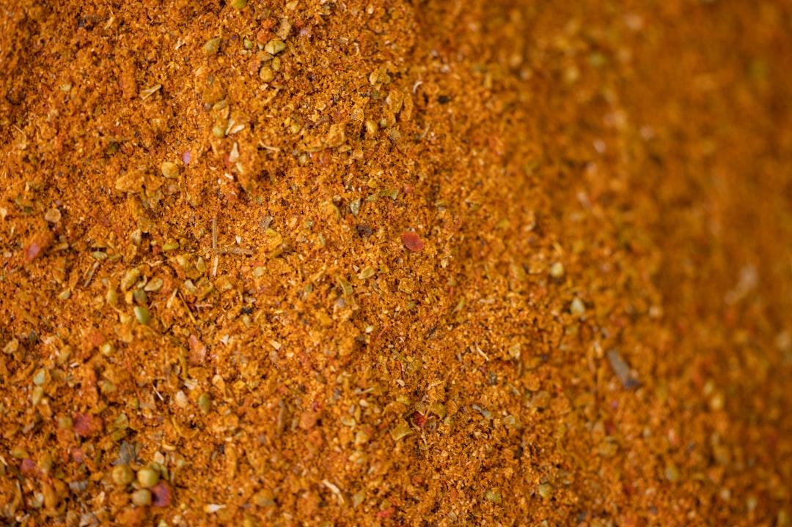

# Taco Meat Seasoning (Taco Spice Base)

*Taco marinade - though properly termed a spice base, as this is a cooked ground meat dish rather than a marinating preparation. The spices are incorporated during cooking rather than beforehand.*

**Yield:** Approximately 500 grams cooked taco meat (serves 6-8 as taco filling)

## Overview
Taco meat doesn't use a traditional cold marinade, instead, it relies on a carefully balanced spice blend applied to ground meat as it cooks. This approach is characteristic of efficient Tex-Mex cooking: the spices are added to the pan as the meat browns, allowing them to bloom in the meat's rendered fat while the tomato purée provides body and moisture. The result is flavorful, tender, well-spiced ground meat in 20-25 minutes, perfect for filling warm tortillas. This is working kitchen simplicity.

## Ingredients

### Base & Protein
- 500 grams ground beef (or ground turkey, chicken, or pork)
- 1 medium onion (approximately 150 grams, finely chopped)
- 1 green bell pepper (approximately 100 grams, finely chopped)
- 3-4 garlic cloves (crushed or minced)

### Spices & Seasonings
- 1/2 teaspoon hot smoked paprika
- 1/4 teaspoon ground cumin (or 1/2 teaspoon for more earthy flavor)
- 1/4 teaspoon dried red chilli flakes (or 1/2 teaspoon for more heat)
- 1/2 teaspoon fine sea salt (adjust to taste)
- 1/4 teaspoon freshly ground black pepper (adjust to taste)

### Liquid
- 6 tablespoons tomato purée (or tomato paste)

### Optional Additions
- 1 tablespoon fish sauce (for depth; optional, non-traditional)
- 1/2 teaspoon ground coriander (for complexity)
- 1/2 teaspoon dried oregano (for herbal note)
- 2-3 tablespoons beef stock (if meat becomes too dry during cooking)

## Method

### Stage 1 – Brown the Ground Meat
1. Heat a large skillet or frying pan over medium-high heat.
1. Add the ground beef (or other ground meat).
1. Using a wooden spoon or spatula, break the meat into small pieces as it cooks.
1. Stir occasionally to ensure even cooking.
1. Continue cooking for 5-7 minutes until the meat is mostly browned (some pink is acceptable).
1. The meat should release its fat into the pan, do not drain.

### Stage 2 – Add Aromatics
1. Once the meat is mostly browned, add the finely chopped onion to the pan.
1. Add the finely chopped green bell pepper.
1. Add the crushed or minced garlic.
1. Stir very thoroughly to combine all ingredients.
1. Continue cooking, stirring frequently, for 3-4 minutes.
1. The vegetables should soften and their aromatics perfume the pan.
1. The mixture will smell fragrant and rich.

### Stage 3 – Bloom the Spices
1. Reduce heat to medium (lower the heat to prevent spices from burning).
1. Add 1/2 teaspoon hot smoked paprika to the pan.
1. Add 1/4 teaspoon ground cumin.
1. Add 1/4 teaspoon dried red chilli flakes.
1. Stir everything together very thoroughly for 1-2 minutes.
1. The spices will begin to "bloom", their aromatics will intensify and distribute throughout the meat.
1. This blooming step prevents the spices from tasting raw or powdery.

### Stage 4 – Add Tomato Purée & Liquid
1. Add 6 tablespoons tomato purée (or tomato paste) to the meat mixture.
1. Stir very thoroughly, incorporating the tomato into every part of the meat.
1. Cook for 2-3 minutes, stirring frequently, as the tomato purée slightly caramelizes and darkens.
1. If the mixture becomes too thick and dry (the spoon leaving tracks), add 2-3 tablespoons beef stock or water to create sauce.
1. The final consistency should be wet but thick, not soupy, not dry.

### Stage 5 – Season & Adjust
1. Add 1/2 teaspoon fine sea salt (or to taste).
1. Add 1/4 teaspoon freshly ground black pepper (or to taste).
1. Stir thoroughly.
1. Taste a small amount (be careful, it will be hot).
1. Assess and adjust:
   - More salt: Add pinch if needed
   - More heat: Add additional 1/4 teaspoon chilli flakes
   - More earthiness: Add 1/4 teaspoon additional cumin
   - More tomato: Add 1-2 tablespoons additional tomato purée

### Stage 6 – Final Simmer & Integration
1. Reduce heat to low.
1. Simmer uncovered for 8-10 minutes.
1. Stir occasionally, the mixture should bubble gently at the edges.
1. The flavors will integrate and the sauce will slightly thicken.
1. Taste again and make final salt/spice adjustments if needed.

### Stage 7 – Use Immediately or Hold
1. The taco meat is now ready to serve.
1. Spoon into warm flour or corn tortillas.
1. Top with desired accompaniments: shredded lettuce, diced tomato, sour cream, guacamole, salsa, cheese.

## Notes
- **Ground Meat Type:** Beef is traditional; turkey, chicken, or pork work equally well. Beef provides the richest flavor.
- **Fat Important:** Do not drain the rendered fat from the meat, it carries flavor and helps develop sauce.
- **Spice Blooming Critical:** Cooking the spices in fat for 1-2 minutes prevents them from tasting raw or bitter.
- **Tomato Purée vs. Paste:** Purée is thinner than paste; both work, but measure accordingly (paste may require added water).
- **Not a True Marinade:** This is a cooked spice application, not a cold marinade where meat sits before cooking.
- **Quick Preparation:** This is efficient cooking, the entire process takes 25-30 minutes from raw meat to finished filling.
- **Sauce Consistency:** The finished meat should have visible sauce clinging to the meat particles, not be dry or pool excessively with liquid.
- **Flavor Development:** The gentle simmer at the end allows spices to fully integrate and flavors to mature.

## Variations
**Extra Spicy:** Add 1/2 teaspoon additional chilli flakes during blooming stage; use hot paprika exclusively.
**Milder Heat:** Reduce chilli flakes to 1/8 teaspoon; use sweet paprika instead of hot.
**With Oregano:** Add 1/2 teaspoon dried oregano during blooming for herbal character.
**Extra Tomato:** Add 3 additional tablespoons tomato purée for thicker, more tomato-forward sauce.
**With Ground Coriander:** Add 1/2 teaspoon ground coriander for complexity and slight citrus note.
**Extra Cumin:** Use 1/2 teaspoon ground cumin instead of 1/4 teaspoon for earthier, more robust flavor.

## Serving
Use in: Warm flour or corn tortillas, burrito bowls, nachos, quesadillas, taco salad
Portion: Approximately 60-70 grams (1/4 cup) per taco/serving
Temperature: Served warm or hot, not chilled
Accompaniments: Shredded lettuce, diced tomato, shredded cheese, sour cream, guacamole, salsa, cilantro

## Storage
- Refrigerate in sealed glass container for up to 3-4 days
- The cooked meat will solidify slightly when chilled; reheat gently over low heat, adding 1-2 tablespoons water if too thick
- Can be frozen in airtight container or freezer bag for 4-6 weeks
- Thaw in refrigerator overnight before reheating
- To reheat: Add to skillet over low-medium heat with 1-2 tablespoons water, stirring gently until warmed through (5-7 minutes)
- Best consumed within 2-3 days for optimal flavor freshness
- Check for any off-odors or visible discoloration before using