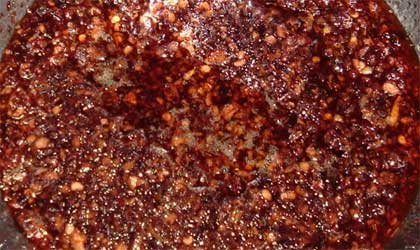

# Nam Prik Pao

*This universal Thai sauce appears on nearly every Thai table as a condiment, dip, and flavor agent. The name "nam prik" means chilli sauce in Thai, while "pao" refers to roasting, indicating the charred, complex flavors from toasted shrimp paste and the pounded-to-paste technique. This is Thailand's answer to sambal: powerful, umami-forward, and absolutely essential.*

**Yield:** Approximately 300-350 grams (makes 24-28 tablespoons)

## Overview
Nam prik pao is the definition of Thai culinary philosophy: a simple dish of tremendous depth. The combination of dried shrimp, fermented shrimp paste, pungent garlic, fiery chillies, and tiny sweet-acid aubergines creates a complex, intensely flavorful paste that transcends its humble ingredients. Fresh coriander adds herbal brightness. This sauce is served as a table condiment alongside steamed rice, used as a dip for fresh vegetables, spooned onto grilled meats, and stirred into soups. The mortar-and-pestle preparation is essential, it builds flavor through the pounding action that can't be replicated by machine.

## Ingredients

### Seafood Components
- 50-60 grams dried shrimp (small, raw)
- 1.5-2 cm cube of shrimp paste (belacan/terasi, approximately 15-20 grams)
- 50 grams cooked prawns, peeled and roughly chopped

### Aromatics & Heat
- 4-5 garlic cloves
- 4-5 fresh red chillies (medium size)
- 2-3 tablespoons fresh coriander leaves (packed tightly)

### Vegetables
- 6-8 tiny baby aubergines (approximately 50-60 grams total), or substitute regular aubergine chopped finely

### Liquid & Seasoning
- 4 tablespoons fresh lime juice (or lemon juice)
- 2 tablespoons Thai fish sauce
- 3 teaspoons soft light brown sugar or palm sugar
- Pinch of fine sea salt (adjust to taste)

## Method

### Stage 1 – Soak & Warm Components
1. Rinse the dried shrimp briefly under cold water to remove any sediment.
1. Place the dried shrimp in a bowl and cover with warm water.
1. Allow to soak for 12-15 minutes until the shrimp soften and plump.
1. Drain the shrimp in a colander and set aside.
1. While the shrimp soak, wrap the shrimp paste cube tightly in aluminum foil.

### Stage 2 – Toast Shrimp Paste
1. **Option A (Dry Pan):** Place the foil-wrapped shrimp paste in a dry skillet over medium heat. Dry-fry for 4-5 minutes, turning the packet occasionally, until the paste smells fragrant and slightly charred.
1. **Option B (Gas Flame):** Mold the shrimp paste onto the end of a metal skewer and hold over a gas flame for 1-2 minutes, rotating until the outside darkens and the aroma intensifies.
1. **Option C (Toaster Oven):** Wrap in foil and toast at 180°C (350°F) for 5-7 minutes.
1. Remove the toasted shrimp paste and allow to cool for 1-2 minutes.
1. Unwrap carefully and set aside.

### Stage 3 – Prepare Chillies & Garlic
1. Wash the fresh red chillies.
1. Cut off the stem end.
1. For less heat, slice in half and remove all seeds and white membrane; chop finely.
1. For authentic Thai version, leave seeds and membrane intact and slice the chillies.
1. Peel garlic cloves and crush with the side of a knife to break apart slightly.

### Stage 4 – Build the Paste Base (First Pounding)
1. Place the soaked dried shrimp into a large mortar.
1. Add the toasted shrimp paste.
1. Add the crushed garlic cloves (still in rough pieces).
1. Add the prepared chillies.
1. Using a heavy pestle, pound forcefully and deliberately for 2-3 minutes.
1. The ingredients will gradually break down into a rough paste.
1. Continue until the mixture is mostly combined and coarse, not perfectly smooth.

### Stage 5 – Add Cooked Prawns & Coriander
1. Add the chopped cooked prawns to the mortar.
1. Add the coarsely chopped fresh coriander leaves.
1. Continue pounding with the pestle for 1-2 minutes.
1. Pound gently, you want to incorporate these items, not destroy the prawn texture completely.
1. The mixture should have visible prawn and herb pieces.

### Stage 6 – Add Baby Aubergines
1. Rinse the baby aubergines and chop roughly into bite-sized pieces (leaving some whole is fine).
1. If using regular aubergine, cut into very small cubes.
1. Gradually add the aubergine pieces to the mortar.
1. Using the pestle, gently pound and crush the aubergine into the mixture.
1. This will break down the aubergine and release its juices into the sauce.
1. Continue for 2-3 minutes until the aubergine is mostly integrated and some pieces are visible.

### Stage 7 – Add Liquids & Seasonings
1. Squeeze the lime juice directly into the mortar (start with 3 tablespoons).
1. Add 2 tablespoons Thai fish sauce.
1. Add 3 teaspoons soft light brown sugar or palm sugar.
1. Stir very thoroughly to combine all ingredients, approximately 1-2 minutes of stirring.
1. Taste and adjust:
   - More lime juice if you want brightness and tartness (up to 4 tablespoons total)
   - More fish sauce if the umami seems muted (but don't exceed 3 tablespoons)
   - More sugar if the shrimp paste funk dominates
   - Pinch of salt if needed

### Stage 8 – Final Texture & Rest
1. Stir once more to ensure even distribution of all liquid.
1. The final nam prik should be chunky paste with visible shrimp pieces, aubergine fragments, and herbal bits.
1. Transfer to a serving bowl or glass jar.
1. Allow to rest for 10-15 minutes before serving, flavors continue to develop.

## Notes
- **Mortar & Pestle Essential:** The pounding action creates texture and flavor depth impossible to replicate with food processors. This is traditional Thai technique.
- **Dried Shrimp Quality:** Use high-quality dried shrimp, they should be pinkish, fragrant, and free of mold. Cheap versions are tasteless.
- **Shrimp Paste Toasting:** The heating mellows fermentation funk and makes the paste easier to incorporate. Never skip this step.
- **Baby Aubergines:** These Thai eggplants are bitter-sweet and tender. If unavailable, substitute with regular aubergine cut into tiny dice, though the character differs.
- **Cooked Prawns:** Use peeled, cooked prawns, raw causes food-safety concerns. These add sweetness and texture to the paste.
- **Fresh Coriander:** This herb provides essential brightness and freshness to balance the umami-heavy shrimp and paste.
- **Fish Sauce Power:** This fermented ingredient is strong. Taste as you add; you can't remove it once added.
- **Texture, Not Smoothness:** Nam prik is chunky, not pureed. Visible pieces of shrimp, aubergine, and herbs are correct.

## Variations
**Extra Spicy:** Use 6 chillies with all seeds and membranes intact; use chilli paste instead of fresh for intensity.
**Milder Version:** Use 2-3 chillies; remove all seeds and white membrane.
**Sweeter:** Add 5-6 teaspoons palm sugar for sweetness balancing umami.
**Extra Shrimp:** Increase dried shrimp to 70 grams or cooked prawns to 75 grams for stronger seafood character.
**More Herbs:** Increase coriander to 1/4 cup for herbal emphasis; add mint if desired.

## Serving
Use in: Rice dish condiment, vegetable dip, grilled meat accompaniment, soup flavor agent
Typical ratio: 1-2 tablespoons per serving alongside rice or vegetables
Temperature: Served at room temperature
Application: Spooned onto plates, used as dipping sauce, stirred into soups, added to stir-fried vegetables

## Storage
- Refrigerate in sealed glass jar for up to 7-10 days
- The fresh coriander and aubergine in the paste limit shelf-life
- Will separate slightly in the jar (liquid rises, solids settle), stir before serving
- Can be frozen in ice-cube trays for 4-6 weeks; thaw in refrigerator before use
- Best consumed within first week for maximum chilli brightness and coriander freshness
- Check for any mold or musty smell before using
- Does not keep at room temperature due to fresh vegetable and seafood content
- In tropical climates, use within 5-6 days for safety

