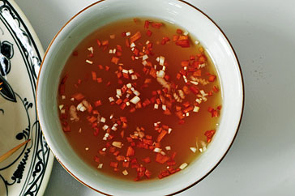

# Nuoc Cham

*In Vietnam, this fiery-bright sauce serves the exact purpose that salt and pepper do in Western cuisine: it appears on every table as the fundamental condiment for seasoning dishes to individual taste. The name means "chilli sauce", simple, direct, and absolutely essential. Fresh lime juice provides brightness, fish sauce contributes umami depth, while chillies deliver both heat and flavor.*

**Yield:** Approximately 120-140 milliliters (makes 10-12 tablespoons)

## Overview
Nuoc cham represents Vietnamese cooking philosophy distilled to its essence. This is not a complex sauce requiring technique or special ingredients, it's a straightforward expression of heat, bright acidity, and umami fermentation that exists primarily to season rice dishes, noodles, vegetables, and proteins to individual preference. Every Vietnamese cook makes this sauce twice daily, adjusting heat and salt to mood. The mortar-and-pestle pounding of fresh chillies releases their oils and creates flavor intensity. Lime juice brightens, fish sauce deepens, and sugar balances everything. This is cooking at its most honest and essential.

## Ingredients

### Primary Components
- 2-3 fresh red chillies (medium to large, depending on heat preference)
- 2-3 garlic cloves (fresh, pungent)
- 1.5-2 tablespoons granulated sugar (white or light brown)
- 3 tablespoons Vietnamese or Thai fish sauce
- Juice of 1-1.5 limes (approximately 2-3 tablespoons)
- Pinch of fine sea salt (adjust to taste)

### Optional Additions
- 1/4 teaspoon white pepper (for heat variation)
- 1-2 tablespoons water (to adjust consistency)

## Method

### Stage 1 – Prepare Chillies & Garlic
1. Wash the fresh red chillies.
1. Cut off the stem end.
1. For less heat, slice in half and remove all seeds and white membrane; chop roughly.
1. For authentic Vietnamese heat, leave all seeds and membrane intact; chop roughly.
1. The pieces should be 1/2 inch size or smaller.
1. Peel garlic cloves and crush with the side of a knife to break apart partially.

### Stage 2 – Pound Chillies & Garlic
1. Place the chopped chillies in a large mortar.
1. Add the crushed garlic cloves.
1. Using a heavy pestle, pound forcefully and deliberately.
1. Continue pounding for 1-2 minutes until the chillies and garlic break down into a fine paste.
1. The mortar and pestle action is essential, it releases the chilli oils and creates proper texture.
1. The paste should be well-broken but visible garlic and chilli pieces are fine.

### Stage 3 – Add Sugar & Fish Sauce
1. Add 1.5 tablespoons granulated sugar to the pounded chillies in the mortar.
1. Add 3 tablespoons fish sauce.
1. Stir very thoroughly with a spoon, mixing 1-2 minutes until the sugar dissolves and ingredients are combined.
1. At this point, the mixture will seem intensely pungent due to the raw garlic and fish sauce, this is correct.

### Stage 4 – Add Lime Juice & Adjust Consistency
1. Squeeze the lime juice directly into the mortar (start with 2 tablespoons from a fresh lime).
1. Stir well to combine.
1. If the sauce seems very thick or pasty, add 1 tablespoon water and stir.
1. The final sauce should be thin enough to pour and dip, not be a paste.

### Stage 5 – Taste & Final Adjustment
1. Taste the nuoc cham.
1. Assess heat level: Does it have sufficient chilli punch? Add chopped fresh chillies if needed.
1. Assess salt/umami: Does the fish sauce flavor dominate? This is correct, but you can balance with more lime juice.
1. Assess sweetness: The sugar should balance heat and salt without being noticeable as sweetness, it enhances other flavors.
1. Adjust to your preference:
   - More lime juice for brightness and tartness (up to 3 tablespoons total)
   - More fish sauce rarely needed; begin with 3 tablespoons
   - More salt if the seasoning seems flat (just a pinch)
   - More water if consistency is too thick

### Stage 6 – Transfer & Rest
1. Pour into a serving bowl or glass jar.
1. Stir once more to ensure even distribution.
1. Allow to rest for 5-10 minutes before serving.
1. This resting period allows flavors to blend, the raw garlic becomes slightly less aggressive.

## Notes
- **Fresh Lime Essential:** Bottled lime juice cannot substitute. Fresh lime juice provides essential brightness and complexity.
- **Mortar & Pestle Important:** The pounding action creates texture and releases chilli oils. Food processors create a different character.
- **Fish Sauce Quality:** Use Vietnamese or Thai fish sauce, the fermented umami is essential. The smell indicates quality, not defect.
- **Raw Garlic:** This sauce uses raw garlic, which is pungent. This is intentional and traditional. The lime juice mellows it slightly.
- **Heat Adjustment:** The chilli quantity is flexible, use more or fewer based on your heat tolerance and preference.
- **Resting Develops Flavor:** The 5-10 minute rest period mellows the raw garlic character while allowing flavors to marry.
- **Salt as Seasoner:** The fish sauce provides saltiness; additional salt is rarely needed but can be added by pinch if desired.
- **Consistency Important:** Nuoc cham should be pourable, not thick, it's a sauce to dip into and spoon over, not a paste.

## Variations
**Extra Spicy:** Use 3-4 chillies with all seeds and membranes intact; add pinch of white pepper.
**Milder Heat:** Use 1 chilli; remove all seeds and white membrane.
**Sweeter Version:** Add 2-2.5 tablespoons sugar instead of 1.5 for sweetness balancing heat.
**Less Fish Sauce:** Use 2.5 tablespoons if the umami intensity seems overwhelming (build from here).
**With Shallots:** Add 1 finely minced shallot (optional, non-traditional but flavorful).
**Extra Fresh:** Add 1 tablespoon finely chopped fresh mint or cilantro for herbal brightness.

## Serving
Use in: Rice dish condiment, noodle soup topping, vegetable dip, grilled meat accompaniment, spring roll dip
Typical ratio: 1-2 tablespoons per serving, adjusted individually for heat tolerance
Temperature: Served at room temperature, typically in small individual bowls for dipping
Application: Spooned onto plates alongside rice; diners add to taste; used as dipping for spring rolls and vegetables

## Storage
- Refrigerate in sealed glass jar for up to 4-5 days
- The fresh chillies and garlic have limited shelf-life; the sauce is best used within 2-3 days for maximum brightness
- Will separate slightly in the jar (liquid on top, solids settle), stir before serving
- Can be frozen in ice-cube trays for 4-6 weeks; thaw in refrigerator before use
- The raw garlic character mellows in refrigeration; the sauce becomes smoother after 1-2 days
- Check for any mold or musty smell before serving
- Does not keep at room temperature due to fresh chilli and garlic content
- In tropical climates, use within 2-3 days for optimal flavor and safety
- Traditional Vietnamese practice: make fresh frequently rather than store long-term