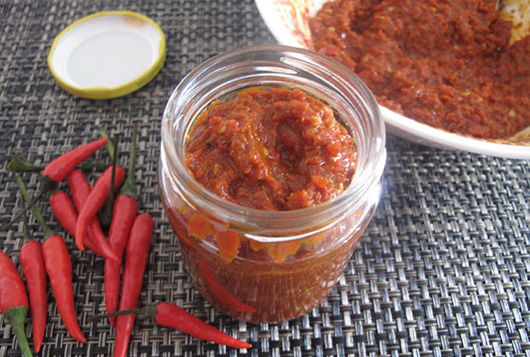

# Sambal Belacan

*This is the sambal of champions, pungent, assertive shrimp paste tamed by heat and citrus, counterbalanced only by fiery chillies that match its intensity. Belacan, the fermented shrimp paste that gives this sambal its character, is not for the faint-hearted. In Southeast Asia, this powerful condiment is served in small quantities with rice dishes, the starch tempering both heat and umami fermentation.*

**Yield:** Approximately 40-50 grams (makes 8-10 teaspoons)

## Overview
Sambal belacan represents the true umami heart of Southeast Asian cooking. Belacan, fermented shrimp paste, is a polarizing ingredient with a powerful aroma and intensely funky flavor. Combined with raw chillies and balanced with citrus juice, this sambal creates a complex flavor bomb meant to accompany rice, vegetables, and mild proteins where its intensity acts as a seasoning rather than a dish itself. The key is balance: the shrimp paste must be heated to mellow its raw funk while the citrus brightens and the chillies provide heat. Rice is essential for serving, nothing stands alone against this sambal's power.

## Ingredients

### Primary Ingredients
- 4-5 fresh red chillies (medium to large, depending on heat preference)
- 1-1.5 cm cube of belacan (fermented shrimp paste, approximately 15-18 grams)
- Juice of 1/2 lime (or full lime, about 1.5-2 tablespoons, to taste)
- 1/4 teaspoon fine sea salt (adjust to taste)

### Optional Additions
- 1 garlic clove (crushed; for additional pungency)
- 1/2 teaspoon palm sugar or regular sugar (to balance umami)

## Method

### Stage 1 – Toast the Shrimp Paste
1. Measure your belacan cube (approximately 1-1.5 cm cube).
1. **Option A (Gas Flame):** Mold the paste onto the end of a metal skewer. Hold the skewer over a gas flame, rotating slowly for 1-2 minutes until the outside of the paste begins to look dry and slightly darkened. The aroma will intensify dramatically, this is good.
1. **Option B (Dry Pan):** Wrap the belacan cube tightly in aluminum foil. Place in a dry skillet over medium heat. Dry-fry for 4-6 minutes, turning the foil packet occasionally. The belacan will smell pungent and slightly charred, correct.
1. **Option C (Toaster Oven):** Wrap belacan in foil, place on a small baking sheet, and toast at 180°C (350°F) for 5-8 minutes. The aroma will mask others in your kitchen, warning given.
1. Remove the toasted belacan and set aside to cool for 1-2 minutes.
1. This toasting step mellows the raw fermentation funk while allowing you to handle the paste.

### Stage 2 – Prepare Chillies
1. Wash the fresh red chillies.
1. Cut off the stem end.
1. For less heat, slice the chilli in half lengthwise and remove the seeds and white membrane inside.
1. For maximum heat and authentic preparation, leave seeds and membrane intact.
1. Chop the chillies finely into small pieces.

### Stage 3 – Pound Chillies
1. Place the chopped chillies into a mortar.
1. Add the fine sea salt (this helps release juices from the chillies).
1. Using a heavy pestle, pound forcefully and deliberately.
1. Continue pounding for 2-3 minutes until the chillies break down into a rough paste.
1. The mortar and pestle is essential here, no food processor; this is traditional technique.

### Stage 4 – Add Toasted Shrimp Paste
1. Remove the foil from the cooled toasted belacan.
1. Add the toasted belacan to the pounded chillies in the mortar.
1. Continue pounding with the pestle, pressing the shrimp paste into the chillies.
1. Pound for 1-2 minutes until the shrimp paste and chillies are thoroughly combined.
1. The mixture should appear even in color and texture.

### Stage 5 – Add Citrus Juice & Optional Ingredients
1. Squeeze the lime juice directly into the mortar (start with 1 tablespoon).
1. Stir well to combine.
1. Taste and adjust:
   - Add more lime juice if you want additional brightness (up to 2 tablespoons total)
   - Add pinch of salt if the umami seems muted
   - Add 1/2 teaspoon sugar if the fermentation flavor seems too intense
1. If adding crushed garlic for additional pungency, add now and stir.

### Stage 6 – Final Blending & Resting
1. Pound or stir the mixture for another 30 seconds to fully integrate all flavors.
1. The sambal should be a coarse, speckled paste where you can see chilli and shrimp paste particles.
1. Transfer to a small bowl or serving spoon.
1. Allow to rest for 5-10 minutes before serving, flavors will develop.

## Notes
- **Belacan Selection:** This fermented shrimp paste is intensely pungent and an acquired taste. Brands like Malaysian belacan or Indonesian terasi are standard. The smell does not reflect the taste, trust the process.
- **Toasting Essential:** Never use raw belacan directly. The heating matures and mellows the fermentation funk while making the paste more manageable.
- **Mortar & Pestle Only:** The pounding action is critical, food processors won't achieve the proper coarse texture and flavor development.
- **Citrus Balance:** The lime juice is essential for cutting through the shrimp paste funk. Adjust to preference, but never use less than 1 tablespoon.
- **Heat vs. Umami:** The raw chillies provide heat; the belacan provides umami. Together they create complexity that both enhance each other.
- **Small Batch Preparation:** This sambal is best made fresh to order due to the powerful, volatile flavors of fresh chillies and just-toasted shrimp paste.
- **Powerful Condiment:** Never overeat this sambal. A teaspoon or two alongside a plate of rice and vegetables is the proper serving.

## Variations
**Milder Heat:** Use fewer chillies (2-3 instead of 4-5); remove all seeds.
**With Garlic:** Add 1 crushed garlic clove for additional pungency and depth.
**Sweeter Version:** Add 1 teaspoon palm sugar or regular sugar to balance the fermentation intensity.
**Extra Citrus:** Use lime juice exclusively (not lemon), the flavor is more authentic.
**Without Sugar:** Traditional preparation uses no sugar, saltiness balances everything.

## Serving
Use in: Rice dish accompaniment, vegetable tempering sauce, protein condiment, curry base
Typical ratio: 1 small teaspoon per serving (this is powerful, respect its intensity)
Temperature: Served at room temperature in small bowl alongside rice
Application: A small spoonful or teaspoon portion served on the side of the plate; diners add to rice as they eat

## Storage
- Refrigerate in sealed glass jar for up to 5-7 days maximum
- The fresh chillies have limited shelf-life; the belacan becomes increasingly pungent
- The sambal will separate slightly in the jar, stir before serving
- Can be frozen in ice-cube trays for 4-6 weeks; thaw in refrigerator before use
- In tropical climates, best consumed within 2-3 days for maximum chilli freshness
- Does not keep at room temperature due to fresh chilli content
- Check for any mold or musty smell before using
- Traditional practice: make fresh before serving, this is a fresh condiment, not meant for long storage