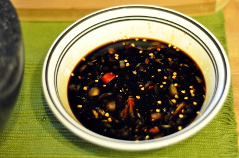

# Sambal Kecap

*This Indonesian soy-based sambal balances sweet kecap manis with fiery chillies and pungent garlic, creating a complex dipping sauce that's far more sophisticated than the sum of its parts. Traditionally served alongside satay skewers and fried chicken, this condiment illustrates the Indonesian mastery of sweet-spicy harmony.*

**Yield:** Approximately 175 milliliters (makes 12-15 tablespoons)

## Overview
Sambal kecap is deceptively simple yet deeply flavorful, a sweet-spicy Indonesian dipping sauce that represents the nation's love of contrasting flavors. Kecap manis, the sweet soy sauce that gives this sambal its name and character, provides a rich molasses-like sweetness that's balanced by raw chilli heat and garlic pungency. This is a dip meant for protein: grilled satay skewers, fried chicken, grilled seafood. The sweetness of the kecap contrasts with smoky, charred meat while the heat cuts through richness. This sambal appears on countless Indonesian tables as a standard condiment alongside meals.

## Ingredients

### Primary Ingredients
- 150 milliliters kecap manis (Indonesian sweet soy sauce, dark, thick, with molasses character)
- 2-3 fresh red chillies (medium heat)
- 4-5 garlic cloves
- 3-4 tablespoons fresh lime juice (or lemon juice)
- 1-2 tablespoons water (to adjust consistency)

### Optional Ingredients
- 1 teaspoon tamarind water (for tartness)
- 1 teaspoon fish sauce (for umami depth)
- 1/2 teaspoon ground ginger (for warmth)

## Method

### Stage 1 – Prepare Chillies & Garlic
1. Wash fresh red chillies.
1. Cut off the stem end.
1. For less heat, slice the chilli in half and remove seeds and white membrane, then finely chop.
1. For maximum heat, leave seeds intact and finely chop the entire chilli.
1. Peel and crush 4-5 garlic cloves in a mortar with a heavy pestle until they form a fine paste.

### Stage 2 – Combine Base Ingredients
1. Pour the kecap manis into a small bowl.
1. Add the finely chopped chillies to the kecap manis.
1. Add the crushed garlic paste.
1. Stir very thoroughly with a spoon, breaking up garlic clumps, until well combined, approximately 1-2 minutes.

### Stage 3 – Add Acid & Adjust Consistency
1. Add 3 tablespoons fresh lime juice (or lemon juice).
1. Stir well to combine.
1. Add 1 tablespoon water.
1. Stir again.
1. Taste and adjust:
   - Add more lime juice if you want brightness and tartness
   - Add more water if the sambal seems too thick
   - Add more chilli if you want extra heat

### Stage 4 – Optional Additions
1. If adding tamarind water, add 1 teaspoon and stir well, this adds complexity
1. If adding fish sauce, add a few drops and stir, this adds umami depth
1. If adding ginger, add 1/2 teaspoon and stir until evenly distributed

### Stage 5 – Rest & Develop Flavor
1. Transfer to a serving bowl or glass jar.
1. Cover loosely with plastic wrap or cloth.
1. Allow to sit at room temperature for 20-30 minutes.
1. This resting period allows flavors to meld and develop, do not skip this step.

### Stage 6 – Final Taste & Serve
1. Before serving, taste again.
1. Adjust lime juice, salt (can add pinch of sea salt if needed), or water as desired.
1. Stir well, the sambal will separate slightly with visible chilli particles floating in sauce.

## Notes
- **Kecap Manis Character:** This thick, sweet soy sauce is essential, cannot be substituted with regular soy sauce. Indonesian brands like ABC or Bango are widely available in Asian grocers.
- **Chilli Heat vs. Sweetness:** The sweetness of kecap manis requires actual heat from chillies to balance it. Never underestimate number of chillies needed.
- **Garlic Flavor:** Fresh, pungent garlic is crucial. Use fresh garlic cloves, never garlic powder.
- **Acid Balance:** Lime juice brightens and cuts through sweetness. Adjust to your preference for tartness.
- **Resting Period:** This sambal develops depth of flavor as ingredients sit together, the 20-30 minute rest is not optional.
- **Texture:** The sambal should be slightly chunky with visible chilli and garlic particles, not completely smooth.
- **Fish Sauce:** This Indonesian addition is optional but traditional; use sparingly, it's pungent.

## Variations
**Extra Spicy:** Add 1-2 additional chillies; keep seeds and membranes for maximum heat.
**Sweeter Version:** Reduce lime juice to 2 tablespoons for more kecap manis character.
**With Tamarind:** Replace lime juice with 4 tablespoons tamarind water for fruitier, more complex tartness.
**With Ginger:** Add 3/4 teaspoon ground ginger for warming spice.
**Thicker Consistency:** Reduce water to 1/2 tablespoon or skip water entirely for thicker dipping sauce.

## Serving
Use in: Satay dipping sauce, fried chicken condiment, fried seafood accompaniment, noodle dish topping
Typical ratio: 1-2 tablespoons per serving, used as dipping sauce
Temperature: Served at room temperature or chilled
Application: Served in small bowl for dipping; use spoon to dollop onto plate alongside grilled/fried proteins

## Storage
- Refrigerate in sealed glass jar for up to 7-10 days
- The fresh chillies and garlic have limited shelf-life; use within 1 week for best flavor
- Will separate if left undisturbed (liquid settles, chillies rise), stir before each serving
- Can be frozen in ice-cube trays for 3-4 weeks; thaw in refrigerator before use
- Best served fresh; prepare within 2-3 days of serving for optimal chilli brightness
- Does not keep at room temperature due to fresh ingredients
- Check for any mold or musty smell before using