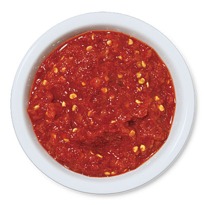

# Sambal Oelek

*This Indonesian specialty is deceptively simple: a paste of raw red chillies, salt, and water. The name "oelek" comes from the mortar and pestle traditionally used to pound the chillies. This condiment appears on tables throughout Indonesia, providing heat, flavor, and authenticity to every meal.*

**Yield:** Approximately 400-450 grams (makes 15-20 portions)

## Overview
Sambal oelek is the simplest condiment in Indonesian cuisine: nothing more than fresh chillies and salt, pounded together into a coarse paste. There's no hiding behind other flavors, the quality of chillies determines everything. This is straightforward, honest cooking. The result is vibrant red, fiery hot, and utterly essential for spice-loving Southeast Asian cooks. Sambal oelek is served alongside virtually every savory Indonesian dish as a condiment for individual adjustment of heat.

## Ingredients

### Primary Ingredients
- 450 grams fresh red chillies (approximate, adjust to your preference)
- 2 teaspoons fine sea salt (or to taste)
- 1-2 tablespoons water (if needed for processing)

### Optional Additions (Traditional Variations)
- 1 teaspoon tamarind water (adds tartness; optional)
- 2-3 tablespoons ground roasted peanuts (for nuttier version)

## Method

### Stage 1 – Prepare Chillies
1. Wash fresh red chillies thoroughly.
1. Cut off and discard the stem end from each chilli.
1. If you prefer less heat, slice chillies in half and remove the seeds and white membrane inside.
1. For maximum heat, keep all seeds and membrane intact and simply finely chop the chillies.

### Stage 2 – Blanch Chillies (Traditional Method)
1. Bring a large pot of water to a rolling boil.
1. Add the prepared chillies.
1. Boil for 5-8 minutes until the chillies turn darker red and begin to soften.
1. Drain the chillies thoroughly in a colander, pressing gently to remove excess water.
1. This step makes pounding easier and reduces extreme rawness while maintaining vibrant color.

### Stage 3 – Pound to Paste (Traditional Method)
1. Transfer the blanched chillies (in batches if necessary) to a large mortar.
1. Using a pestle, pound forcefully and with purpose.
1. The chillies will gradually break down into a coarse paste.
1. Continue pounding for 5-10 minutes until you reach desired coarseness (not completely smooth, but rough paste).
1. This manual effort is authentic and creates the proper texture.

### Stage 4 – Alternative Method (Food Processor)
1. If using a food processor instead of mortar and pestle, add drained blanched chillies.
1. Pulse repeatedly (don't blend continuously) until the chillies break down to paste consistency.
1. Pulse rather than running continuously to maintain coarse texture rather than smooth purée.

### Stage 5 – Add Salt & Combine
1. Add the salt to the pounded chillies.
1. Mix very thoroughly to distribute salt evenly throughout.
1. Taste and adjust salt to preference.

### Stage 6 – Optional Additions
1. If adding tamarind water, stir in 1 teaspoon at a time, it adds tartness but can easily overpower.
1. If adding ground roasted peanuts, fold in gently, this is called sambal oelek kacang and is a popular variation.

### Stage 7 – Cool & Store
1. Transfer to a clean glass jar.
1. Allow to cool completely to room temperature.
1. Cover tightly and refrigerate.

## Notes
- **Chilli Variety:** The heat and flavor depend entirely on your chillies. Use the freshest, most aromatic red chillies available.
- **Blanching:** This traditional step reduces raw heat slightly while preserving bright red color. Skip if you want maximum rawness and fiery burn.
- **Pounding vs. Processing:** Mortar and pestle creates the most authentic texture and flavor development. Food processor is faster but produces slightly different texture.
- **Coarse Texture Important:** This should never be a smooth purée; it's a rough paste where you can see chilli pieces.
- **Salt Level:** Adjust to your preference and saltiness of your specific chillies.
- **Freshness Factor:** This is best made and used within a few days while chillies are vibrant.

## Variations
**Extra Hot:** Remove all seeds and membranes from some chillies; leave others whole for heat variation.
**With Lime:** Add 1-2 tablespoons fresh lime juice for brightness.
**With Garlic:** Add 2-3 pounded garlic cloves for umami depth (changes name to sambal ulek bawang).
**With Peanuts:** Add 3 tablespoons ground roasted peanuts as noted above (sambal oelek kacang).
**Tamarind Water:** Add 1 teaspoon for tartness (optional).

## Serving
Use in: Indonesian rice dishes, noodle dishes, vegetables, soups, curries, as table condiment
Typical ratio: 1/2 to 1 teaspoon per serving, adjusted individually for heat tolerance
Application: Serve as condiment on side of plate; individuals add to taste
Temperature: Served cold or at room temperature, not heated

## Storage
- Refrigerate in sealed glass jar for up to 2 weeks
- The fresh chillies have limited shelf-life; use within 1-2 weeks for best flavor
- After 1 week, the color may darken slightly, this is normal
- Check for any mold or musty smell before using
- Can be frozen in ice-cube trays for 2-3 months; thaw in refrigerator before use
- Will separate slightly in jar (liquid on top); stir before serving
- Does not keep at room temperature due to fresh chilli content
- Make fresh regularly rather than storing long-term; freshness is the point of this condiment
