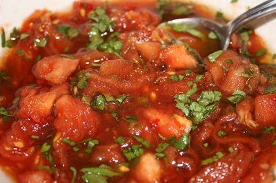

# Sambal Salamat

*This Indonesian tomato-based sambal offers a unique balance of fresh tomato acidity, chilli heat, and fermented fish sauce umami, all brightened with live coriander. "Salamat" means thanks, fitting for a sambal so vibrant and flavorful that it elevates simple rice dishes into memorable meals.*

**Yield:** Approximately 150 milliliters (makes 12-15 tablespoons)

## Overview
Sambal salamat is the tomato-forward answer for cooks who want fresh vegetable flavor alongside heat. Unlike pure chilli sambals, this version builds complexity through ripe tomato body, fermented fish sauce depth, and fresh coriander's distinctive herbal note. The mixing and resting period allows the tomato juices to marry with fish sauce and chilli heat, creating something far greater than its simple ingredients suggest. This sambal appears on Indonesian tables as a bright, fresh condiment that cuts through rich, oily dishes while standing proudly alongside simple rice and steamed vegetables.

## Ingredients

### Primary Ingredients
- 3-4 medium ripe tomatoes (approximately 500-600 grams total)
- 1-2 fresh red chillies (adjust for heat preference)
- 3-4 tablespoons fish sauce (Southeast Asian style)
- 1/4 teaspoon fine sea salt
- 2-3 tablespoons fresh coriander leaves (packed, finely chopped)

### Optional Ingredients
- 1 garlic clove (crushed; for additional pungency)
- 1/2 teaspoon palm sugar (to balance acidity and salt)
- 1 tablespoon fresh lime juice (for additional brightness)

## Method

### Stage 1 – Prepare Tomatoes for Peeling
1. Wash the ripe tomatoes thoroughly.
1. Using a small sharp knife, score a small X or cross into the base of each tomato (opposite the stem end).
1. Cut only through the skin, not too deep into the flesh.
1. This cross helps the skin release cleanly from the flesh.

### Stage 2 – Blanch & Shock Tomatoes
1. Bring a large pot of water to a rolling boil.
1. Carefully add the scored tomatoes to the boiling water.
1. Leave the tomatoes in boiling water for 20-30 seconds, or until the skin around the score begins to curl and peel away.
1. Remove the tomatoes immediately with a slotted spoon.
1. Plunge the hot tomatoes directly into a bowl of ice-cold water.
1. Let them cool for 30 seconds.
1. This shocking stops the cooking and makes the skins easy to remove.

### Stage 3 – Peel & Seed Tomatoes
1. Remove each tomato from the ice water.
1. Starting at the score, peel away the tomato skin with your fingers or a small knife.
1. The skin should come away easily in strips.
1. Once fully peeled, cut the tomato in half horizontally.
1. Using your fingers or a small spoon, gently scoop out the seeds and jelly-like center (this prevents excess liquid in the sambal).
1. Roughly chop the tomato flesh into small, bite-sized pieces.
1. Place the chopped tomato in a bowl, allowing the juices to collect.

### Stage 4 – Prepare Chilli
1. Wash the fresh red chillies.
1. Cut off the stem end.
1. For less heat, slice in half and remove all seeds and white membrane, then finely chop.
1. For more heat, leave seeds intact and chop finely.
1. Add the chopped chilli to the bowl with tomatoes.

### Stage 5 – Add Seasonings & Aromatics
1. Add 1/4 teaspoon salt to the tomato mixture.
1. Add 3 tablespoons fish sauce (or 4 tablespoons if you prefer stronger umami), begin with less and add more to taste.
1. Add the finely chopped fresh coriander leaves (approximately 2-3 tablespoons, packed).
1. If adding crushed garlic, add 1 clove now.
1. If adding palm sugar or regular sugar, add 1/2 teaspoon now, this balances the acidity and salt.

### Stage 6 – Mix & Rest
1. Stir all ingredients together very thoroughly.
1. Ensure the salt, fish sauce, and sugar dissolve and distribute evenly.
1. Continue stirring for 1-2 minutes until the mixture is well combined.
1. Cover the bowl loosely with plastic wrap or cloth.
1. Allow to rest at room temperature for at least 2 hours.
1. This resting period is essential, the tomato juices meld with fish sauce and chilli heat creates something unified and delicious.

### Stage 7 – Taste & Adjust Before Serving
1. After 2 hours, stir the sambal again.
1. Taste and assess:
   - Fish sauce: Add more if it seems flat or lacks punch (1 more tablespoon maximum)
   - Chilli heat: Taste should have clear heat but not be overwhelming
   - Salt: Add pinch of salt if needed (lime juice can also brighten)
   - Lime juice: Add 1 tablespoon if more brightness/tartness is desired
1. Stir once more and serve.

## Notes
- **Ripe Tomato Essential:** Only use truly ripe, flavorful tomatoes (red color, some give to pressure, fragrant). Pale or hard tomatoes will not work.
- **Fish Sauce Strength:** This ingredient is powerful, it's fermented, pungent, umami-forward. Start with 3 tablespoons and add gradually. You cannot remove it once added.
- **Fresh Coriander Important:** This herb is not optional; it provides the fresh, bright character that differentiates this sambal from others.
- **Resting Period Critical:** The 2-hour rest is not optional. The flavors transform from individual ingredients to unified condiment.
- **Seed Removal:** Removing tomato seeds prevents excess liquid that would dilute the sambal's intensity.
- **Peeling vs. Non-Peeling:** Peeling tomatoes creates smooth consistency; un-peeled tomatoes create chunkier texture. This recipe assumes peeling for classic texture.
- **Strong Flavors:** The fermented quality of fish sauce is intentional, this sambal is powerful and meant to accompany mild dishes, not stand as feature.

## Variations
**Milder Heat:** Use only 1 chilli; remove all seeds and membrane.
**Extra Coriander:** Use up to 4 tablespoons fresh coriander for herbaceous emphasis.
**With Garlic:** Add 1-2 crushed garlic cloves for additional pungency and depth.
**Sweeter Version:** Add 1 full teaspoon palm sugar or regular sugar for sweetness balancing umami and heat.
**With Lime:** Add 1-2 tablespoons fresh lime juice for citrus brightness, this lightens the fish sauce funk.
**Extra Spicy:** Use 3 chillies with all seeds and membranes intact.

## Serving
Use in: Rice dish accompaniment, vegetable side condiment, protein temper, curry flavor agent
Typical ratio: 1-2 tablespoons per serving alongside rice
Temperature: Served at room temperature or lightly chilled
Application: Served in small bowl or spooned onto side of plate; diners add as desired to rice

## Storage
- Refrigerate in sealed glass jar for up to 4-5 days
- The fresh coriander and tomato content limit shelf-life; use within 3-4 days for maximum flavor
- The sambal will separate and release liquid as it sits, stir before serving
- Can be frozen in ice-cube trays for 3-4 weeks; thaw in refrigerator before use
- Best used fresh, the bright coriander flavor fades significantly after 4-5 days
- Check for any mold or musty smell before reheating
- Does not keep at room temperature due to fresh tomato and coriander content
- Make fresh regularly rather than relying on long-term storage for best results