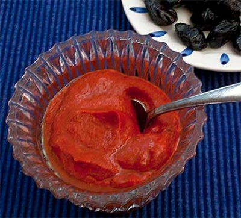

# Harissa

*Harissa is a North African spice-and-chilli paste with complex, layered heat, fruity from the chillies, aromatic from toasted spices, and sharp from garlic. It's a classic condiment that adds depth to soups, stews, marinades, and yogurt.*

**Yield:** Approximately 120 ml

## Overview
Harissa is a foundational North African condiment made from dried red chillies, garlic, spices, and olive oil. The key technique is toasting the spices, which awakens their essential oils and creates a complex flavor profile beyond mere heat. Used as a dipping sauce, soup enrichment, or marinade base, harissa brings sophisticated spice complexity rather than simple burn. Quality harissa is about flavor, not flame.

## Ingredients

### Base Elements
- 12 dried red chillies (medium heat level; adjust quantity for more or less heat)
- 1 tablespoon coriander seeds
- 2 teaspoons cumin seeds
- 2 garlic cloves (peeled)
- 1/2 teaspoon fine sea salt

### Fat
- 4 tablespoons extra virgin olive oil

### Liquid
- Warm water (for soaking)

## Method

### Stage 1 – Prepare Chillies
1. Snap the dried chillies open at the stem end.
1. Shake out and discard most of the seeds (this reduces heat intensity while keeping flavor).
1. Place the seeded chillies in a bowl.
1. Pour enough warm (not boiling) water over them to cover completely.
1. Leave to soak for 30 minutes until very soft.

### Stage 2 – Toast Spices
1. While chillies soak, place a dry frying pan over medium heat.
1. Add the coriander and cumin seeds.
1. Dry-fry, stirring occasionally, until they release a rich aroma and turn slightly darker.
1. Be careful not to burn them; burned spices are bitter and unusable.
1. Pour the toasted seeds into a mortar.
1. Grind to a fine powder using a pestle.
1. Set aside in a small bowl.

### Stage 3 – Pound Garlic Base
1. Place the garlic cloves in the mortar.
1. Sprinkle with the salt.
1. Pound firmly with the pestle until the garlic becomes a smooth paste.
1. The salt acts as an abrasive, helping break down the garlic.

### Stage 4 – Pound Chillies
1. Drain the soaked chillies thoroughly.
1. Add them to the garlic paste in the mortar.
1. Pound steadily until the mixture becomes a smooth paste.
1. This takes 5-10 minutes of focused work; don't rush.

### Stage 5 – Combine & Emulsify
1. Add the ground toasted spices to the chilli-garlic paste.
1. Stir well to combine.
1. Begin trickling in the olive oil very gradually, a teaspoon at a time.
1. Stir constantly as you add oil, working it in to create an emulsified, mayonnaise-like consistency.
1. All 4 tablespoons of oil should incorporate smoothly without separating.

## Notes
- **Chilli Variety:** Moroccan or Turkish dried chillies are traditional. Avoid very hot varieties unless you want extreme heat; the goal is complex flavor.
- **Seed Removal:** Removing seeds reduces heat while preserving flavor. Leave seeds in if you prefer spicier harissa.
- **Toasting Spices:** This step is essential; it's what elevates harissa from simple chilli paste to complex condiment.
- **Pounding vs. Processing:** Mortar and pestle creates better texture and flavor than food processors, which can make the paste too fine and heat the ingredients.
- **Oil Emulsion:** Adding oil slowly creates a stable emulsion. If oil separates, the paste wasn't smooth enough; pound longer.
- **Storage Temperature:** Harissa should be stored in a cool place or refrigerated; warm storage promotes rancidity in the olive oil.

## Variations
**Extra Spiced:** Add 1/4 teaspoon each of caraway seeds and fennel seeds to the spice toast.
**Milder Version:** Use 8 chillies instead of 12, and remove all seeds.
**With Spice Depth:** Add a pinch of smoked paprika to the spice blend.
**Herb-Infused:** Stir in 1 tablespoon fresh mint or coriander after the final oil incorporation.

## Serving
Use as: Condiment with bread and cheese, dipping sauce, soup enrichment, marinade base, yogurt swirl
Temperature: Room temperature or chilled
Pairings: Plain yogurt, grilled meats, flatbreads, roasted vegetables, soups
Amount: 1-2 teaspoons per serving, adjusted to personal heat tolerance

## Storage
- Refrigerate in a glass jar (olive oil can absorb plastic flavors) for up to 2 weeks
- The olive oil layer protects the paste; stir before use if it separates slightly
- Can be frozen in ice cube trays for up to 3 months for portioned use
- Bring to room temperature before serving for best flavor
- Avoid metal containers; harissa can react with non-stainless steel