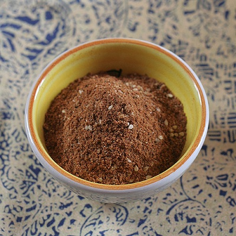

# Baharat

*This aromatic spice blend is found throughout the Eastern Mediterranean, spreading from Egypt, Jordan, and Lebanon to Syria, Sudan, and Ethiopia. The Arabic name Baharat literally translates to "spice", a universal blend that spans borders and cultures.*

**Yield:** Approximately 115 grams (makes 20+ portions)

## Overview
Baharat is the signature spice blend of the Eastern Mediterranean and Arabian cuisine. It balances warm aromatics (cinnamon, cardamom, cloves) with peppery heat and depth from allspice and paprika. This is not a finishing blend but a foundational one, used to season meat dishes, rice, soups, and slow-cooked foods. The warm spices reflect the climate and trade history of the region, cinnamon from Sri Lanka, cardamom from India, tempered by local paprika. Each country has slight variations, but the core character remains: sophisticated, warm, and complex.

## Ingredients

### Whole Spices to Roast
- 1 cinnamon stick (broken into small pieces)
- 2 tablespoons coriander seeds
- 2 tablespoons cumin seeds
- 6 tablespoons cardamom seeds (or 12 green cardamom pods)
- 2 tablespoons cloves
- 2 tablespoons black peppercorns

### Pre-Ground Spices to Add After Roasting
- 4 tablespoons paprika
- 1 teaspoon ground allspice
- 2 teaspoons freshly grated nutmeg
- 2 teaspoons chilli powder
- 1.5 teaspoons fine sea salt

## Method

### Stage 1 – Grind Cinnamon Separately
1. Break the cinnamon stick into very small pieces (roughly 1 cm each).
1. Place in a spice mill or coffee grinder.
1. Pulse until reduced to fine powder.
1. Transfer to a bowl and set aside.

### Stage 2 – Dry Roast Whole Spices
1. Place a heavy-bottomed frying pan over medium heat with no oil.
1. Add the coriander seeds, cumin seeds, cardamom seeds (or crushed cardamom pods), cloves, and black peppercorns.
1. Continuously stir and toss the spices as they heat for 4-5 minutes.
1. They will become aromatic and visibly darker.
1. Remove from heat when the aroma is rich and distinctive.
1. Do not allow smoking; that indicates burning and bitterness.
1. Transfer to a cool surface and allow to reach room temperature.

### Stage 3 – Grind Roasted Spices
1. Transfer cooled spices to a mortar or spice grinder.
1. Grind thoroughly to a fine powder.
1. Work in batches if your equipment is small.
1. Sift to remove any large particles.

### Stage 4 – Combine All Components
1. Add the ground cinnamon powder from Stage 1 to the mortar with the roasted spices.
1. Add the paprika, allspice, grated nutmeg, chilli powder, and salt.
1. Mix very thoroughly for 2-3 minutes to blend flavors evenly.
1. The color should be uniform throughout.

### Stage 5 – Store
1. Transfer to an airtight glass jar.
1. Label with the date of preparation.
1. Store in a cool, dark place away from strong light and heat.

## Notes
- **Cinnamon Grinding Separate:** Cinnamon sticks are harder than other spices and grind better alone, then blended at the end for better texture.
- **Cardamom Flexibility:** Using cardamom seeds (from crushed pods) works better than whole pods, which can be gritty if not removed after roasting.
- **Paprika Freshness:** Use freshly opened paprika if possible; it oxidizes quickly and loses color and flavor after opening.
- **Nutmeg Freshness:** Freshly grated nutmeg is far superior to pre-ground; the oils begin oxidizing immediately after grating.
- **Regional Variations:** Some versions add more cinnamon, others increase cloves. Adjust to personal preference.

## Variations
**Spicier:** Increase chilli powder to 2.5 teaspoons.
**Sweeter:** Add 1/2 cinnamon stick to the initial roasting, or grind an additional stick and add 1 teaspoon at the end.
**Earthier:** Increase cumin seeds to 3 tablespoons in the roasting stage.
**For Red Meat:** Add 1 additional tablespoon paprika and 1 teaspoon extra nutmeg.

## Serving
Use in: Middle Eastern meat curries, rice pilafs, spiced stews, meat marinades, slow-cooked dishes
Typical ratio: 1-2 teaspoons per portion depending on dish
Application: Toast briefly in oil before adding other ingredients to bloom the spices
Temperature: Works best when fried in hot oil to release aromatic oils

## Storage
- Store in airtight glass jar in a cool, dark place away from light and heat
- Properly stored, remains flavorful for 8-10 months
- Flavor gradually fades after 6 months; check aroma before using in important dishes
- The paprika fades fastest with light exposure; keep in dark jar
- Does not require refrigeration
- Label with preparation date
- Make fresh every 8-10 months for optimal color and potency

