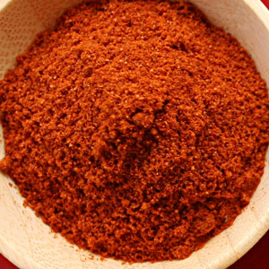

# Berbere

*Ethiopia produces some of Africa's most delicious food. Dishes such as spicy stews, fueled by the fire of this legendary hot spice mixture, are traditionally served on large discs of spongy bread called injera. Berbere is the soul of Ethiopian cooking.*

**Yield:** Approximately 50-60 grams (makes 15-20 portions)

## Overview
Berbere is the cornerstone of Ethiopian cuisine, a powerfully hot and complex spice blend that's both a condiment and a cooking base. Unlike other chilli-forward blends, Berbere combines dried chillies with cardamom, cloves, and ajowan to create heat with sophistication. The blend is intensely aromatic and demands respect; a little goes a long way. This is a blend for stews and braises that simmer for hours, allowing the spices to develop depth and integrate with other ingredients.

## Ingredients

### Whole Spices to Roast
- 10 dried red chillies (seeds partially removed for manageable heat)
- 8 white cardamom pods (or green cardamom)
- 1 teaspoon cumin seeds
- 1 teaspoon coriander seeds
- 1 teaspoon fenugreek seeds
- 8 cloves
- 1 teaspoon allspice berries
- 2 teaspoons black peppercorns
- 1 teaspoon ajowan seeds (bishop's weed; optional but traditional)

### Ground Spices to Add After Roasting
- 1 teaspoon ground ginger
- 1/2 teaspoon freshly grated nutmeg
- 2 tablespoons fine sea salt

## Method

### Stage 1 – Prepare Chillies
1. Take each dried red chilli and snap it in half.
1. Remove and discard some (about half) of the seeds from inside.
1. This creates manageable heat while retaining chilli character.
1. For maximum heat, remove only a few seeds; for milder blend, remove all seeds.

### Stage 2 – Roast Whole Spices
1. Place a heavy-bottomed frying pan over medium heat with no oil.
1. Add the prepared chillies, cardamom pods (bruised to open), cumin, coriander, fenugreek, cloves, allspice berries, peppercorns, and ajowan seeds.
1. Continuously stir and shake the pan as they heat for 5-6 minutes.
1. The mixture will become deeply aromatic.
1. Remove from heat when the aroma is rich and pungent.
1. Do not allow smoking; that indicates burning.
1. Transfer to a cool surface immediately to stop cooking.

### Stage 3 – Cool Completely
1. Allow roasted spices to reach room temperature (15 minutes).

### Stage 4 – Remove Cardamom Husks
1. Once cool, carefully open the cardamom pods and extract the seeds inside.
1. Discard the cardamom husks.
1. Place cardamom seeds in a mortar.

### Stage 5 – Grind to Powder
1. Add all remaining roasted spices to the mortar with cardamom seeds.
1. Grind thoroughly to a fine powder.
1. Work in batches if your mortar is small.
1. Sift to remove large particles; re-grind as needed.

### Stage 6 – Add Ground Spices & Mix
1. Stir in the ginger, grated nutmeg, and salt.
1. Mix very thoroughly for 2-3 minutes to ensure even distribution.

### Stage 7 – Store
1. Transfer to an airtight jar.
1. Label with preparation date.
1. Store in a cool, dark place away from light and heat.

## Notes
- **Heat Management:** This blend is genuinely very hot. Start with small amounts and adjust upward in recipes.
- **Chilli Seed Adjustment:** Removing some seeds controls heat while maintaining authentic flavor. Remove all seeds for milder blend.
- **Ajowan Seeds:** These add a thyme-like character that's subtle but important. If unavailable, substitute 1 teaspoon dried thyme.
- **Long Cooking:** Berbere is designed for long-simmered stews where spices integrate over hours. Don't use as a quick-fry base.
- **Cardamom Husk Removal:** Leaving husks in creates gritty texture; remove seeds and discard pods.

## Variations
**Milder Heat:** Remove all chilli seeds; increase allspice berries to 2 teaspoons.
**Extra Heat:** Keep all chilli seeds; add 2 additional dried red chillies.
**Earthier Brown:** Add 1 additional teaspoon of cumin seeds and increase cloves to 10-12.

## Serving
Use in: Ethiopian stews (doro wot, misir wot), slow-cooked meat dishes, spicy lentil preparations
Typical ratio: 1-3 teaspoons per large pot of stew (extends to 6-8 servings)
Application: Add with vegetables and liquid for long slow-cooking; don't use in quick-fry applications
Temperature: Requires simmering time; heat needs time to integrate

## Storage
- Store in airtight jar in cool, dark place away from light and heat
- Properly stored, remains potent for 6-8 months
- This blend's potency actually increases slightly during the first 1-2 weeks of storage as flavors integrate
- After 6 months, potency begins to fade; check heat level before using in important dishes
- Does not require refrigeration
- The chillies may cause the blend to absorb moisture; check for clumping
- Label with preparation date

