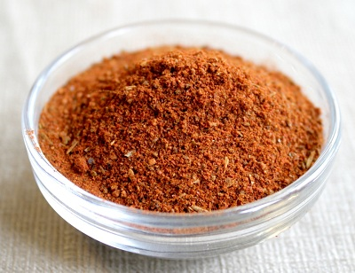

# Cajun Spice Mix

*This iconic Cajun spice mix is famous in Louisiana classics such as gumbo and jambalaya. It also works beautifully in stews, thick soups, blackened fish, and any dish requiring bold, earthy, warming spices.*

**Yield:** Approximately 100-120 grams (makes 20-25 portions)

## Overview
Cajun spice mix is the heart of Louisiana cooking, a blend that speaks to the region's agricultural traditions and Spanish, African, and French influences. Unlike hotter blends, Cajun spicing emphasizes oregano, thyme, and paprika for earthy warmth. The blend is complex and slightly savory, designed for proteins and vegetables that will simmer for hours. This is cooking with soul and history.

## Ingredients

### Base Vegetables (Finely Chopped)
- 1 medium onion (finely chopped)
- 2 garlic cloves (finely chopped)

### Whole Spices to Roast
- 1 teaspoon black peppercorns
- 1 teaspoon cumin seeds
- 1 teaspoon white mustard seeds

### Ground & Dried Spices to Add After Roasting
- 2 teaspoons paprika
- 1 teaspoon chilli powder (or cayenne for extra heat)
- 1 teaspoon dried oregano
- 2 teaspoons dried thyme
- 1.5 teaspoons fine sea salt

## Method

### Stage 1 – Dry Roast Seeds
1. Place a heavy-bottomed frying pan over medium heat with no oil.
1. Add the black peppercorns, cumin seeds, and white mustard seeds.
1. Continuously stir and toss for 2-3 minutes as they heat.
1. Watch carefully, they'll begin popping and release fragrance. Remove when pungent.
1. Do not let them burn; that creates bitterness rather than aroma.
1. Transfer to a mortar and allow to cool completely.

### Stage 2 – Grind Roasted Spices
1. Grind the cooled roasted spices in a mortar to a fine powder.
1. If your mortar is small, keep this ground powder separate for now.

### Stage 3 – Prepare Aromatics
1. Finely chop the onion and garlic cloves.
1. Place in a food processor (if using processor method) or prepare for blending.

### Stage 4 – Combine Spices
1. In a bowl, combine the ground roasted spice powder with paprika, chilli powder, oregano, thyme, and salt.
1. Mix very thoroughly for 1-2 minutes to blend evenly.

### Stage 5 – Blend with Aromatics
1. Add the chopped onion and garlic to the spice mixture.
1. If using a food processor, pulse until well combined, creating a slightly wet spice paste.
1. If blending by hand, mix thoroughly with a spoon until evenly distributed.

### Stage 6 – Use or Store
1. Use immediately in gumbo, jambalaya, or other dishes.
1. If storing, transfer to airtight container in cool, dark place.
1. Can be refrigerated in a sealed jar for up to 2 weeks, or frozen for 3 months.

## Notes
- **Fresh Aromatics:** Unlike dry spice blends, this includes fresh onion and garlic, making it a paste rather than a powder. This is authentic.
- **Peppercorn Roasting:** True Cajun style requires roasting for peppercorn character. Don't skip this step.
- **Heat Adjustment:** Use chilli powder for traditional; substitute cayenne for extra kick.
- **Storage:** Because of fresh components, this requires refrigeration or freezing. Fresh is best; use within 1-2 weeks.
- **Thyme vs. Oregano Balance:** The 2:1 ratio of thyme to oregano is traditional; adjust to preference.

## Variations
**Spicier:** Use cayenne instead of chilli powder, or increase to 1.5 teaspoons.
**Extra Herbaceous:** Add 1 teaspoon fresh parsley or dried basil.
**Thicker Paste:** Add 1 tablespoon vegetable oil to create a smoother consistency.
**For Blackening Fish:** Keep proportions but reduce salt (as it will be used as a coating), and add 2 teaspoons smoked paprika.

## Serving
Use in: Gumbo, jambalaya, Creole stews, blackened meats and fish, cajun rice dishes
Typical ratio: 2-3 tablespoons per large pot of stew (serves 6-8)
Application: Add early in cooking with vegetables and aromatics for flavor integration
Temperature: Works best in longer-cooked dishes where flavors have time to meld

## Storage
- Refrigerate in airtight jar for up to 2 weeks (due to fresh onion and garlic)
- Freeze in ice-cube trays or small containers for 3 months
- Does not keep at room temperature due to fresh components
- Thaw in refrigerator before use
- Check for mold or off odors before using after 2 weeks
- Fresh-made is significantly better than stored; make in batches as needed