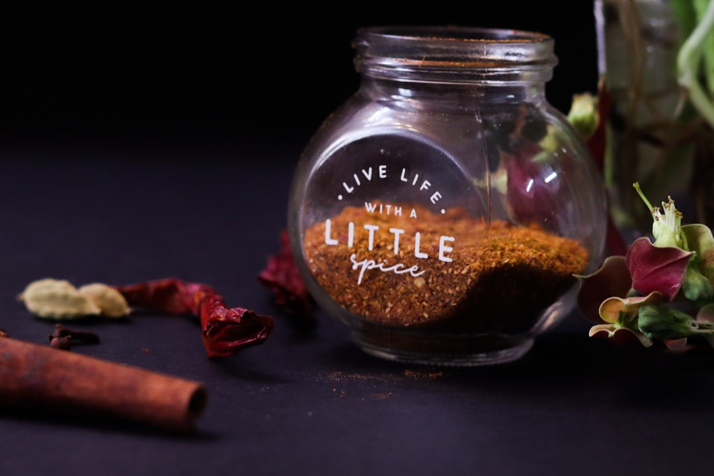

# Creole Spice Mix

*Creole spice is a staple of Louisiana cooking, bringing aromatic herbs, warm paprika, and bright heat to stews, rice dishes, and braised proteins. It is more herb-forward than its cousin Cajun spice but still delivers the familiar Creole depth and peppery warmth.*

**Yield:** Approximately 90-100 grams (makes 20-25 portions)

## Overview
Creole spice mix is the seasoning foundation for dishes like jambalaya, gumbo, shrimp creole, and tomato-based sauces. It balances sweet paprika with savoury dried herbs, garlic, and a touch of cayenne for gentle heat. Unlike heavier, smokier blends, Creole seasoning is bright and versatile, designed to complement seafood, chicken, pork, and vegetable preparations.

## Ingredients

### Dry Spice Blend
- 5 tablespoons paprika
- 3 tablespoons fine sea salt
- 2 tablespoons onion powder
- 2 tablespoons garlic powder
- 2 tablespoons dried oregano
- 2 tablespoons dried basil
- 1 tablespoon dried thyme
- 1 tablespoon ground black pepper
- 1 tablespoon white pepper
- 1 tablespoon cayenne pepper

## Method

### Stage 1 – Measure All Spices
1. Spoon each spice into a small mixing bowl.
1. Use fresh ground pepper and bright paprika for the best aroma.

### Stage 2 – Blend
1. Stir all spices thoroughly until the mixture is uniform in color and texture.
1. Break up any clumps of dried herbs or powders.
1. If desired, sift the blend through a fine mesh sieve for an even finer texture.

### Stage 3 – Store
1. Transfer the Creole spice mix to an airtight container.
1. Label with the preparation date.
1. Store in a cool, dark place away from heat and light.

## Notes
- **Paprika choice:** Use sweet or mild paprika for classic Creole character; smoked paprika will shift the blend toward a different, spicier profile.
- **Herb balance:** The oregano, basil, and thyme provide the signature Creole herbaceousness. Keep the ratios even to avoid any one flavor dominating.
- **Heat level:** Cayenne adds bright heat. Reduce it if you want a milder all-purpose blend.
- **Salt:** Adjust the salt to taste, especially if using the mix as a rub or seasoning for salted proteins.
- **Freshness:** Ground spices are best when fresh. Replace the blend after 6-8 months for optimal flavor.

## Variations
**Smoky Creole:** Replace 2 tablespoons paprika with 2 tablespoons smoked paprika.
**Mild Creole:** Reduce cayenne to 1/2 tablespoon and substitute 1 tablespoon paprika for a gentler blend.
**Garlic Boost:** Add 1 teaspoon granulated garlic for a stronger garlicky note.
**Seafood Creole:** Add 1 teaspoon celery seed for a slightly more classic Louisiana seafood seasoning.

## Serving
Use in: Jambalaya, gumbo, shrimp creole, blackened fish, roasted vegetables, grilled chicken
Typical ratio: 1-2 tablespoons per 500 g of protein or per large skillet of stew
Application: Add early in cooking for simmered dishes; sprinkle as a finishing seasoning for roasted or grilled foods

## Storage
- Store in an airtight jar away from light and heat
- Properly stored, retains best quality for 6-8 months
- Stir before use if spices settle
- Keep the lid tightly sealed to preserve aroma
- Do not refrigerate unless the container is frequently opened in a humid kitchen
