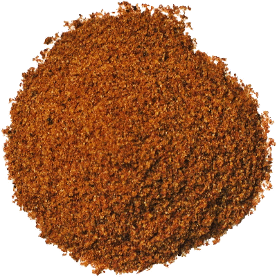

# Fajita Seasoning Mix

*This is a dry spice blend designed to season fajita preparations, grilled meat and vegetables with a specific Tex-Mex character. Unlike wet marinades, this powder is added to hot oil and protein, creating a quick-cooking flavorful coating. This mix prioritizes speed and simplicity without sacrificing authentic taste.*

**Yield:** Approximately 25-30 grams (makes 6-8 fajita portions)

## Overview
Fajita seasoning is fundamentally practical: it's meant to quickly season thinly sliced meat and vegetables as they cook in a hot skillet or on the grill. Unlike marinades (which require soaking time), this powder coats the protein immediately and develops flavor in minutes. The blend emphasizes cumin, chilli, and paprika, the signature Tex-Mex trio, enhanced with garlic and onion powders for umami. This is efficient, effective, and delicious cooking.

## Ingredients

### Dry Spices
- 2 teaspoons chilli powder
- 1 teaspoon fine sea salt
- 1 teaspoon paprika (smoked or regular)
- 1/2 teaspoon onion powder
- 1/4 teaspoon garlic powder
- 1/4 teaspoon cayenne pepper (adjust to heat preference)
- 1/4 teaspoon ground cumin
- 1 tablespoon cornstarch (optional thickening agent; reduces to coating for sauces)

## Method

### Stage 1 – Measure All Spices
1. Measure chilli powder, salt, paprika, onion powder, garlic powder, cayenne, and cumin into a small bowl.
1. Set aside the cornstarch if using.

### Stage 2 – Mix Spices
1. Using a spoon, stir the spice mixture very thoroughly for 1-2 minutes.
1. Break up any clumps (especially onion and garlic powders).
1. Ensure color is uniform throughout.

### Stage 3 – Add Optional Cornstarch
1. If using cornstarch for thickening (useful for creating saucier fajitas), add now.
1. Stir for another 30 seconds to combine completely.

### Stage 4 – Store
1. Transfer to small airtight container or spice jar.
1. Label with preparation date.
1. Store in cool, dark place away from heat.

### Stage 5 – To Use
1. Heat 1-2 tablespoons oil in large skillet over medium-high heat.
1. Add thinly sliced chicken, beef, or seafood.
1. When protein begins to brown, sprinkle seasoning mix over meat (approximately 1-2 tablespoons per pound of protein).
1. Add sliced peppers and onions.
1. Cook, stirring frequently, for 5-7 minutes until meat is cooked through and vegetables are tender-crisp.
1. If using cornstarch, it will create a light sauce; add 1/4 cup water if more sauce is desired.

## Notes
- **Quick Cooking:** This blend is designed for fast-cooking applications (5-7 minutes), not slow simmering.
- **Powder Quality:** Onion and garlic powders should be fresh and fragrant; old versions impart musty notes.
- **Cornstarch Optional:** Include for thicker, saucier fajitas; omit for drier coating.
- **Protein Choices:** Works equally well with chicken, beef, pork, shrimp, or firm fish.
- **Vegetable Timing:** Add quick-cooking peppers and onions in final minutes; harder vegetables should be pre-cooked.
- **Tex-Mex Character:** This is Americanized Tex-Mex, different from authentic Mexican preparations. Embrace its efficiency and flavor.

## Variations
**Spicier:** Use cayenne pepper instead of regular, or increase to 1/2 teaspoon.
**Smokier:** Use smoked paprika (all of it, or 1/2 smoked + 1/2 regular).
**Extra Cumin:** Increase ground cumin to 1/2 teaspoon for deeper earthy character.
**With Lime:** Add 1 teaspoon grated fresh lime zest before using (makes "wet" coating; use fresh each time).
**Less Salty:** Reduce salt to 1/2 teaspoon if using in salty dishes.

## Serving
Use in: Chicken fajitas, beef fajitas, shrimp fajitas, vegetable fajitas, taco filling, grain bowls with seasoned meat
Typical ratio: 1-2 tablespoons seasoning mix per 1 pound protein
Application: Fry seasoned meat and vegetables in hot oil for 5-7 minutes
Accompaniments: Serve with warm tortillas, sour cream, guacamole, salsa, sautéed peppers and onions

## Storage
- Store in airtight container in cool, dark place away from heat and moisture
- Properly stored, remains potent for 12 months
- Powdered onion and garlic are stable long-term
- Check aroma before using after 6 months; fading indicates age
- Does not require refrigeration
- If storing multiple batches, label clearly (with/without cornstarch)
- Label with preparation date
- Very stable blend; can make large batches and store for extended periods
- Cornstarch version may clump slightly if exposed to humidity; store with desiccant packet if needed